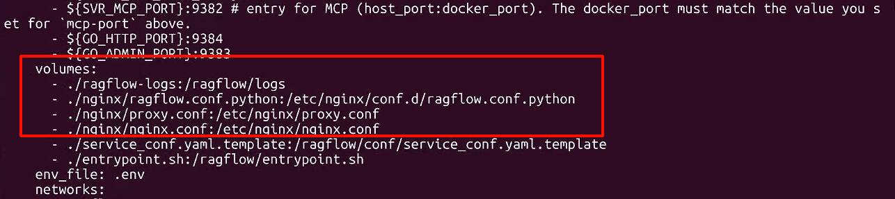

# 常见问题

关于通用功能、故障排除、使用方法等问题的解答。

---

import TOCInline from '@theme/TOCInline';

<TOCInline toc={toc} />

## 通用功能

---

### RAGFlow 与其他 RAG 产品有何不同？

尽管 LLM 极大推动了自然语言处理（NLP）的发展，但"垃圾进垃圾出"的现状仍未改变。在应对这一问题上，RAGFlow 相比其他检索增强生成（RAG）产品引入了两个独特功能。

- 细粒度文档解析：文档解析涉及图片和表格，您可以根据需要灵活干预。
- 可追溯答案，减少幻觉：您可以信任 RAGFlow 的回复，因为您可以查看支撑它们的引用和参考来源。

---

### 哪些嵌入模型可以在本地部署？

从 `v0.22.0` 开始，我们仅发布精简版，不再在镜像标签后添加 **-slim** 后缀。

---

### 在哪里找到 RAGFlow 的版本？如何解读？

您可以在 UI 的 **System** 页面找到 RAGFlow 版本号：


如果您从源码构建 RAGFlow，版本号也会出现在系统日志中：

```
        ____   ___    ______ ______ __
       / __ \ /   |  / ____// ____// /____  _      __
      / /_/ // /| | / / __ / /_   / // __ \| | /| / /
     / _, _// ___ |/ /_/ // __/  / // /_/ /| |/ |/ /
    /_/ |_|/_/  |_|\____//_/    /_/ \____/ |__/|__/

2025-02-18 10:10:43,835 INFO     1445658 RAGFlow version: v0.15.0-50-g6daae7f2
```

其中：

- `v0.15.0`：正式发布的版本。
- `50`：自正式发布以来的 git 提交次数。
- `g6daae7f2`：`g` 是前缀，`6daae7f2` 是当前提交 ID 的前七位字符。

---

### 为什么不使用其他开源向量数据库作为文档引擎？

目前，只有 Elasticsearch 和 [Infinity](https://github.com/infiniflow/infinity) 满足 RAGFlow 的混合搜索要求。大多数开源向量数据库对全文搜索的支持有限，而稀疏嵌入并不能替代全文搜索。此外，这些向量数据库缺乏 RAGFlow 所必需的关键功能，如短语搜索和高级排序能力。

这些局限性促使我们从零开始开发了 AI 原生数据库 [Infinity](https://github.com/infiniflow/infinity)。

---

### cloud.ragflow.io 与本地部署的开源 RAGFlow 服务之间的区别？

cloud.ragflow.io 展示了 RAGFlow 企业版的能力。其 DeepDoc 模型使用专有数据进行了预训练，并提供更精细的团队权限控制。本质上，cloud.ragflow.io 是 RAGFlow 即将推出的 SaaS（软件即服务）产品的预览。

您可以部署开源 RAGFlow 服务并通过 Python 客户端或 RESTful API 调用它。但是，cloud.ragflow.io 不支持此功能。

---

### 为什么 RAGFlow 解析文档比 LangChain 耗时更长？

我们在文档预处理任务上投入了大量精力，包括使用我们的视觉模型进行布局分析、表格结构识别和 OCR（光学字符识别）。这导致了额外的处理时间。

---

### 为什么 RAGFlow 比其他项目需要更多资源？

RAGFlow 内置了多个文档结构解析模型，这导致了额外的计算资源消耗。

---

### RAGFlow 支持哪些架构或设备？

我们官方支持 x86 CPU 和 Nvidia GPU。我们也在 ARM64 平台上测试 RAGFlow，但我们不维护 ARM 架构的 RAGFlow Docker 镜像。如果您使用的是 ARM 平台，请按照[本指南](./develop/build_docker_image.md)构建 RAGFlow Docker 镜像。

---

### 是否提供用于集成第三方应用的 API？

相关 API 现已可用。请参阅 [RAGFlow HTTP API 参考](./references/http_api_reference.md) 或 [RAGFlow Python API 参考](./references/python_api_reference.md) 了解更多信息。

---

### 是否支持流式输出？

是的，我们支持。流式输出在聊天助手和 Agent 中默认启用。请注意，您无法通过 RAGFlow 的 UI 禁用流式输出。要在响应中禁用流式输出，请使用 RAGFlow 的 Python 或 RESTful API：

Python：

- [创建聊天补全](./references/python_api_reference.md#create-chat-completion)
- [与聊天助手对话](./references/python_api_reference.md#converse-with-chat-assistant)
- [与 Agent 对话](./references/python_api_reference.md#converse-with-agent)

RESTful：

- [创建聊天补全](./references/http_api_reference.md#create-chat-completion)
- [与聊天助手对话](./references/http_api_reference.md#converse-with-chat-assistant)
- [与 Agent 对话](./references/http_api_reference.md#converse-with-agent)

---

### 是否支持通过 URL 分享对话？

不支持此功能。

---

### 是否支持多轮对话，引用之前的对话作为当前查询的上下文？

是的，我们支持基于正在进行的对话的现有上下文来增强用户查询：

1. 在 **Chat** 页面，将鼠标悬停在所需的助手上，选择 **Edit**。
2. 在 **Chat Configuration** 弹出窗口中，点击 **Prompt engine** 选项卡。
3. 打开 **Multi-turn optimization** 以启用此功能。

---

### AI 搜索和聊天的关键区别是什么？

- **AI 搜索**：这是单轮 AI 对话，使用预定义的检索策略（加权关键词相似度与加权向量相似度的混合搜索）和系统默认的聊天模型。它不涉及高级 RAG 策略，如知识图谱、自动关键词或自动问题。检索到的分块将显示在聊天模型回复的下方。
- **AI 聊天**：这是多轮 AI 对话，您可以定义自己的检索策略（可以用加权重排序得分替代混合搜索中的加权向量相似度），并选择您的聊天模型。在 AI 聊天中，您可以针对具体场景配置高级 RAG 策略，如知识图谱、自动关键词和自动问题。检索到的分块不会与答案一起显示。

在调试聊天助手时，您可以将 AI 搜索作为参考，用于验证您的模型设置和检索策略。

---

## 故障排除

---

### 升级到 v0.25.4 时出现 `Request error 404: undefined`

要解决此问题，请执行以下任一操作：

- 从 [main 分支](https://github.com/infiniflow/ragflow) 拉取最新源码，然后拉取并启动 v0.25.4 镜像。
- 在 [.env 文件](https://github.com/infiniflow/ragflow/blob/main/docker/.env) 中将 `RAGFLOW_IMAGE` 从 `infiniflow/ragflow:latest` 更新为 `infiniflow/ragflow:v0.25.4`，然后重启服务。

### 如何从零开始构建 RAGFlow 镜像？

请参见[构建 RAGFlow Docker 镜像](./develop/build_docker_image.md)。

---

### 无法访问 https://huggingface.co

本地部署的 RAGFlow 默认从 [Huggingface 网站](https://huggingface.co) 下载 OCR 模型。如果您的机器无法访问该网站，会出现以下错误且 PDF 解析失败：

```
FileNotFoundError: [Errno 2] No such file or directory: '/root/.cache/huggingface/hub/models--InfiniFlow--deepdoc/snapshots/be0c1e50eef6047b412d1800aa89aba4d275f997/ocr.res'
```

要修复此问题，改用 https://hf-mirror.com：

1. 停止所有容器并移除所有相关资源：

   ```bash
   cd ragflow/docker/
   docker compose down
   ```

2. 取消注释 **ragflow/docker/.env** 中的以下行：

   ```
   # HF_ENDPOINT=https://hf-mirror.com
   ```

3. 启动服务器：

   ```bash
   docker compose up -d
   ```

---

### `Fail to access model(Ollama/xxxxx)`

Ollama 在首次加载模型时可能因内存限制或内存不足（OOM）超时或失败。建议先单独测试您的本地模型。如果与其他服务共享硬件，很可能出现内存耗尽。要解决此问题，请换用更小的模型或增加 RAM。

---

### `MaxRetryError: HTTPSConnectionPool(host='hf-mirror.com', port=443)`

此错误表明您没有互联网访问权限或无法连接到 hf-mirror.com。请尝试以下操作：

1. 从 [huggingface.co/InfiniFlow/deepdoc](https://huggingface.co/InfiniFlow/deepdoc) 手动下载资源文件到本地文件夹 **~/deepdoc**。
2. 在 **docker-compose.yml** 中添加卷挂载，例如：

   ```
   - ~/deepdoc:/ragflow/rag/res/deepdoc
   ```

---

### `RuntimeError: Unable to start Tika server.`

此错误几乎总是由于 Java 未安装或在环境中不可访问导致的。请参见[此处](https://github.com/infiniflow/ragflow/issues/13194)获取详细说明。

---

### `Cannot stat '/etc/nginx/conf.d/ragflow.conf.python': No such file or directory`

要解决此问题，请从 [GitHub](https://github.com/infiniflow/ragflow) 上的对应 tag 下载缺失的文件，或按如下方式更新 `~/ragflow/docker/docker-compose.yml`：



---

### `WARNING: can't find /ragflow/rag/res/borker.tm`

忽略此警告并继续。所有系统警告都可以忽略。

---

### `network anomaly There is an abnormality in your network and you cannot connect to the server.`


除非服务器完全初始化，否则您将无法登录 RAGFlow。运行 `docker logs -f docker-ragflow-cpu-1`。

*如果系统显示以下内容，则表示服务器已成功初始化：*

```
     ____   ___    ______ ______ __
    / __ \ /   |  / ____// ____// /____  _      __
   / /_/ // /| | / / __ / /_   / // __ \| | /| / /
  / _, _// ___ |/ /_/ // __/  / // /_/ /| |/ |/ /
 /_/ |_|/_/  |_|\____//_/    /_/ \____/ |__/|__/

 * Running on all addresses (0.0.0.0)
 * Running on http://127.0.0.1:9380
 * Running on http://x.x.x.x:9380
 INFO:werkzeug:Press CTRL+C to quit
```

---

### `Realtime synonym is disabled, since no redis connection`

忽略此警告并继续。所有系统警告都可以忽略。


---

### 为什么我的文档解析卡在不到百分之一？


点击"解析状态"栏旁边的红色叉号，然后重新启动解析过程，看看问题是否仍然存在。如果问题持续且您的 RAGFlow 是本地部署的，请尝试以下操作：

1. 检查 RAGFlow 服务器日志，确认其是否正常运行：

   ```bash
   docker logs -f docker-ragflow-cpu-1
   ```

2. 检查 **task_executor.py** 进程是否存在。
3. 检查 RAGFlow 服务器是否可以访问 hf-mirror.com 或 huggingface.com。

---

### 为什么我的 PDF 解析卡在接近完成，而日志没有显示任何错误？

点击"解析状态"栏旁边的红色叉号，然后重新启动解析过程，看看问题是否仍然存在。如果问题持续且您的 RAGFlow 是本地部署的，解析过程很可能因内存不足而被终止。尝试通过增加 **docker/.env** 中的 `MEM_LIMIT` 值来增加内存分配。

:::note
请确保重启 RAGFlow 服务器以使更改生效！

```bash
docker compose stop
```

```bash
docker compose up -d
```

:::


---

### `Index failure`

索引失败通常表示 Elasticsearch 服务不可用。

---

### 如何查看 RAGFlow 的日志？

```bash
tail -f ragflow/docker/ragflow-logs/*.log
```

---

### 如何检查 RAGFlow 各组件的状态？

1. 检查 Elasticsearch Docker 容器的状态：

   ```bash
   $ docker ps
   ```

   *以下是示例结果：*

   ```bash
   5bc45806b680   infiniflow/ragflow:latest     "./entrypoint.sh"        11 hours ago   Up 11 hours               0.0.0.0:80->80/tcp, :::80->80/tcp, 0.0.0.0:443->443/tcp, :::443->443/tcp, 0.0.0.0:9380->9380/tcp, :::9380->9380/tcp   docker-ragflow-cpu-1
   91220e3285dd   docker.elastic.co/elasticsearch/elasticsearch:8.11.3   "/bin/tini -- /usr/l…"   11 hours ago   Up 11 hours (healthy)     9300/tcp, 0.0.0.0:9200->9200/tcp, :::9200->9200/tcp           ragflow-es-01
   d8c86f06c56b   mysql:5.7.18        "docker-entrypoint.s…"   7 days ago     Up 16 seconds (healthy)   0.0.0.0:3306->3306/tcp, :::3306->3306/tcp     ragflow-mysql
   cd29bcb254bc   quay.io/minio/minio:RELEASE.2023-12-20T01-00-02Z       "/usr/bin/docker-ent…"   2 weeks ago    Up 11 hours      0.0.0.0:9001->9001/tcp, :::9001->9001/tcp, 0.0.0.0:9000->9000/tcp, :::9000->9000/tcp     ragflow-minio
   ```

2. 按照[本文档](./guides/run_health_check.md)检查 Elasticsearch 服务的健康状态。

:::danger 重要
Docker 容器的状态并不一定反映服务的状态。您可能会发现即使对应的 Docker 容器正在运行，服务也不健康。可能的原因包括网络故障、端口号错误或 DNS 问题。
:::

---

### `Exception: Can't connect to ES cluster`

1. 检查 Elasticsearch Docker 容器的状态：

   ```bash
   $ docker ps
   ```

   *健康的 Elasticsearch 组件状态应如下所示：*

   ```
   91220e3285dd   docker.elastic.co/elasticsearch/elasticsearch:8.11.3   "/bin/tini -- /usr/l…"   11 hours ago   Up 11 hours (healthy)     9300/tcp, 0.0.0.0:9200->9200/tcp, :::9200->9200/tcp           ragflow-es-01
   ```

2. 按照[本文档](./guides/run_health_check.md)检查 Elasticsearch 服务的健康状态。

   :::danger 重要
   Docker 容器的状态并不一定反映服务的状态。您可能会发现即使对应的 Docker 容器正在运行，服务也不健康。可能的原因包括网络故障、端口号错误或 DNS 问题。
   :::

3. 如果容器不断重启，请确保 `vm.max_map_count` >= 262144，如[此 README](https://github.com/infiniflow/ragflow?tab=readme-ov-file#-start-up-the-server) 所述。如果希望更改永久生效，需要在 **/etc/sysctl.conf** 中更新 `vm.max_map_count` 值。请注意，此配置仅适用于 Linux。

---

### 无法启动 ES 容器，提示 `Elasticsearch did not exit normally`

这是因为您忘记在 **/etc/sysctl.conf** 中更新 `vm.max_map_count` 值，而您对该值的更改在系统重启后被重置了。

---

### `{"data":null,"code":100,"message":"<NotFound '404: Not Found'>"}`

您的 IP 地址或端口号可能不正确。如果您使用默认配置，请在浏览器中输入 `http://<IP_OF_YOUR_MACHINE>`（**不是 9380，也不需要端口号！**）。这样应该可以正常工作。

---

### `Ollama - Mistral instance running at 127.0.0.1:11434 but cannot add Ollama as model in RagFlow`

正确的 Ollama IP 地址和端口对于将模型添加到 Ollama 至关重要：

- 如果您使用的是 cloud.ragflow.io，请确保托管 Ollama 的服务器具有可公开访问的 IP 地址。请注意，127.0.0.1 不是可公开访问的 IP 地址。
- 如果您在本地部署 RAGFlow，请确保 Ollama 和 RAGFlow 在同一局域网内，并可以相互通信。

请参见[部署本地 LLM](./guides/models/deploy_local_llm.md) 了解更多信息。

---

### 是否提供使用 DeepDoc 解析 PDF 或其他文件的示例？

是的，我们提供。请参见 **rag/app** 文件夹下的 Python 文件。

---

### `FileNotFoundError: [Errno 2] No such file or directory`

1. 检查 MinIO Docker 容器的状态：

   ```bash
   $ docker ps
   ```

   *健康的 MinIO 组件状态应如下所示：*

   ```bash
   cd29bcb254bc   quay.io/minio/minio:RELEASE.2023-12-20T01-00-02Z       "/usr/bin/docker-ent…"   2 weeks ago    Up 11 hours      0.0.0.0:9001->9001/tcp, :::9001->9001/tcp, 0.0.0.0:9000->9000/tcp, :::9000->9000/tcp     ragflow-minio
   ```

2. 按照[本文档](./guides/run_health_check.md)检查 Elasticsearch 服务的健康状态。

:::danger 重要
Docker 容器的状态并不一定反映服务的状态。您可能会发现即使对应的 Docker 容器正在运行，服务也不健康。可能的原因包括网络故障、端口号错误或 DNS 问题。
:::

---

## 使用方法

---

### 如何使用本地部署的 LLM 运行 RAGFlow？

您可以使用 Ollama 或 Xinference 部署本地 LLM。请参见[此处](./guides/models/deploy_local_llm.md)了解更多信息。

---

### 如何添加不受支持的 LLM？

如果您的模型目前不受支持，但其 API 与 OpenAI 的 API 兼容，请在 **Model providers** 页面点击 **OpenAI-API-Compatible** 来配置您的模型：


---

### 如何将 RAGFlow 与 Ollama 集成？

- 如果 RAGFlow 是本地部署的，请确保 RAGFlow 和 Ollama 在同一局域网内。
- 如果您使用的是在线演示版，请确保 Ollama 服务器的 IP 地址是公开且可访问的。

请参见[此处](./guides/models/deploy_local_llm.md)了解更多信息。

---

### 如何更改文件大小限制？

对于本地部署的 RAGFlow：每次上传的总文件大小限制为 1GB，批量上传限制为 32 个文件。每个账户的文件总数没有上限。要更新此 1GB 文件大小限制：

- 在 **docker/.env** 中，取消注释 `# MAX_CONTENT_LENGTH=1073741824`，根据需要调整值，注意 `1073741824` 表示 1GB（字节）。
- 如果您在 **docker/.env** 中更新了 `MAX_CONTENT_LENGTH` 的值，请确保在 **nginx/nginx.conf** 中相应更新 `client_max_body_size`。

:::tip 注意
不建议手动更改 32 个文件的批量上传限制。但是，如果您使用 RAGFlow 的 HTTP API 或 Python SDK 上传文件，32 个文件的批量上传限制会自动取消。
:::

---

### `Error: Range of input length should be [1, 30000]`

此错误是因为匹配搜索条件的分块过多。尝试减少 **TopN** 并提高 **Similarity threshold** 来修复此问题：

1. 点击页面中上方的 **Chat**。
2. 右键点击所需对话 > **Edit** > **Prompt engine**
3. 减少 **TopN** 和/或提高 **Similarity threshold**。
4. 点击 **OK** 确认更改。


---

### 如何获取用于集成第三方应用的 API 密钥？

请参见[获取 RAGFlow API 密钥](./develop/acquire_ragflow_api_key.md)。

---

### 如何升级 RAGFlow？

请参见[升级 RAGFlow](./administrator/upgrade_ragflow.md) 了解更多信息。

---

### 如何将文档引擎切换为 Infinity？

要将文档引擎从 Elasticsearch 切换到 [Infinity](https://github.com/infiniflow/infinity)：

1. 停止所有正在运行的容器：

   ```bash
   $ docker compose -f docker/docker-compose.yml down -v
   ```
   :::caution 警告
   `-v` 将删除所有 Docker 容器卷，现有数据将被清空。
   :::

2. 在 **docker/.env** 中，设置 `DOC_ENGINE=${DOC_ENGINE:-infinity}`
3. 重启 Docker 镜像：

   ```bash
   $ docker compose -f docker-compose.yml up -d
   ```

---

### 上传的文件存储在 RAGFlow 镜像的哪里？

所有上传的文件存储在 MinIO（RAGFlow 的对象存储解决方案）中。例如，如果您直接将文件上传到数据集，它位于 `<knowledgebase_id>/filename`。

---

### 如何调整文档解析和嵌入的批量大小？

您可以通过设置环境变量 `DOC_BULK_SIZE` 和 `EMBEDDING_BATCH_SIZE` 来控制文档解析和嵌入的批量大小。增大这些值可能会提高大规模数据处理的吞吐量，但也会增加内存使用量。请根据您的硬件资源进行调整。

---

### 如何加速聊天助手的问答速度？

请参见[此处](./guides/chat/best_practices/accelerate_question_answering.md)。

---

### 如何加速 Agent 的问答速度？

请参见[此处](./guides/agent/best_practices/accelerate_agent_question_answering.md)。

### 如何使用 MinerU 解析 PDF 文档？

从 v0.22.0 起，RAGFlow 包含 MinerU (&ge; 2.6.3) 作为可选的多后端 PDF 解析器。请注意，RAGFlow 仅作为 MinerU 的*远程客户端*，调用 MinerU API 解析 PDF 并读取返回的文件。要使用此功能：

1. 准备一个可访问的 MinerU API 服务（FastAPI 服务器）。
2. 在 **.env** 文件中或从 UI 的 **Model providers** 页面，将 RAGFlow 配置为 MinerU 的远程客户端：
   - `MINERU_APISERVER`：MinerU API 端点（例如 `http://mineru-host:8886`）。
   - `MINERU_BACKEND`：MinerU 后端：
      - `"pipeline"`（默认）
      - `"vlm-http-client"`
      - `"vlm-transformers"`
      - `"vlm-vllm-engine"`
      - `"vlm-mlx-engine"`
      - `"vlm-vllm-async-engine"`
      - `"vlm-lmdeploy-engine"`。
   - `MINERU_SERVER_URL`：（可选）下游 vLLM HTTP 服务器（例如 `http://vllm-host:30000`）。当 `MINERU_BACKEND` 设置为 `"vlm-http-client"` 时适用。
   - `MINERU_OUTPUT_DIR`：（可选）用于存放 MinerU API 服务输出（zip/JSON）的本地目录。
   - `MINERU_DELETE_OUTPUT`：是否在使用临时目录时删除临时输出：
     - `1`：删除。
     - `0`：保留。
3. 在 Web UI 中，导航到数据集的 **Configuration** 页面，找到 **Ingestion pipeline** 部分：
   - 如果您选择使用 **Built-in** 下拉菜单中的分块方法，请确保它支持 PDF 解析，然后从 **PDF parser** 下拉菜单中选择 **MinerU**。
   - 如果您使用自定义导入流程，请在 **Parser** 组件的 **PDF parser** 部分选择 **MinerU**。

:::note
所有 MinerU 环境变量都是可选的。设置后，这些值将用于在首次使用时为租户自动配置 MinerU OCR 模型。要避免自动配置，请跳过环境变量设置，仅从 UI 的 **Model providers** 页面配置 MinerU。
:::

:::caution 警告
第三方视觉模型标记为**实验性**，因为我们尚未针对上述数据提取任务对这些模型进行全面测试。
:::
---

### 如何配置 MinerU 特定的设置？

下表总结了远程 MinerU 最常用的环境变量：

| 环境变量 | 描述 | 默认值 | 示例 |
| ---------------------- | ---------------------------------- | ----------------------------------- | ----------------------------------------------------------------------------------------------- |
| `MINERU_APISERVER` | MinerU API 服务的 URL | *未设置* | `MINERU_APISERVER=http://your-mineru-server:8886` |
| `MINERU_BACKEND` | MinerU 解析后端 | `pipeline` | `MINERU_BACKEND=pipeline\|vlm-transformers\|vlm-vllm-engine\|vlm-mlx-engine\|vlm-vllm-async-engine\|vlm-http-client` |
| `MINERU_SERVER_URL` | 远程 vLLM 服务器的 URL（用于 `vlm-http-client`） | *未设置* | `MINERU_SERVER_URL=http://your-vllm-server-ip:30000` |
| `MINERU_OUTPUT_DIR` | MinerU 输出文件的目录 | 系统定义的临时目录 | `MINERU_OUTPUT_DIR=/home/ragflow/mineru/output` |
| `MINERU_DELETE_OUTPUT` | 是否在使用临时目录时删除 MinerU 输出目录 | `1`（删除临时输出） | `MINERU_DELETE_OUTPUT=0` |

1. 设置 `MINERU_APISERVER` 将 RAGFlow 指向您的 MinerU API 服务器。
2. 设置 `MINERU_BACKEND` 指定解析后端。
3. 如果使用 `"vlm-http-client"` 后端，请将 `MINERU_SERVER_URL` 设置为您的 vLLM 服务器 URL。MinerU API 期望请求体中包含 `backend=vlm-http-client` 和 `server_url=http://<server>:30000`。
4. 设置 `MINERU_OUTPUT_DIR` 指定 RAGFlow 存储 MinerU API 输出的位置；否则将使用系统临时目录。
5. 设置 `MINERU_DELETE_OUTPUT` 为 `0` 以保留 MinerU 的临时输出（调试时很有用）。

:::tip 注意
有关 MinerU 原生支持的其他环境变量的信息，请参见[此处](https://opendatalab.github.io/MinerU/usage/cli_tools/#environment-variables-description)。
:::

---

### 如何使用 MinerU 配合 vLLM 服务器进行文档解析？

RAGFlow 支持 MinerU 的 `vlm-http-client` 后端，使您能够在通过 HTTP 调用 MinerU 的同时将文档解析任务委托给远程 vLLM 服务器。配置方法：

1. 确保 MinerU API 服务可访问（例如 `http://mineru-host:8886`）。
2. 设置或指向一个 vLLM HTTP 服务器（例如 `http://vllm-host:30000`）。
3. 在 **docker/.env** 文件（或从源码运行时的 shell 中）配置以下内容：
   - `MINERU_APISERVER=http://mineru-host:8886`
   - `MINERU_BACKEND="vlm-http-client"`
   - `MINERU_SERVER_URL="http://vllm-host:30000"`
   MinerU API 调用期望请求体中包含 `backend=vlm-http-client` 和 `server_url=http://<server>:30000`。
4. 根据需要配置 `MINERU_OUTPUT_DIR` / `MINERU_DELETE_OUTPUT` 来管理返回的 zip/JSON 文件。

:::tip 注意
使用 `vlm-http-client` 后端时，RAGFlow 服务器不需要 GPU，仅需网络连接。这可以实现经济高效的分布式部署，多个 RAGFlow 实例共享一个远程 vLLM 服务器。
:::

### 如何使用外部 Docling Serve 服务器进行文档解析？

RAGFlow 支持两种 Docling 模式：

1. **本地 Docling**（现有模式）：在 RAGFlow 运行时安装 Docling（`USE_DOCLING=true`）并进程内解析。
2. **外部 Docling Serve**（远程模式）：将 RAGFlow 指向 Docling Serve 端点。

要启用远程模式，请设置：

```bash
DOCLING_SERVER_URL=http://your-docling-serve-host:5001
```

行为说明：

- 当设置了 `DOCLING_SERVER_URL` 时，RAGFlow 使用 `/v1/convert/source` 将 PDF 发送到 Docling Serve（对于较旧的服务器，会回退到 `/v1alpha/convert/source`）。
- 当未设置 `DOCLING_SERVER_URL` 时，RAGFlow 使用本地进程内 Docling。

### 如何使用 PaddleOCR 进行文档解析？

从 v0.24.0 起，RAGFlow 包含 PaddleOCR 作为可选的 PDF 解析器。请注意，RAGFlow 仅作为 PaddleOCR 的*远程客户端*，调用 PaddleOCR API 解析 PDF 并读取返回的文件。

在 RAGFlow 中配置和使用 PaddleOCR 主要有两种方式：

#### 1. 使用 PaddleOCR 官方 API

此方法使用 PaddleOCR 的官方 API 服务及访问令牌。

**第 1 步：配置 RAGFlow**
- **通过环境变量：**
   ```bash
   # 在 docker/.env 文件中：
   PADDLEOCR_API_URL=https://your-paddleocr-api-endpoint
   PADDLEOCR_ALGORITHM=PaddleOCR-VL
   PADDLEOCR_ACCESS_TOKEN=your-access-token-here
   ```

- **通过 UI：**
   - 导航到 **Model providers** 页面
   - 添加一个新的 OCR 模型，厂商类型为 "PaddleOCR"
   - 配置以下字段：
      - **PaddleOCR API URL**：您的 PaddleOCR API 端点
      - **PaddleOCR Algorithm**：选择与 API 端点对应的算法
      - **AI Studio Access Token**：PaddleOCR API 的访问令牌

**第 2 步：在数据集配置中使用**
- 在数据集的 **Configuration** 页面中，找到 **Ingestion pipeline** 部分
- 如果使用支持 PDF 解析的内置分块方法，请从 **PDF parser** 下拉菜单中选择 **PaddleOCR**
- 如果使用自定义导入流程，请在 **Parser** 组件中选择 **PaddleOCR**

**注意：**
- 要获取 API URL，请访问 [PaddleOCR 官方网站](https://aistudio.baidu.com/paddleocr)，点击 **API** 按钮，选择您要使用的特定算法示例代码（例如 PaddleOCR-VL），并复制 `API_URL`。
- 访问令牌可以从 [AI Studio 平台](https://aistudio.baidu.com/account/accessToken) 获取。
- 此方法需要互联网连接以访问官方 PaddleOCR API。

#### 2. 使用自托管 PaddleOCR 服务

此方法允许您部署自己的 PaddleOCR 服务，无需访问令牌即可使用。

**第 1 步：部署 PaddleOCR 服务**
按照 [PaddleOCR 服务文档](https://www.paddleocr.ai/latest/en/version3.x/deployment/serving.html) 部署您自己的服务。对于布局解析，您可以使用类似以下端点：

```bash
http://localhost:8080/layout-parsing
```

**第 2 步：配置 RAGFlow**
- **通过环境变量：**
  ```bash
  PADDLEOCR_API_URL=http://localhost:8080/layout-parsing
  PADDLEOCR_ALGORITHM=PaddleOCR-VL
  # 自托管服务不需要访问令牌
  ```

- **通过 UI：**
   - 导航到 **Model providers** 页面
   - 添加一个新的 OCR 模型，厂商类型为 "PaddleOCR"
   - 配置以下字段：
      - **PaddleOCR API URL**：部署服务的端点
      - **PaddleOCR Algorithm**：选择与部署服务对应的算法
      - **AI Studio Access Token**：留空

**第 3 步：在数据集配置中使用**
- 在数据集的 **Configuration** 页面中，找到 **Ingestion pipeline** 部分
- 如果使用支持 PDF 解析的内置分块方法，请从 **PDF parser** 下拉菜单中选择 **PaddleOCR**
- 如果使用自定义导入流程，请在 **Parser** 组件中选择 **PaddleOCR**

#### 环境变量汇总

| 环境变量 | 描述 | 默认值 | 是否必需 |
|---------------------|-------------|---------|----------|
| `PADDLEOCR_API_URL` | PaddleOCR API 端点 URL | `""` | 使用环境变量时必需 |
| `PADDLEOCR_ALGORITHM` | 用于解析的算法 | `"PaddleOCR-VL"` | 否 |
| `PADDLEOCR_ACCESS_TOKEN` | 官方 API 的访问令牌 | `None` | 仅使用官方 API 时需要 |

环境变量可用于自动配置，但如果通过 UI 配置则不是必需的。设置环境变量后，这些值将用于在首次使用时为租户自动配置 PaddleOCR 模型。


### 如何使用 Ollama 配合 RAGFlow 进行本地 LLM 推理？

RAGFlow 支持 Ollama 作为本地模型供应商，用于私密的离线推理。

**第 1 步：启动 Ollama 并拉取模型**

```bash
export OLLAMA_HOST=0.0.0.0
ollama serve
ollama pull llama3
```

**第 2 步：在 RAGFlow 中添加 Ollama**

1. 前往 **Settings** > **Model providers** > **Ollama**。
2. 将 Base URL 设置为 `http://host.docker.internal:11434`（Docker）或 `http://localhost:11434`（裸机）。
3. 输入模型名称（例如 `llama3`）并点击 **Save**。

**第 3 步：在助手中使用 Ollama**

- 打开助手的 **Configuration** 页面，在 **Chat model** 下选择 Ollama 模型。
