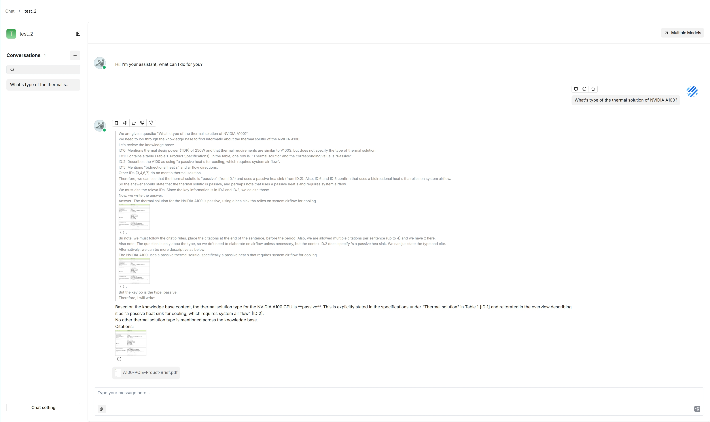

# 快速开始
import Tabs from '@theme/Tabs';
import TabItem from '@theme/TabItem';
import APITable from '@site/src/components/APITable';

RAGFlow 是一个基于深度文档理解的开源 RAG（检索增强生成）引擎。与 LLM 集成后，它能够提供有据可依的真实问答能力，并从各种复杂格式的数据中提供可靠的引用来源。

本快速开始指南描述以下完整流程：

- 启动本地 RAGFlow 服务器
- 创建数据集
- 介入文件解析
- 基于您的数据集建立 AI 聊天

:::danger 重要
我们官方支持 x86 CPU 和 Nvidia GPU，本文档提供在 x86 平台上使用 Docker 部署 RAGFlow 的说明。我们也在 ARM64 平台上测试了 RAGFlow，但我们不维护 ARM 架构的 RAGFlow Docker 镜像。

如果您使用的是 ARM 平台，请按照[本指南](./develop/build_docker_image.md)构建 RAGFlow Docker 镜像。
:::

## 前置条件

- CPU &ge; 4 核（x86）；
- 内存 &ge; 16 GB；
- 磁盘 &ge; 50 GB；
- Docker &ge; 24.0.0 & Docker Compose &ge; v2.26.1。
- [gVisor](https://gvisor.dev/docs/user_guide/install/)：仅当您计划使用 RAGFlow 的代码执行器（[sandbox](https://github.com/infiniflow/ragflow/tree/main/sandbox)）功能时需要。

:::tip 注意
如果您尚未在本地机器（Windows、Mac 或 Linux）上安装 Docker，请参阅[安装 Docker 引擎](https://docs.docker.com/engine/install/)。
:::

## 启动服务器

本节提供在 Linux 上搭建 RAGFlow 服务器的说明。如果您使用不同的操作系统，也无需担心，大部分步骤是相似的。

1. 确保 `vm.max_map_count` &ge; 262144。

<details>
  <summary>点击展开详情：</summary>

   `vm.max_map_count`：该值设置一个进程可以拥有的内存映射区域的最大数量。默认值为 65530。虽然大多数应用程序只需要不到一千个映射，但降低此值可能导致异常行为，当进程达到限制时系统会抛出内存不足错误。

   RAGFlow v0.25.4 使用 Elasticsearch 或 [Infinity](https://github.com/infiniflow/infinity) 进行多路召回。正确设置 `vm.max_map_count` 的值对于 Elasticsearch 组件的正常运行至关重要。

<Tabs
  defaultValue="linux"
  values={[
    {label: 'Linux', value: 'linux'},
    {label: 'macOS', value: 'macos'},
    {label: 'Windows', value: 'windows'},
  ]}>
  <TabItem value="linux">
   1.1. 检查 `vm.max_map_count` 的值：

   ```bash
   $ sysctl vm.max_map_count
   ```

   1.2. 如果 `vm.max_map_count` 的值不足 262144，请重新设置：

   ```bash
   $ sudo sysctl -w vm.max_map_count=262144
   ```

   :::caution 警告
   此更改将在系统重启后被重置。如果下次启动服务器时忘记更新该值，可能会收到 `Can't connect to ES cluster` 异常。
   :::
   
   1.3. 为确保更改永久生效，请在 **/etc/sysctl.conf** 中添加或更新 `vm.max_map_count` 值：

   ```bash
   vm.max_map_count=262144
   ```
  </TabItem>
  <TabItem value="macos">
   如果您在 macOS 上使用 Docker Desktop，请运行以下命令更新 `vm.max_map_count`：

   ```bash
   docker run --rm --privileged --pid=host alpine sysctl -w vm.max_map_count=262144
   ```

   :::caution 警告
   此更改将在系统重启后被重置。如果下次启动服务器时忘记更新该值，可能会收到 `Can't connect to ES cluster` 异常。
   :::

   要使更改持久化，请创建一个包含正确设置的文件：

   1.1. 创建一个文件：

   ```shell
   sudo nano /Library/LaunchDaemons/com.user.vmmaxmap.plist
   ```

   1.2. 打开该文件：

   ```shell
   sudo launchctl load /Library/LaunchDaemons/com.user.vmmaxmap.plist
   ```

   1.3. 添加设置：

   ```xml
   <?xml version="1.0" encoding="UTF-8"?>
   <!DOCTYPE plist PUBLIC "-//Apple//DTD PLIST 1.0//EN" "http://www.apple.com/DTDs/PropertyList-1.0.dtd">
   <plist version="1.0">
   <dict>
       <key>Label</key>
       <string>com.user.vmmaxmap</string>
       <key>ProgramArguments</key>
       <array>
           <string>/usr/sbin/sysctl</string>
           <string>-w</string>
           <string>vm.max_map_count=262144</string>
       </array>
       <key>RunAtLoad</key>
       <true/>
   </dict>
   </plist>
   ```

   1.4. 保存文件后，加载新的守护进程：

   ```shell
   sudo launchctl load /Library/LaunchDaemons/com.user.vmmaxmap.plist
   ```

   :::note
   如果上述步骤不起作用，请考虑使用[此变通方案](https://github.com/docker/for-mac/issues/7047#issuecomment-1791912053)，该方案使用容器操作，无需手动编辑 macOS 设置。
   :::

  </TabItem>
  <TabItem value="windows">

   #### 如果您在 Windows 上使用 Docker Desktop，则*必须*使用 docker-machine 设置 `vm.max_map_count`：

   ```bash
   $ docker-machine ssh
   $ sudo sysctl -w vm.max_map_count=262144
   ```
   #### 如果您在 Windows 上使用 Docker Desktop WSL 2 后端，则使用 docker-desktop 设置 `vm.max_map_count`：

   1.1. 在 WSL 中运行以下命令：
   ```bash
   $ wsl -d docker-desktop -u root
   $ sysctl -w vm.max_map_count=262144
   ```

   :::caution 警告
   此更改将在重启 Docker 后被重置。如果下次启动服务器时忘记更新该值，可能会收到 `Can't connect to ES cluster` 异常。
   :::

   1.2. 如果您不想每次重启 Docker 后都运行这些命令，可以按如下方式更新 `%USERPROFILE%.wslconfig`，使更改对所有 WSL 发行版永久且全局生效：

   ```bash
   [wsl2]
   kernelCommandLine = "sysctl.vm.max_map_count=262144"
   ```
   *这将使所有 WSL2 虚拟机在启动时应用该设置。*

   :::note
   如果您使用的是 Windows 11 或 Windows 10 版本 22H2，并且已安装 Microsoft Store 版本的 WSL，您也可以在 docker-desktop WSL 发行版中更新 **/etc/sysctl.conf** 以使更改持久化：

   ```bash
   $ wsl -d docker-desktop -u root
   $ vi /etc/sysctl.conf
   ```

   ```bash
   # 追加一行，内容为：
   vm.max_map_count = 262144
   ```
   :::
  </TabItem>
</Tabs>

</details>

2. 克隆仓库：

   ```bash
   $ git clone https://github.com/infiniflow/ragflow.git
   $ cd ragflow/docker
   ```

3. 切换到当前版本：

   ```bash
   $ git checkout -f v0.25.4
   ```
4. 使用预构建的 Docker 镜像启动服务器：

   ```bash
   # 使用 CPU 执行 DeepDoc 任务：
   $ docker compose -f docker-compose.yml up -d
   ```

   ```mdx-code-block
   <APITable>
   ```

   | RAGFlow 镜像标签     | 镜像大小（GB） | 是否稳定？              |
   | ------------------- | --------------- | ------------------------ |
   | v0.25.4             | &approx;2       | 稳定版本                 |
   | nightly             | &approx;2       | *不稳定*的每日构建版本    |

   ```mdx-code-block
   </APITable>
   ```

   :::tip 注意
   所示镜像大小指*下载后*的 Docker 镜像大小，是压缩后的大小。Docker 运行镜像时会解压，导致磁盘占用显著增加。Docker 镜像解压后约为 7 GB。
   :::

5. 服务器启动运行后，检查服务器状态：

   ```bash
   $ docker logs -f docker-ragflow-cpu-1
   ```

   *以下输出表示系统成功启动：*

   ```bash
        ____   ___    ______ ______ __
       / __ \ /   |  / ____// ____// /____  _      __
      / /_/ // /| | / / __ / /_   / // __ \| | /| / /
     / _, _// ___ |/ /_/ // __/  / // /_/ /| |/ |/ /
    /_/ |_|/_/  |_|\____//_/    /_/ \____/ |__/|__/

    * Running on all addresses (0.0.0.0)
   ```

   :::danger 重要
   如果您跳过此确认步骤直接登录 RAGFlow，浏览器可能会提示 `network anomaly` 错误，因为此时 RAGFlow 可能尚未完全初始化。
   :::  

6. 在 Web 浏览器中输入服务器的 IP 地址并登录 RAGFlow。

   :::caution 警告
   使用默认设置时，只需输入 `http://IP_OF_YOUR_MACHINE`（**无需**端口号），因为使用默认配置时默认 HTTP 服务端口 `80` 可以省略。
   :::

## 配置 LLM

RAGFlow 是一个 RAG 引擎，需要与 LLM 配合使用才能提供有据可依、无幻觉的问答能力。RAGFlow 支持大多数主流 LLM，完整列表请参见[支持的模型](./guides/models/supported_models.md)。

:::note 
RAGFlow 也支持使用 Ollama、Xinference 或 LocalAI 本地部署 LLM，但此部分不在本快速开始指南中展开。
:::

添加和配置 LLM：

1. 点击页面右上角的头像 **>** **模型供应商**。

2. 点击所需的 LLM 并相应更新 API 密钥。

3. 点击**系统模型设置**选择默认模型：

   - 聊天模型
   - 嵌入模型
   - 图像转文本模型
   - 以及更多。

> 某些模型（例如图像转文本模型 **qwen-vl-max**）属于特定 LLM 的子模型，您可能需要更新 API 密钥才能访问这些模型。

## 创建您的第一个数据集

您可以上传文件到 RAGFlow 中的数据集，并将其解析为知识库。一个数据集实际上是多个文件解析结果的集合。RAGFlow 中的问答可以基于一个特定数据集或多个数据集。RAGFlow 支持的文件格式包括文档（PDF、DOC、DOCX、TXT、MD、MDX）、表格（CSV、XLSX、XLS）、图片（JPEG、JPG、PNG、TIF、GIF）和幻灯片（PPT、PPTX）。

创建第一个数据集：

1. 点击页面顶部中央的 **数据集** 选项卡 **>** **创建数据集**。

2. 输入数据集名称，点击**确定**确认更改。

   *您将进入数据集的**配置**页面。*

   

3. RAGFlow 提供多种分块模板，适应不同的文档布局和文件格式。为您的数据集选择嵌入模型和分块方法（模板）。

   :::danger 重要 
   一旦选择了嵌入模型并使用它解析了文件，就不再允许更改。显而易见的原因是：我们必须确保特定数据集中的所有文件都使用*相同*的嵌入模型进行解析（确保它们在相同的嵌入空间中进行比较）。
   :::

   *您将进入数据集的**数据集**页面。*

4. 点击 **+ 添加文件** **>** **本地文件** 开始上传特定文件到数据集。

5. 在上传的文件条目中，点击播放按钮开始文件解析：

   

   :::caution 注意 
   - 如果文件解析卡在 1% 以下，请参见[此 FAQ](./faq.md#why-does-my-document-parsing-stall-at-under-one-percent)。
   - 如果文件解析卡在接近完成，请参见[此 FAQ](./faq.md#why-does-my-pdf-parsing-stall-near-completion-while-the-log-does-not-show-any-error)
   :::

## 介入文件解析

RAGFlow 具有可见性和可解释性，允许您查看分块结果并在必要时进行干预。操作如下：

1. 点击完成文件解析的文件，查看分块结果：

   *您将进入**分块**页面：*

   

2. 将鼠标悬停在每个快照上，快速查看每个分块。

3. 双击分块文本，在必要时添加关键词或进行*手动*修改：

   

   :::caution 注意
   您可以为文件分块添加关键词或问题，以提高其在包含这些关键词的查询中的排名。此操作会增加其关键词权重，从而提升其在搜索结果中的位置。
   :::

4. 在检索测试中，在**测试文本**中提出一个快速问题，以确认您的配置是否有效：

   *从下图中可以看出，RAGFlow 以真实的引用作为回答依据。*

   

## 建立 AI 聊天

RAGFlow 中的对话基于特定数据集或多个数据集。创建数据集并完成文件解析后，即可开始 AI 对话。

1. 点击页面顶部中央的 **聊天** 选项卡 **>** **创建聊天** 创建聊天助手。
2. 点击创建的聊天应用进入其配置页面。
   > RAGFlow 提供为每个对话选择不同聊天模型的灵活性，同时允许您在**系统模型设置**中设置默认模型。

2. 在配置页面右侧更新**聊天设置**：

   - 命名您的助手并指定数据集。
   - **空响应**：
     - 如果您希望将 RAGFlow 的回答*限定*在您的数据集范围内，请在此处留一个响应。这样当它未检索到答案时，会*统一*以此处设置的内容进行回复。
     - 如果您希望 RAGFlow 在未从数据集中检索到答案时*自由发挥*，请留空，但这可能会导致幻觉。

3. 更新**系统提示词**或暂时保留默认设置。

4. 在**模型**下拉列表中选择聊天模型。

5. 现在，让我们开始吧：

   


:::tip 注意
RAGFlow 还提供 HTTP 和 Python API，方便您将 RAGFlow 的能力集成到您的应用中。请参阅以下文档了解更多信息：

- [获取 RAGFlow API 密钥](./develop/acquire_ragflow_api_key.md)
- [HTTP API 参考](./references/http_api_reference.md)
- [Python API 参考](./references/python_api_reference.md)
:::
