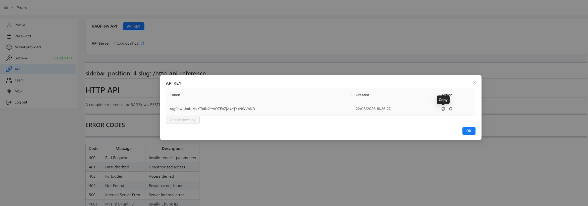

# 获取 RAGFlow API 密钥

RAGFlow 服务器需要 API 密钥来认证您的 HTTP/Python 或 MCP 请求。本文档提供获取 RAGFlow API 密钥的说明。

1. 点击 RAGFlow UI 右上角的头像进入配置页面。
2. 点击 **API** 切换到 **API** 页面。
3. 获取 RAGFlow API 密钥：

:::tip 注意
请参阅 [RAGFlow HTTP API 参考](../references/http_api_reference.md) 或 [RAGFlow Python API 参考](../references/python_api_reference.md) 获取 RAGFlow HTTP 或 Python API 的完整参考。
:::
