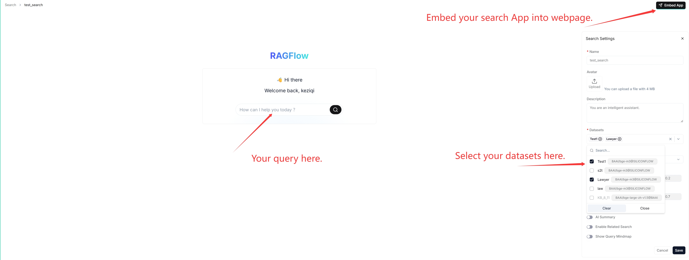

# AI 搜索

进行 AI 搜索。

---

AI 搜索是一种单轮 AI 对话，使用预定义的检索策略（加权关键词相似度与加权向量相似度的混合搜索）和系统默认的聊天模型。它不涉及高级 RAG 策略，如知识图谱、自动关键词或自动问题。相关的分块会根据相似度得分降序排列，显示在聊天模型回复的下方。

:::tip 注意
在调试您的聊天助手时，可以将 AI 搜索作为参考，用于验证您的模型设置和检索策略。
:::

## 前置条件

- 确保您已在**模型供应商**页面配置了系统默认模型。
- 确保目标数据集已正确配置，且目标文档已完成文件解析。

## 常见问题

### AI 搜索和 AI 聊天的主要区别是什么？

聊天是一种多轮 AI 对话，您可以定义自己的检索策略（可以用加权重排序得分替代混合搜索中的加权向量相似度），并选择您的聊天模型。在 AI 聊天中，您可以针对具体场景配置高级 RAG 策略，如知识图谱、自动关键词和自动问题。检索到的分块不会与答案一起显示。
