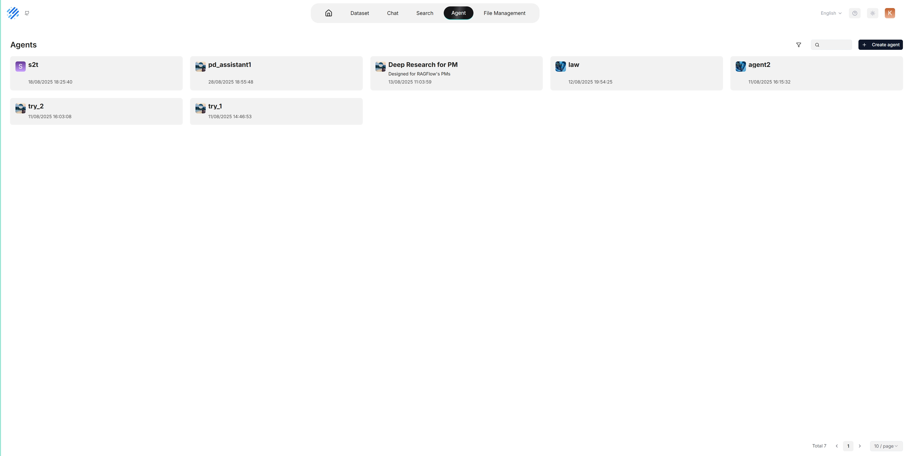
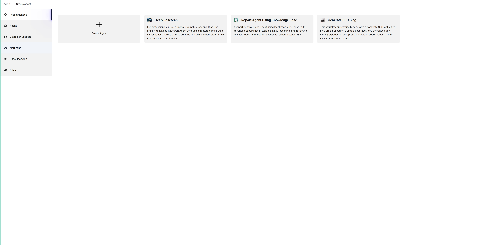
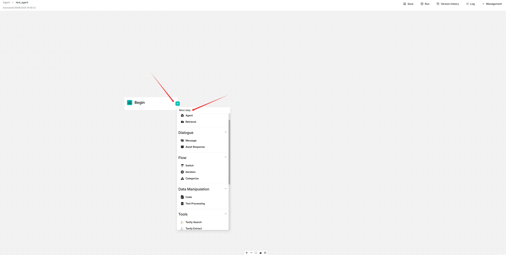

# 介绍

核心概念、基本操作、Agent 编辑器快速概览。

---

:::danger 已弃用！
新版本即将发布。
:::

## 核心概念

Agent 与 RAG 是互补的技术，在业务应用中相互增强彼此的能力。RAGFlow v0.8.0 引入了 Agent 机制，在前端提供无代码工作流编辑器，在后端提供基于图的完整任务编排框架。该机制建立在 RAGFlow 现有 RAG 解决方案之上，旨在编排搜索技术（如查询意图分类、对话引导和查询重写），以：

- 提供更高的检索质量，
- 适应更复杂的场景。

## 创建 Agent

:::tip 注意

在开始之前，请确保：

1. 已正确设置要使用的 LLM。详见[配置 API 密钥](../models/llm_api_key_setup.md)或[部署本地 LLM](../models/deploy_local_llm.md)。
2. 已配置数据集并正确解析了相应文件。详见[配置数据集](../dataset/configure_knowledge_base.md)。

:::

点击页面中上方的 **Agent** 选项卡进入 **Agent** 页面。如下图所示，该页面上的卡片代表已创建的 Agent，可以继续编辑。

我们还提供了适用于不同业务场景的模板。您可以从 Agent 模板生成 Agent，也可以从零开始创建：

1. 点击 **+ 创建 Agent** 显示 **Agent 模板**页面：

   

2. 要从零开始创建 Agent，点击**创建 Agent**。或者，要从模板创建 Agent，点击想要的卡片（如**深度研究**），在弹出的对话框中命名 Agent，然后点击**确定**确认。

   *现在您将进入**无代码工作流编辑器**页面。*

   

3. 点击 **Begin** 组件上的 **+** 按钮，在工作流中选择需要的组件。
4. 点击**保存**以应用对 Agent 的更改。
