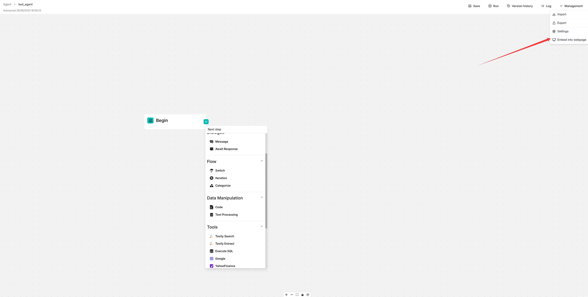

# 将 Agent 嵌入网页

您可以使用 iframe 将 Agent 嵌入第三方网页。

1. 开始之前，必须先[获取 API 密钥](../models/llm_api_key_setup.md)；否则会弹出错误提示。
2. 在 **Agent** 页面，点击目标 Agent 进入其编辑页面。
3. 点击画布右上角的**管理 > 嵌入网页**，弹出**嵌入网页**对话框。
4. 配置嵌入选项：
   - **嵌入类型**：选择全屏聊天（传统 iframe）或悬浮小部件（Intercom 风格）
   - **主题**：选择浅色或深色主题（全屏模式）
   - **隐藏头像**：切换头像可见性
   - **启用流式响应**：为小部件模式启用流式传输
   - **语言**：选择嵌入 Agent 的语言
5. 复制生成的 iframe 代码并嵌入到您的网页中。
6. **在新标签页中聊天**：点击"在新标签页中聊天"按钮，可以在单独的浏览器标签页中使用配置好的设置预览 Agent。这样可以在嵌入前测试 Agent。

