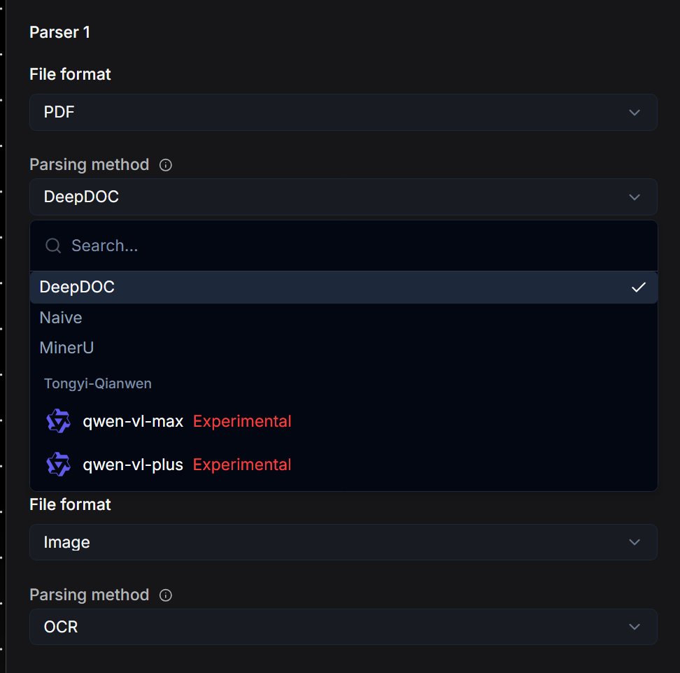
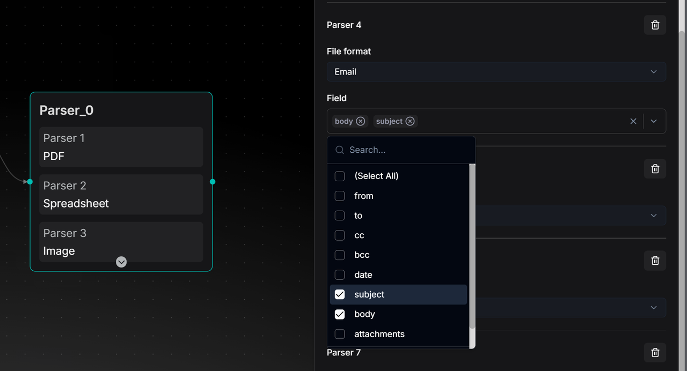
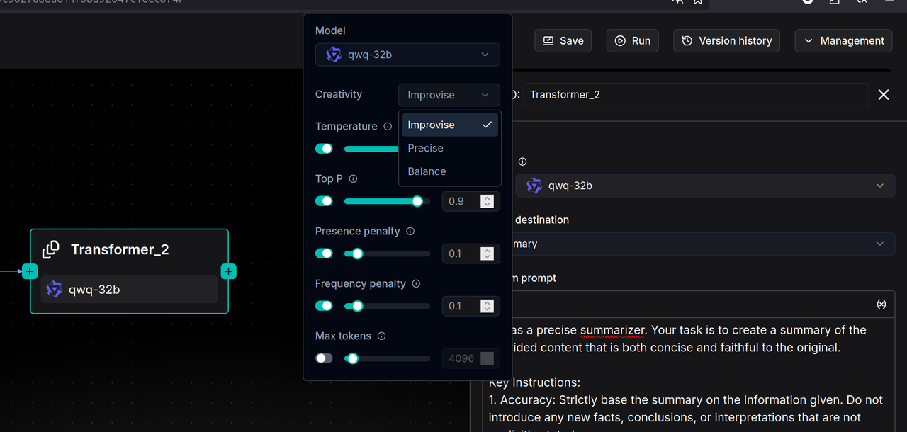
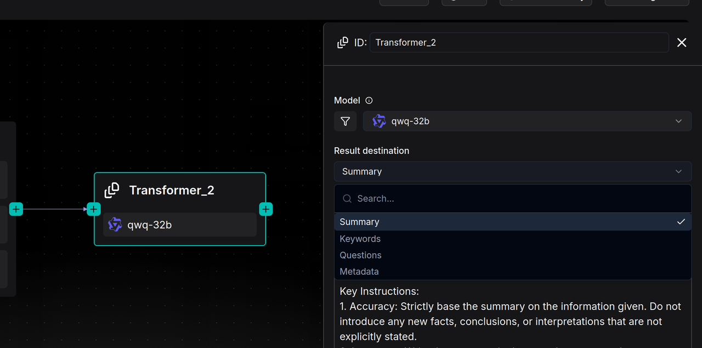
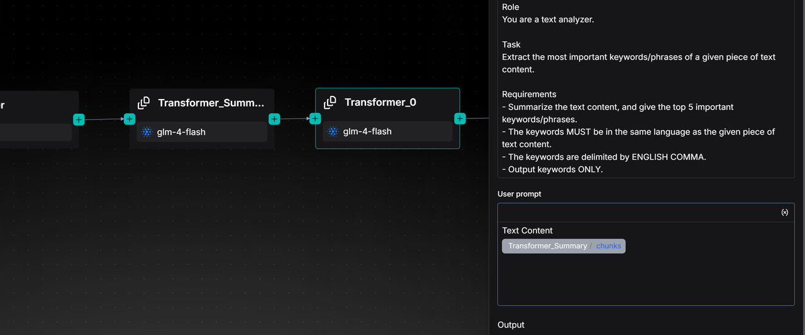
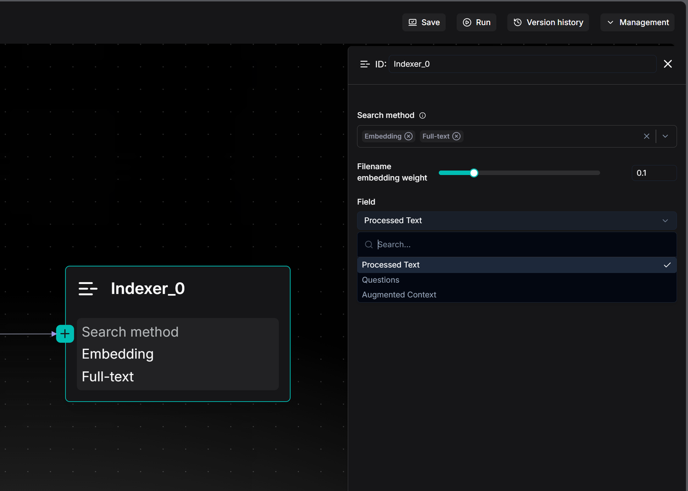
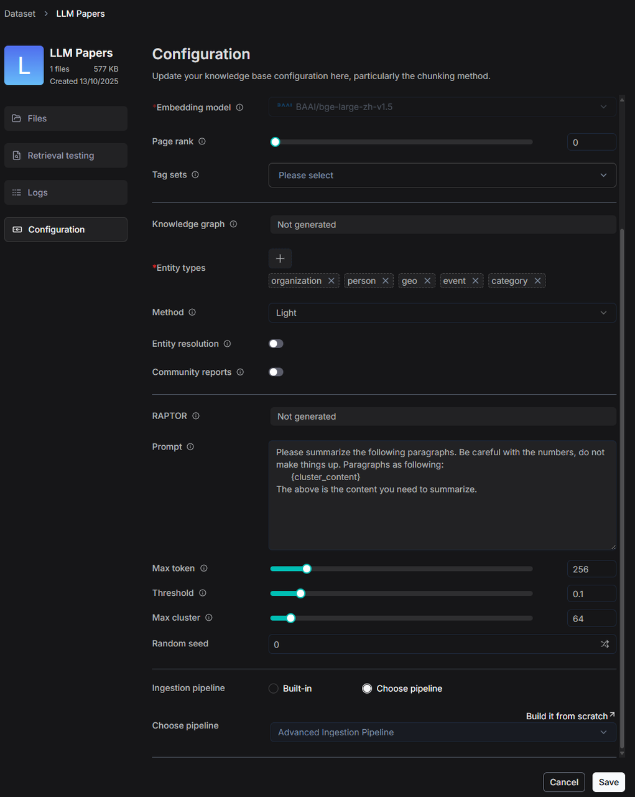

# 数据摄入管道快速入门

RAGFlow 的数据摄入管道是一个可定制、分步骤的工作流，用于准备文档以实现高质量的 AI 检索和回答。您可以将其理解为积木搭建：将不同的处理"组件"连接起来，创建适合特定文档和需求的管道。

---

RAGFlow 是一个开源 RAG 平台，具有强大的文档处理能力。其内置模块 DeepDoc 使用智能解析来分割文档以实现准确检索。为了应对多样化的实际需求——如不同的文件来源、复杂的排版和更丰富的语义——RAGFlow 现在引入了*数据摄入管道*。

数据摄入管道让您可以自定义文档处理的每个步骤：

- 按场景应用不同的解析和分割规则
- 添加预处理，如摘要生成或关键词提取
- 连接到云盘和在线数据源
- 使用高级版面感知模型处理表格和混合内容

这个灵活的管道可以适应您的数据，提高 RAG 中的回答质量。

## 1. 了解核心管道组件

- **Parser** 组件：读取并理解您的文件（PDF、图片、邮件等），提取文本和结构。
- **Transformer** 组件：通过使用 AI 添加摘要、关键词或问题来增强文本，以改善搜索效果。
- **Chunker** 组件：将长文本分割为大小合适的段落（"分块"），以便更好地进行 AI 检索。
- **Indexer** 组件：最后一步。将处理后的数据发送到文档引擎（支持混合全文和向量搜索）。

## 2. 创建数据摄入管道

1. 前往 **Agent** 页面。
2. 点击**创建 Agent**，从空白画布或预构建模板（推荐初学者使用）开始。
3. 在画布上，从右侧面板拖放并连接组件来设计您的流程（如 Parser → Chunker → Transformer → Indexer）。

*现在让我们构建一个典型的数据摄入管道！*

## 3. 配置 Parser 组件

**Parser** 组件将您的文件转换为结构化文本，同时保留排版、表格、标题和其他格式。它支持 8 个大类、23 种以上格式的文件，包括 PDF、图片、音频、视频、邮件、电子表格（Excel）、Word、PPT、HTML 和 Markdown。以下是一些关键配置：

- 对于 PDF 文件，选择以下之一：
  - **DeepDoc**（默认）：RAGFlow 的内置模型。最适合扫描文档或带有表格的复杂排版。
  - **MinerU**：在处理数学公式和复杂排版方面业界领先。
  - **Naive**：简单的文本提取。适用于不含复杂元素的纯文本 PDF。
- 对于图片文件：默认使用 OCR。也可以配置视觉语言模型（VLM）进行高级视觉理解。
- 对于邮件文件：选择要解析的特定字段（如"主题"、"正文"）进行精确提取。
- 对于电子表格：以 HTML 格式输出，保留行列结构。
- 对于 Word/PPT：以 JSON 格式输出，保留文档层级（标题、段落、幻灯片）。
- 对于文本与标记（HTML/MD）：自动去除格式化标签，输出干净文本。

## 4. 配置 Chunker 组件

Chunker 组件智能地分割文本。其目标是防止 AI 上下文窗口溢出，并提高混合搜索中的语义准确性。有两种核心方法（可以顺序使用）：

- 按 Token（默认）：
  - 分块大小：默认为 512 token。需要在检索质量和模型兼容性之间取得平衡。
  - 重叠：设置**重叠百分比**，将一个分块的末尾部分复制到下一个分块的开头。这可以提高语义连续性。
  - 分隔符：默认使用 `\n`（换行符），优先在自然段落边界分割，避免在句子中间截断。
- 按标题（层级式）：
  - 最适合结构化文档，如手册、论文、法律合同。
  - 系统按章节/段落结构分割文档。每个分块代表一个完整的结构单元。

:::caution 重要
在当前设计中，如果同时使用 Token 和 Title 方法，请先连接 **Token chunker** 组件，再连接 **Title chunker** 组件。将 **Title chunker** 直接连接到 **Parser** 可能会导致邮件、图片、电子表格和文本文件出现格式错误。
:::

## 5. 配置 Transformer 组件

**Transformer** 组件旨在弥合"语义鸿沟"。一般来说，它使用 AI 模型添加语义元数据，使您的内容在检索时更容易被发现。它有四种生成类型：

- 摘要（Summary）：创建简洁概述。
- 关键词（Keywords）：提取关键术语。
- 问题（Questions）：生成每个文本块可以回答的问题。
- 元数据（Metadata）：自定义元数据提取。

如果您有多个 **Transformer**，请确保为每个功能分别使用单独的 **Transformer** 组件（如一个用于摘要，另一个用于关键词）。

以下是一些关键配置：

- 模型模式：（选择一种）
  - Improvise：更有创意，适合生成问题。
  - Precise：严格忠实于文本，适合摘要/关键词提取。
  - Balance：大多数场景的折中方案。
- 提示词工程：每种生成类型的系统提示词都是开放可定制的。
- 连接方式：**Transformer** 可以连接到 **Parser** 之后（处理整个文档），也可以连接到 **Chunker** 之后（处理每个分块）。
- 变量引用：该节点不会自动获取内容。在用户提示词中，通过输入 `/` 并选择特定输出（如 `/{Parser.output}` 或 `/{Chunker.output}`）来手动引用上游变量。
- 串联连接：当串联 **Transformer** 时，如果变量引用正确，第二个 **Transformer** 组件将处理第一个的输出（如从摘要生成关键词）。

## 6. 配置 Indexer 组件

**Indexer** 组件为最佳检索效果进行索引。这是最后一步，将处理后的数据写入搜索引擎（如 Infinity、Elasticsearch、OpenSearch）。以下是一些关键配置：

- 检索方式：
  - 全文检索（Full-text）：用于精确匹配（代码、名称）的关键词搜索。
  - 嵌入（Embedding）：使用向量相似度进行语义搜索。
  - 混合（Hybrid，推荐）：两种方法结合，获得最佳召回率。
- 检索策略：
  - 处理后文本（默认）：对分块后的文本进行索引。
  - 问题：对生成的问题进行索引。通常比文本到文本的匹配具有更高的相似度。
  - 增强上下文：对摘要而非原始文本进行索引。适合广泛主题匹配。
- 文件名权重：滑动条，将文档文件名作为检索中的语义信息。
- 嵌入模型：自动使用创建数据集时设置的模型。

:::caution 重要
要同时搜索多个数据集，所有选定的数据集必须使用相同的嵌入模型。
:::

## 7. 测试运行

在管道画布上点击**运行**，上传示例文件并查看分步结果。

## 8. 将管道连接到数据集

1. 创建或编辑数据集时，找到 **Ingestion pipeline** 部分。
2. 点击**选择管道**并选择您保存的管道。

*现在，上传到此数据集的任何文件都将通过您的自定义管道进行处理。*
