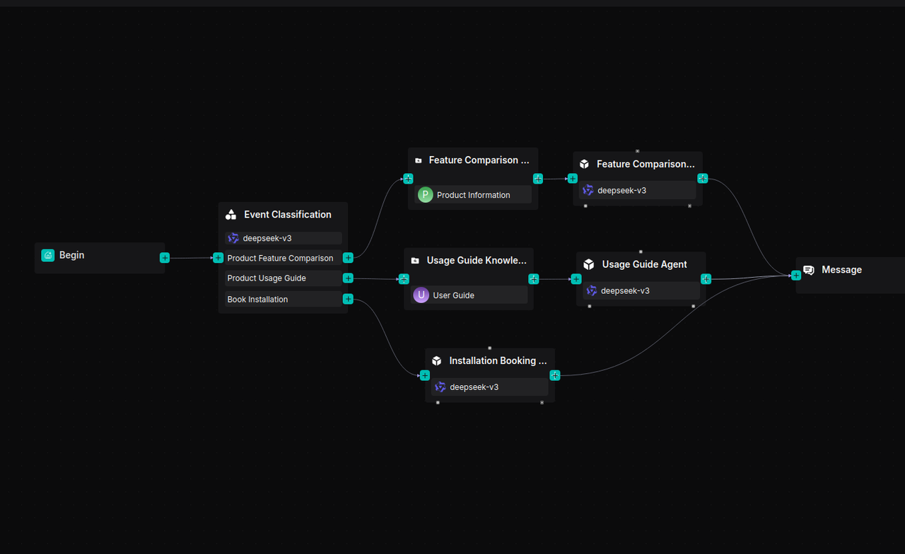
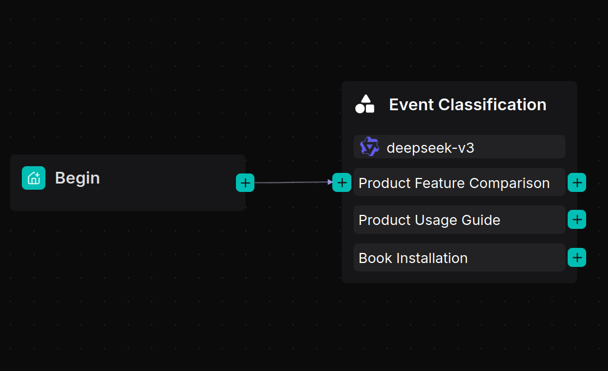
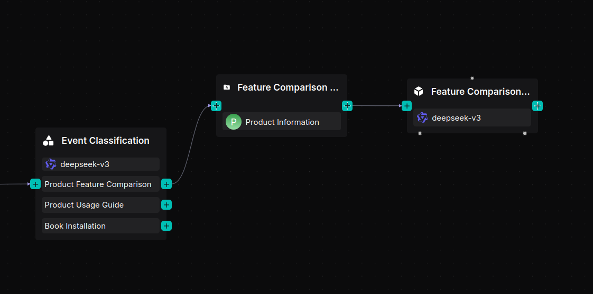
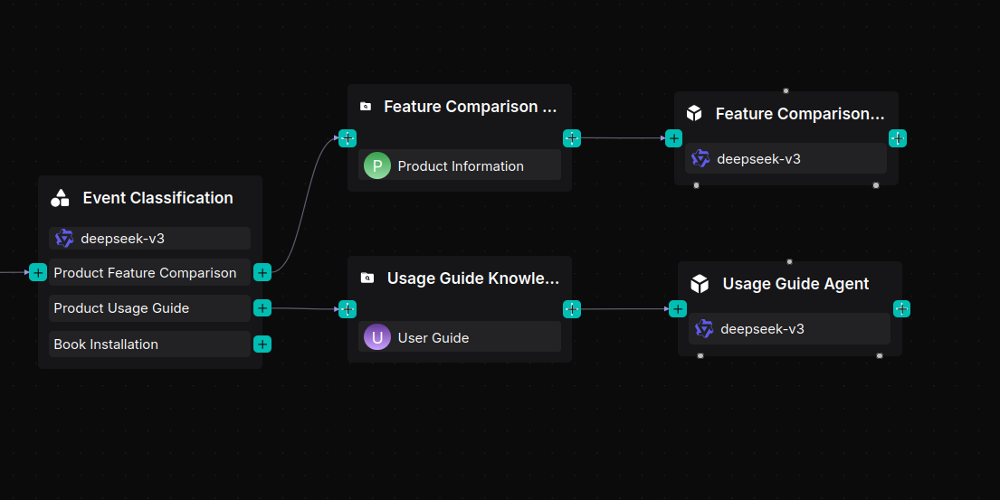
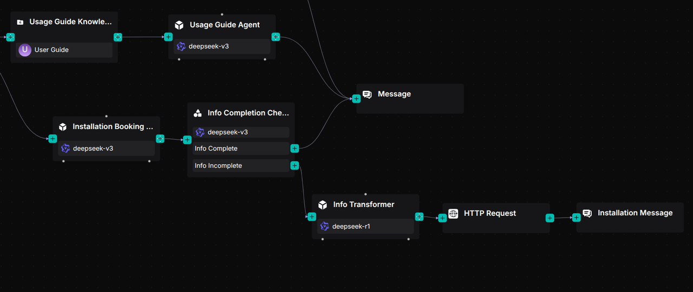
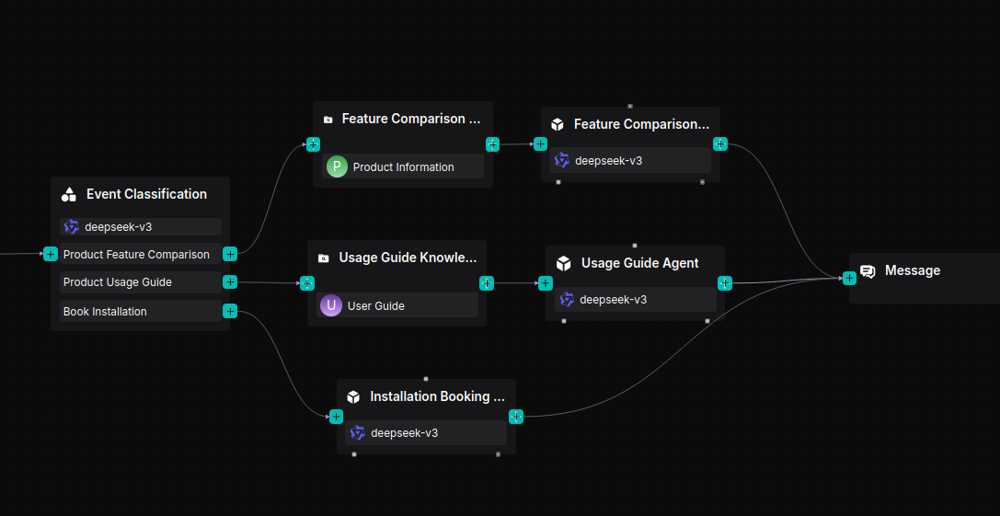

# 构建电商客服 Agent

本快速入门指南将引导您构建一个智能电商客服 Agent。该 Agent 使用 RAGFlow 的工作流和 Agent 框架自动处理常见的客户请求，如产品对比、使用说明和安装预约——提供快速、准确、具有上下文感知能力的回答。在以下各节中，我们将逐步带您构建如下所示的电商客服 Agent：



## 前提条件

- 示例数据集（可从 [Hugging Face](https://huggingface.co/datasets/InfiniFlow/Ecommerce-Customer-Service-Workflow) 获取）。

## 操作步骤

### 准备数据集

1. 确保已下载上述示例数据集。
2. 创建两个数据集：
   - 产品信息（Product Information）
   - 用户指南（User Guide）
3. 将相应的文档上传到每个数据集。
4. 在两个数据集的配置页面中，选择 **Manual** 作为分块方法。
   *RAGFlow 通过在"最小标题"级别分割文档来保持内容完整性，将文本和相关图形保持在一起。*

### 创建 Agent 应用

1. 导航到 **Agent** 页面，创建 Agent 应用以进入 Agent 画布。
   _画布上会出现一个 **Begin** 组件。_
2. 在 **Begin** 组件中配置问候消息，例如：

   ```
   Hi! What can I do for you?
   ```

### 添加 Categorize 组件



此 **Categorize** 组件使用 LLM 识别用户意图，将会话路由到正确的工作流。

### 构建产品功能对比工作流



1. 添加一个名为"产品功能对比知识库"的 **Retrieval** 组件，连接到"产品信息"数据集。
2. 在 **Retrieval** 组件之后添加一个名为"产品功能对比 Agent"的 **Agent** 组件。
3. 配置 Agent 的系统提示词：
   ```
   你是产品规格对比助手。请帮助用户对比产品，确认型号并以结构化的格式清晰地展示差异。
   ```
4. 配置用户提示词：
   ```
   用户查询为 /(Begin Input) sys.query
   参考信息为 /(产品功能对比知识库) formalized_content
   ```

### 构建产品使用指南工作流



1. 添加一个名为"使用指南知识库"的 **Retrieval** 组件，连接到"用户指南"数据集。
2. 添加一个名为"使用指南 Agent"的 Agent 组件。
3. 设置其系统提示词：
   ```
   你是产品使用指南助手。请提供设置、操作和故障排除的分步说明。
   ```
4. 设置用户提示词：
   ```
   用户查询为 /(Begin Input) sys.query
   参考信息为 /(使用指南知识库) formalized_content
   ```

### 构建安装预约助手



1. 添加一个名为"安装预约 Agent"的 **Agent** 组件。
2. 配置其系统提示词以收集三项信息：
   - 联系电话
   - 首选安装时间
   - 安装地址

   *全部三项收集完毕后，Agent 确认信息并通知用户技术人员将致电联系。*

3. 设置用户提示词：
   ```
   用户查询为 /(Begin Input) sys.query
   ```

4. 在三个 Agent 分支之后连接一个 **Message** 组件。
   *此组件向用户显示最终回复。*

   

5. 点击**保存** → **运行**查看执行结果，验证每个查询是否被正确路由和回答。
6. 您可以通过以下提问来测试工作流：
   - 产品对比问题
   - 使用指导问题
   - 安装预约请求
