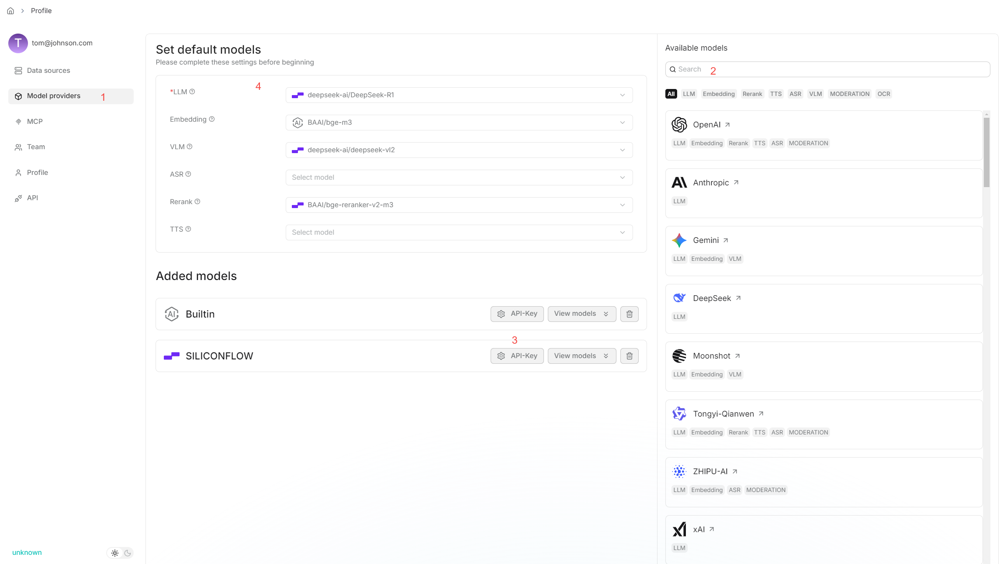
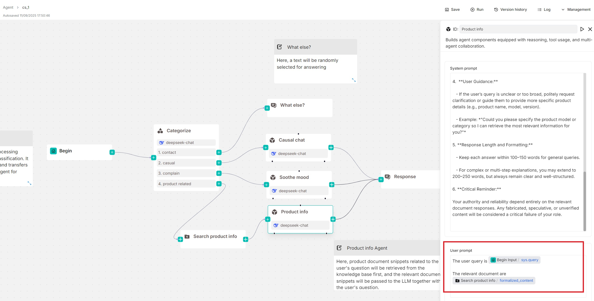
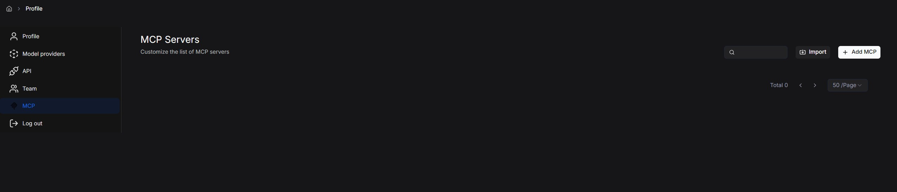
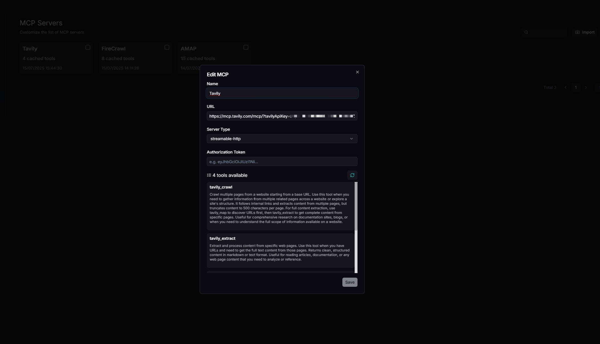
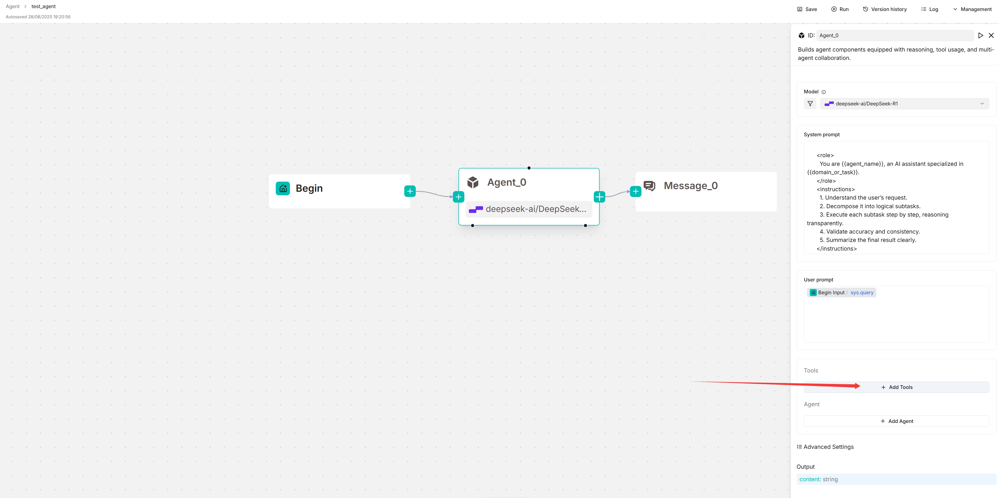
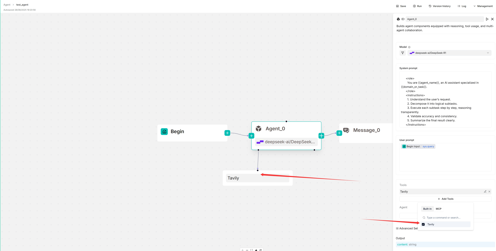
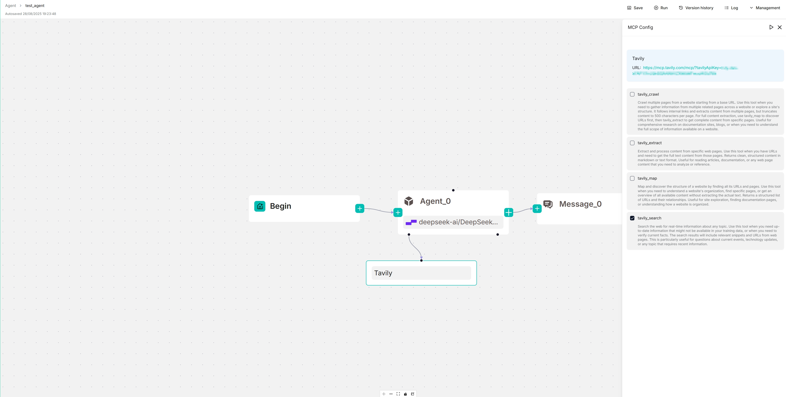
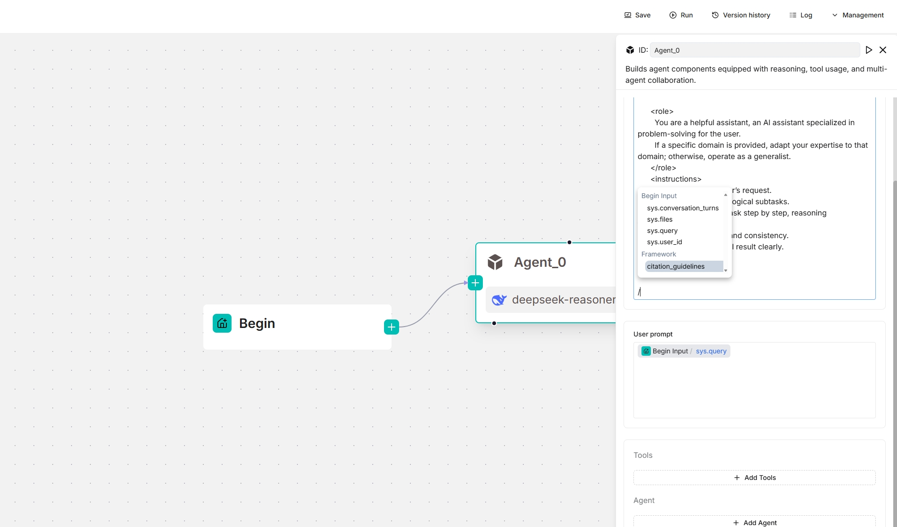
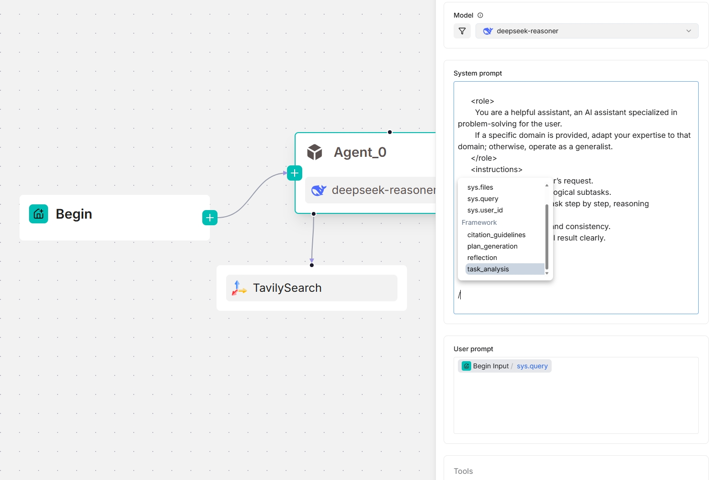

# Agent 组件

具备推理、工具使用和多 Agent 协作能力的组件。

---

**Agent** 组件对 LLM 进行微调并设置其提示词。从 v0.20.5 开始，**Agent** 组件可以独立工作，并具备以下能力：

- 基于环境反馈进行自主推理、反思和调整。
- 使用工具或子 Agent 完成任务。

## 适用场景

当需要 LLM 辅助总结、翻译或控制各类任务时，**Agent** 组件必不可少。

## 前提条件

1. 确保已正确配置对话模型：

  

2. 如果 Agent 涉及数据集检索，请确保[已正确配置目标数据集](../../dataset/configure_knowledge_base.md)。

## 快速入门

### 1. 点击 **Agent** 组件显示配置面板

相应的配置面板会出现在画布右侧。使用该面板定义和微调 **Agent** 组件的行为。

### 2. 选择模型

点击 **Model**，从下拉菜单中选择对话模型。

:::tip 注意
如果没有可供选择的模型，请检查是否已在 **Model providers** 页面添加了对话模型。
:::

### 3. 更新系统提示词（可选）

系统提示词通常定义模型的角色。您可以保持默认系统提示词，也可以自定义覆盖默认值。

### 4. 更新用户提示词

用户提示词通常定义模型的任务。您会看到 `sys.query` 变量已自动填充。输入 `/` 或点击 **(x)** 可查看或添加变量。

在本快速入门中，假设您的 **Agent** 组件独立使用（下方无工具或子 Agent），则可能还需要使用 `formalized_content` 变量指定检索到的分块：

### 5. 跳过工具和 Agent

**+ 添加工具**和 **+ 添加 Agent** 部分*仅*在需要将 **Agent** 组件配置为规划器（下方有工具或子 Agent）时使用。在本快速入门中，假设 **Agent** 组件独立使用（下方无工具或子 Agent）。

### 6. 选择下一个组件

必要时，点击 **Agent** 组件上的 **+** 按钮，从下拉列表中选择工作流中的下一个组件。

## 作为客户端连接 MCP 服务器

:::danger 重要
在本节中，假设 **Agent** 配置为规划器，下方有一个 Tavily 工具。
:::

### 1. 导航到 MCP 配置页面

### 2. 配置 Tavily MCP 服务器

更新 MCP 服务器的名称、URL（含 API 密钥）、服务器类型及其他必要设置。配置正确后，可用的工具将会显示。

### 3. 导航到 Agent 编辑页面

### 4. 连接到 MCP 服务器

1. 点击 **+ 添加工具**：

2. 点击 **MCP** 显示可用的 MCP 服务器。

3. 选择 MCP 服务器：

   *目标 MCP 服务器会出现在 Agent 组件下方，Agent 将自主决定何时调用其提供的可用工具。*

  

### 5. 更新系统提示词以指定触发条件（可选）

为确保工具调用的可靠性，可以在系统提示词中指定哪些任务应触发相应的工具调用。

### 6. 查看 MCP 服务器的可用工具

在画布上，点击新出现的 Tavily 服务器查看并选择其可用工具：

## 配置说明

### Model

点击 **Model** 下拉菜单显示模型配置窗口。

- **Model**：要使用的对话模型。
  - 确保已在 **Model providers** 页面正确设置对话模型。
  - 可以为不同组件使用不同模型，以增加灵活性或提升整体性能。
- **Creativity**：**Temperature**、**Top P**、**Presence penalty** 和 **Frequency penalty** 的快捷设置，表示模型的自由程度。从 **Improvise**、**Precise** 到 **Balance**，每个预设配置对应一组独特的参数组合。
  该参数有三个选项：
  - **Improvise**：产生更具创造性的回答。
  - **Precise**：（默认）产生更保守的回答。
  - **Balance**：**Improvise** 和 **Precise** 之间的折中方案。
- **Temperature**：模型输出的随机性程度。
  默认值为 0.1。
  - 较低的值会产生更确定、更可预测的输出。
  - 较高的值会产生更多样、更有创意的输出。
  - 温度设为零时，相同提示词会产生相同的输出。
- **Top P**：核采样。
  - 通过设置阈值 *P* 并将采样限制在累积概率超过 *P* 的 token 上，降低生成重复或不自然文本的概率。
  - 默认值为 0.3。
- **Presence penalty**：鼓励模型在回答中包含更多样化的 token。
  - 较高的 **presence penalty** 值使模型更有可能生成之前未在输出文本中出现过的 token。
  - 默认值为 0.4。
- **Frequency penalty**：阻止模型在生成文本中过于频繁地重复相同的词或短语。
  - 较高的 **frequency penalty** 值使模型在使用重复 token 时更加保守。
  - 默认值为 0.7。
- **Max tokens**：
  - 模型的最大上下文大小。

:::tip 注意
- 无需所有组件都使用同一个模型。如果某个模型在特定任务上表现不佳，可以考虑换用其他模型。
- 如果不确定 **Temperature**、**Top P**、**Presence penalty** 和 **Frequency penalty** 的机制，只需从 **Creativity** 的三个选项中选择一个即可。
:::

### 系统提示词

通常，系统提示词用于描述 LLM 的任务、指定应答方式以及说明其他杂项要求。我们不打算展开讨论这个话题，因为它的范围可以像提示词工程一样广泛。但请注意，系统提示词通常与键（变量）配合使用，变量作为 LLM 的各种数据输入。

**Agent** 组件依赖键（变量）来指定其数据输入。其直接上游组件*不一定*是其数据输入，工作流中的箭头*仅*表示处理顺序。**Agent** 组件中的键与系统提示词配合使用，为 LLM 指定数据输入。使用正斜杠 `/` 或 **(x)** 按钮查看可用的键。

#### 高级用法

从 v0.20.5 开始，**System prompt** 字段中提供了四个框架级提示词块，允许您在框架级别自定义和*覆盖*提示词。输入 `/` 或点击 **(x)** 查看它们；它们出现在下拉菜单的 **Framework** 条目下。

- `task_analysis` 提示词块
  - 该块负责分析任务——可以是用户任务，也可以是当 **Agent** 组件充当子 Agent 时由主导 Agent 分配的任务。
  - 参考设计：[analyze_task_system.md](https://github.com/infiniflow/ragflow/blob/main/rag/prompts/analyze_task_system.md) 和 [analyze_task_user.md](https://github.com/infiniflow/ragflow/blob/main/rag/prompts/analyze_task_user.md)
  - *仅*在该 **Agent** 组件作为规划器（下方有工具或子 Agent）时可用。
  - 输入变量：
    - `agent_prompt`：系统提示词。
    - `task`：主导 Agent 或子 Agent 的用户提示词。主导 Agent 的用户提示词由用户定义，子 Agent 的用户提示词由主导 Agent 在委派任务时定义。
    - `tool_desc`：可调用工具和子 Agent 的描述。
    - `context`：操作上下文，存储 Agent、工具和子 Agent 之间的交互记录；初始为空。
- `plan_generation` 提示词块
  - 该块根据任务分析结果为 **Agent** 组件创建下一步执行计划。
  - 参考设计：[next_step.md](https://github.com/infiniflow/ragflow/blob/main/rag/prompts/next_step.md)
  - *仅*在该 **Agent** 组件作为规划器（下方有工具或子 Agent）时可用。
  - 输入变量：
    - `task_analysis`：当前任务的分析结果。
    - `desc`：当前被调用的工具或子 Agent 的描述。
    - `today`：当天的日期。
- `reflection` 提示词块
  - 该块使 **Agent** 组件能够进行反思，提高任务的准确性和效率。
  - 参考设计：[reflect.md](https://github.com/infiniflow/ragflow/blob/main/rag/prompts/reflect.md)
  - *仅*在该 **Agent** 组件作为规划器（下方有工具或子 Agent）时可用。
  - 输入变量：
    - `goal`：当前任务的目标。对于主导 Agent 或子 Agent，它是用户提示词。主导 Agent 的用户提示词由用户定义，子 Agent 的用户提示词由主导 Agent 定义。
    - `tool_calls`：工具调用的历史记录
    - `call.name`：被调用工具的名称。
    - `call.result`：工具调用的结果
- `citation_guidelines` 提示词块
  - 参考设计：[citation_prompt.md](https://github.com/infiniflow/ragflow/blob/main/rag/prompts/citation_prompt.md)

*以下截图分别展示了 **Agent** 组件作为独立模块和作为规划器（下方有 Tavily 工具）时可用的框架提示词块：*

### 用户提示词

用户定义的提示词。默认为 `sys.query`，即用户查询。一般来说，当 **Agent** 组件作为独立模块使用（不作为规划器）时，通常需要在此处指定相应 **Retrieval** 组件的输出变量（`formalized_content`），作为 LLM 输入的一部分。

### 工具

您可以将 **Agent** 组件用作协作者，借助其他工具进行推理和反思；例如，**Retrieval** 可以作为 **Agent** 的一个工具。

### Agent

您可以将 **Agent** 组件用作协作者，借助子 Agent 或其他工具进行推理和反思，形成多 Agent 系统。

### 消息窗口大小

一个整数，指定输入到 LLM 的前几轮对话数量。例如，如果设置为 12，最近 12 轮对话的 token 将被输入给 LLM。此功能会消耗额外的 token。

:::tip 重要
此功能*仅*用于多轮对话。
:::

### 最大重试次数

定义 Agent 在停止或报告失败之前，对失败任务或操作进行重试的最大尝试次数。

### 错误后延迟

Agent 在重试失败任务之前等待的时间（秒），有助于避免立即重复尝试，让系统条件得到改善。默认值为 1 秒。

### 最大反思轮次

定义所选对话模型的最大反思轮次。默认值为 1 轮。

:::tip 注意
增大此值会显著延长 Agent 的响应时间。
:::

### 输出

**Agent** 组件输出的全局变量名称，可以被工作流中的其他组件引用。

## 常见问题

### 为什么我的 Agent 响应时间这么长？

详情参见[此处](../best_practices/accelerate_agent_question_answering.md)。
