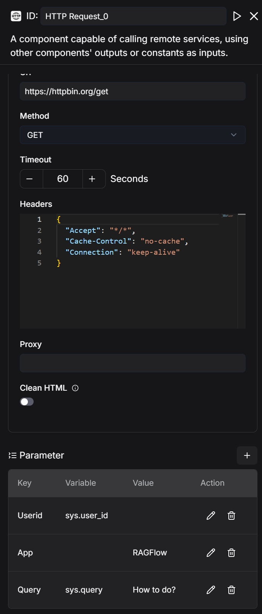
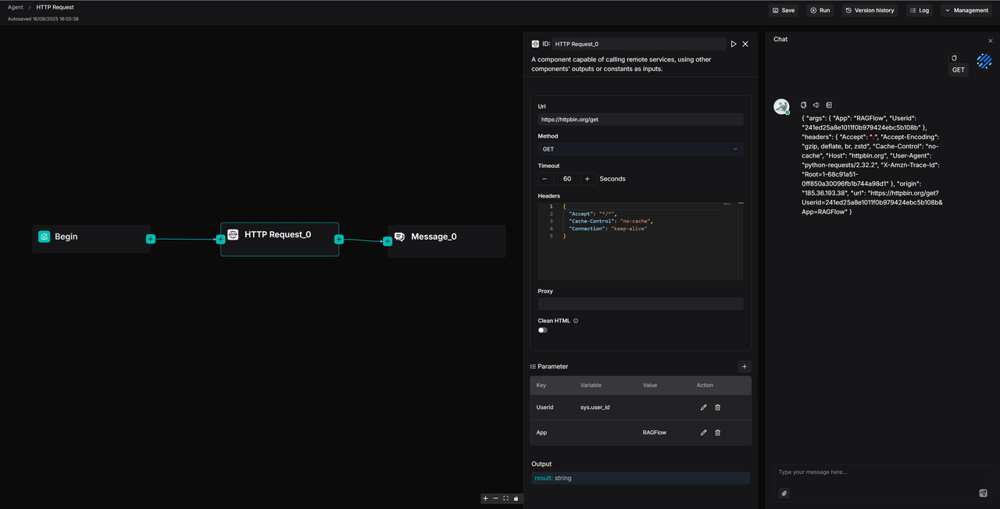

# HTTP request 组件

调用远程服务的组件。

---

**HTTP request** 组件通过提供 URL 和 HTTP 方法来访问远程 API 或服务，并接收响应。您可以自定义请求头、参数、代理和超时设置，使用 GET、POST 等常用方法。它适用于在工作流中与外部系统交换数据。

## 前提条件

- 一个可访问的远程 API 或服务。
- 如果目标服务需要认证，请在请求头中添加 Token 或凭证。

## 配置说明

### URL

*必填*。完整的请求地址，例如：http://api.example.com/data。

### 请求方法

要选择的 HTTP 请求方法。可用选项：

- GET
- POST
- PUT

### 超时

请求的最大等待时间，以秒为单位。默认值为 `60`。

### 请求头

可以在此设置自定义 HTTP 请求头，例如：

```http
{
  "Accept": "application/json",
  "Cache-Control": "no-cache",
  "Connection": "keep-alive"
}
```

### 代理

可选。此请求使用的代理服务器地址。

### 清除 HTML

`Boolean`：是否从返回结果中移除 HTML 标签，只保留纯文本。

### 参数

*可选*。随 HTTP 请求发送的参数。支持键值对：

- 要使用动态系统变量赋值，请设为 Variable。
- 要在特定条件下覆盖这些动态值而使用固定静态值，请选择 Value。

:::tip 注意
- 对于 GET 请求，这些参数附加在 URL 末尾。
- 对于 POST/PUT 请求，它们作为请求体发送。
:::

#### 配置示例



#### 响应示例

```html
{ "args": { "App": "RAGFlow", "Query": "How to do?", "Userid": "241ed25a8e1011f0b979424ebc5b108b" }, "headers": { "Accept": "/", "Accept-Encoding": "gzip, deflate, br, zstd", "Cache-Control": "no-cache", "Host": "httpbin.org", "User-Agent": "python-requests/2.32.2", "X-Amzn-Trace-Id": "Root=1-68c9210c-5aab9088580c130a2f065523" }, "origin": "185.36.193.38", "url": "https://httpbin.org/get?Userid=241ed25a8e1011f0b979424ebc5b108b&App=RAGFlow&Query=How+to+do%3F" }
```

### 输出

HTTP request 组件输出的全局变量名称，可以被工作流中的其他组件引用。

- `Result`：`string`——远程服务返回的响应。

## 示例

这是一个使用示例：工作流从 **Begin** 组件通过 **HTTP Request_0** 组件向 `https://httpbin.org/get` 发送 GET 请求，将参数传递给服务器，最后通过 **Message_0** 组件输出结果。


