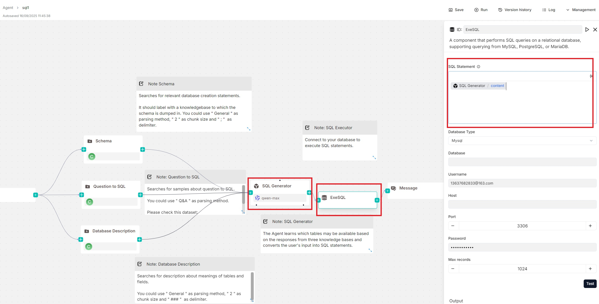

# Execute SQL 工具

在指定关系数据库上执行 SQL 查询的工具。

---

**Execute SQL** 工具允许您连接到关系数据库并运行 SQL 查询，无论查询是直接输入的还是由系统的 Text2SQL 功能通过 **Agent** 组件生成的。

## 前提条件

- 一个已正确配置并运行的数据库实例。
- 数据库必须属于以下类型之一：
  - MySQL
  - PostgreSQL
  - MariaDB
  - Microsoft SQL Server

## 示例

您可以将 **Agent** 组件与 **Execute SQL** 工具配对使用，由 **Agent** 生成 SQL 语句，**Execute SQL** 工具处理数据库连接和查询执行。下图所示的 **Text-to-SQL data expert** Agent 模板就是一个示例配置：

## 配置说明

### SQL 语句

此文本输入框允许您编写静态 SQL 查询（如 `SELECT * FROM my_table`），以及使用变量的动态 SQL 查询。

:::tip 注意
点击 **(x)** 或输入 `/` 来插入变量。
:::

对于动态 SQL 查询，您可以在 SQL 查询中包含变量，如 `SELECT * FROM /sys.query`；如果 **Agent** 组件与 **Execute SQL** 工具配对以生成 SQL 任务（参见[示例](#示例)部分），您可以直接将该 **Agent** 的输出 `content` 插入到此字段中。

### 数据库类型

支持的数据库类型。目前提供以下数据库类型：

- MySQL
- PostgreSQL
- MariaDB
- Microsoft SQL Server (Mssql)

### 数据库

仅在以 **Split** 方式选择时出现。

### 用户名

具有数据库访问权限的用户名。

### 主机

数据库服务器的 IP 地址。

### 端口

数据库服务器监听的端口号。

### 密码

数据库用户的密码。

### 最大记录数

SQL 查询返回的最大记录数，用于控制响应大小并提高效率。默认值为 `1024`。

### 输出

**Execute SQL** 工具提供两个输出变量：

- `formalized_content`：字符串。如果在 **Message** 组件中引用此变量，返回的记录将以表格形式显示。
- `json`：对象数组。如果在 **Message** 组件中引用此变量，返回的记录将以键值对形式呈现。
