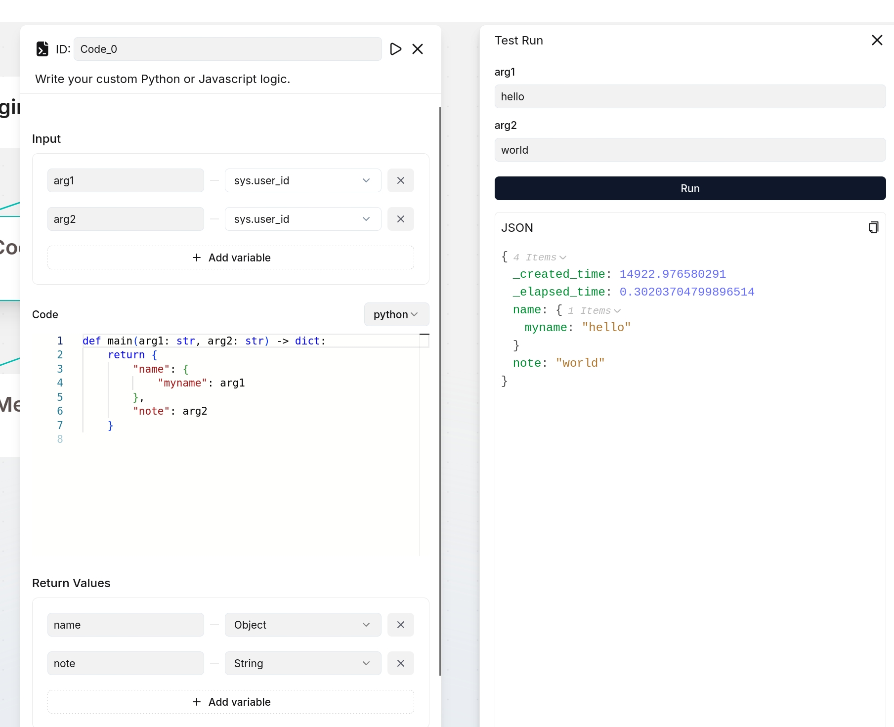
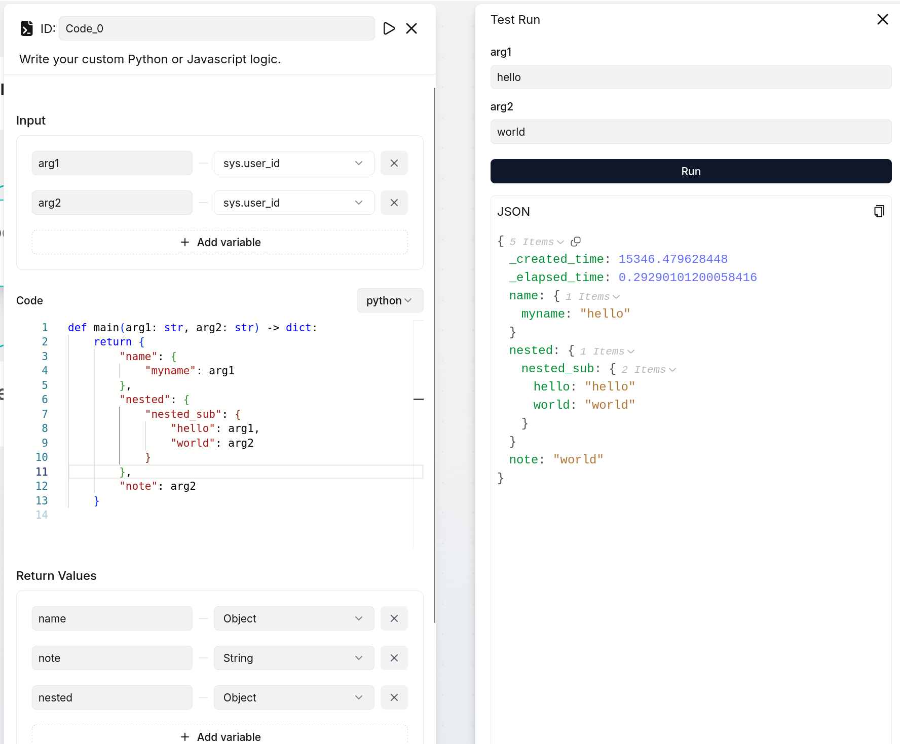
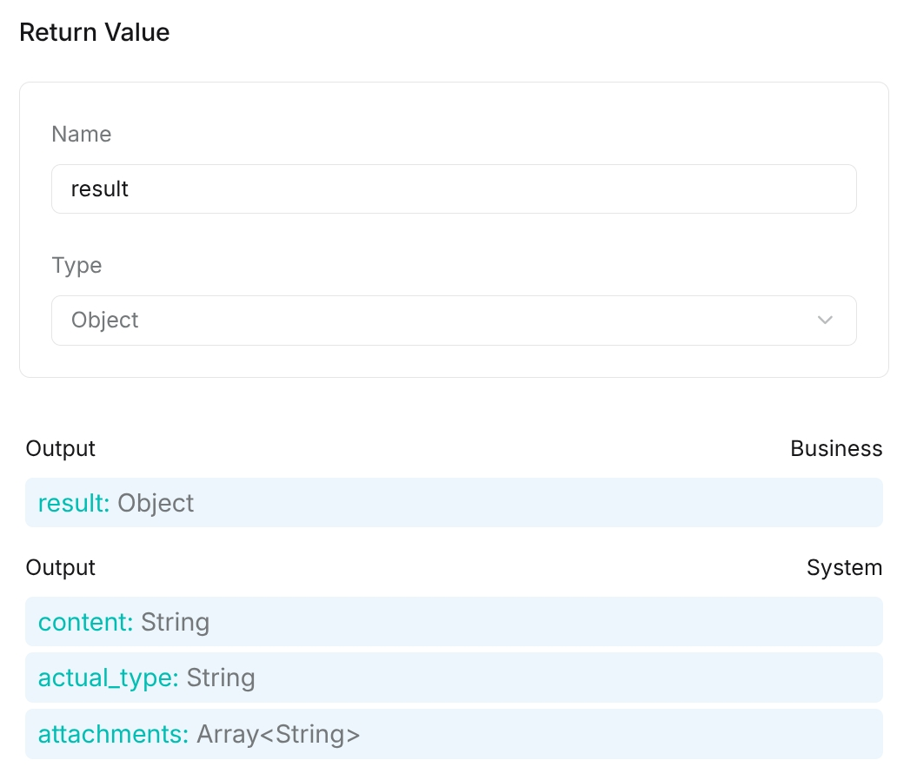
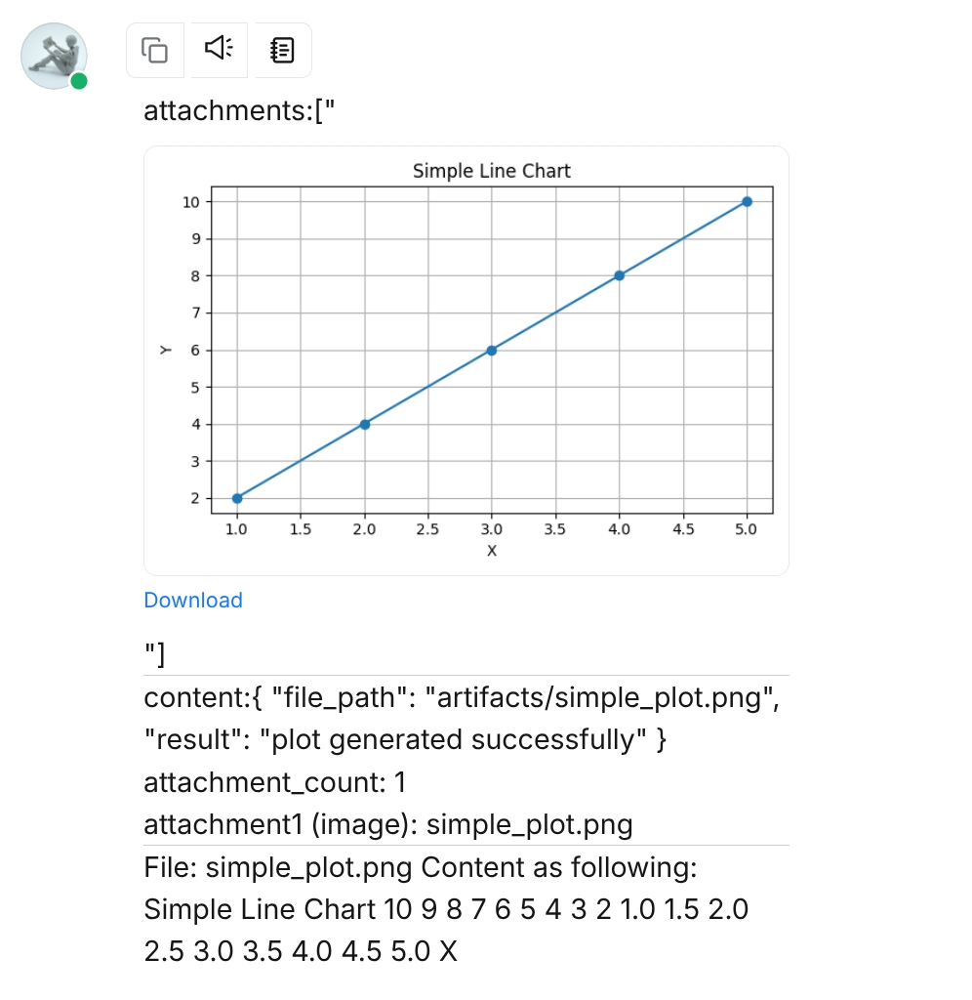

# Code 组件

允许用户将 Python 或 JavaScript 代码集成到 Agent 中以进行动态数据处理的组件。

---

## 适用场景

当需要将复杂代码逻辑（Python 或 JavaScript）集成到 Agent 中以进行动态数据处理时，**Code** 组件必不可少。

## 前提条件

### 1. 确保正确安装 gVisor

我们使用 gVisor 将代码执行与宿主机系统隔离。请按照[官方安装指南](https://gvisor.dev/docs/user_guide/install/)安装 gVisor，确保操作系统兼容后再继续。

### 2. 确保正确安装 Sandbox

RAGFlow Sandbox 是一个安全、可插拔的代码执行后端。它作为 **Code** 组件的代码执行器。请按照[此处的说明](https://github.com/infiniflow/ragflow/tree/main/agent/sandbox)安装 RAGFlow Sandbox。

:::note Docker 客户端版本
executor manager 镜像现在捆绑了 Docker CLI `29.1.0`（API 1.44+）。旧镜像搭载的是 Docker 24.x，在新版 Docker 守护进程下会报错 `client version 1.43 is too old`。如遇到此错误，请拉取最新的 `infiniflow/sandbox-executor-manager:latest` 或在 `./sandbox/executor_manager` 中重新构建。
:::

:::tip 注意
如果 RAGFlow Sandbox 不能正常工作，请务必查阅本文档中的[故障排查](#故障排查)部分。可以保证它能解决 99.99% 的问题！
:::

### 3.（可选）安装必要依赖

如果需要将自己的 Python 或 JavaScript 包导入 Sandbox，请按照[如何将自己的 Python 或 JavaScript 包导入 Sandbox？](#如何将自己的-python-或-javascript-包导入-sandbox)部分中的命令安装额外依赖。

### 4. 在 RAGFlow 中启用 Sandbox 相关设置

确保 `ragflow/docker/.env` 中所有 Sandbox 相关设置均已启用。

### 5. 更改后重启服务

对配置或环境的任何更改都*需要*完全重启服务才能生效。

## 配置说明

### 输入

您可以为 **Code** 组件指定多个输入源。点击 **Input variables** 部分的 **+ 添加变量**包含所需的输入变量。

### 代码

此字段允许您输入和编辑源代码。

:::danger 重要
如果代码实现中包含定义的变量（无论是输入还是输出变量），请确保它们也在相应的 **Input** 或 **Output** 部分中指定。
:::

#### Python 代码示例

```Python
    def main(arg1: str, arg2: str) -> dict:
        return {
            "result": arg1 + arg2,
        }
```

#### JavaScript 代码示例

```JavaScript

    const axios = require('axios');
    async function main(args) {
      try {
        const response = await axios.get('https://github.com/infiniflow/ragflow');
        console.log('Body:', response.data);
      } catch (error) {
        console.error('Error:', error.message);
      }
    }
```

### 返回值

在此定义 **Code** 组件的输出变量。

:::danger 重要
如果在此处定义了输出变量，请确保在代码实现中也进行了定义；否则它们的值将为 `null`。以下是两个示例：




:::

### 输出

输出分为两部分：

- **Business**：在**返回值**中定义的业务输出
- **System**：自动填充的运行时字段，如 `content`、`actual_type` 和 `attachments`

例如，以下代码生成一个简单的折线图：

```Python
def main() -> dict:
    from pathlib import Path

    import matplotlib
    matplotlib.use("Agg")
    import matplotlib.pyplot as plt

    artifacts_dir = Path("artifacts")
    artifacts_dir.mkdir(parents=True, exist_ok=True)

    x = [1, 2, 3, 4, 5]
    y = [2, 4, 6, 8, 10]

    output_path = artifacts_dir / "simple_plot.png"

    plt.figure(figsize=(6, 4))
    plt.plot(x, y, marker="o")
    plt.title("Simple Line Chart")
    plt.xlabel("X")
    plt.ylabel("Y")
    plt.grid(True)
    plt.tight_layout()
    plt.savefig(output_path)
    plt.close()

    return {
        "result": "plot generated successfully",
        "file_path": str(output_path),
    }
```


业务输出显示您定义的返回值，而系统输出显示生成的 `content`、推断的 `actual_type` 和收集的 `attachments`。



## 故障排查

### `HTTPConnectionPool(host='sandbox-executor-manager', port=9385): Read timed out.`

**根本原因**

- 未正确安装 gVisor，`runsc` 未被识别为有效的 Docker 运行时。
- 未拉取所需的 runner 基础镜像，没有 runner 启动。

**解决方案**

对于 gVisor 问题：

1. 安装 [gVisor](https://gvisor.dev/docs/user_guide/install/)。
2. 重启 Docker。
3. 运行以下命令二次确认：

   ```bash
   docker run --rm --runtime=runsc hello-world
   ```

对于基础镜像问题，拉取所需的基础镜像：

```bash
docker pull infiniflow/sandbox-base-nodejs:latest
docker pull infiniflow/sandbox-base-python:latest
```

### `docker: Error response from daemon: client version 1.43 is too old. Minimum supported API version is 1.44`

**根本原因**

executor manager 镜像包含 Docker CLI 24.x（API 1.43），但宿主 Docker 守护进程（如 Docker 25+ / 29.x）现在需要 API 1.44+。

**解决方案**

拉取最新的 executor manager 镜像或在 `./sandbox/executor_manager` 中重新构建以升级内置 Docker 客户端：

```bash
docker pull infiniflow/sandbox-executor-manager:latest
# 或
docker build -t sandbox-executor-manager:latest ./sandbox/executor_manager
```

### `HTTPConnectionPool(host='none', port=9385): Max retries exceeded.`

**根本原因**

`sandbox-executor-manager` 未在 `/etc/hosts` 中映射。

**解决方案**

在 `/etc/hosts` 中添加新条目：

`127.0.0.1 es01 infinity mysql minio redis sandbox-executor-manager`

### `Container pool is busy`

**根本原因**

所有 runner 当前都在使用中，正在执行任务。

**解决方案**

请稍后重试，或增加配置中的池大小以提高可用性并减少等待时间。

## 常见问题

### 如何将自己的 Python 或 JavaScript 包导入 Sandbox？

要导入 Python 包，请更新 **sandbox_base_image/python/requirements.txt** 安装所需依赖。例如，要添加 `openpyxl` 包，执行以下命令行操作：

```bash {4,6}
(ragflow) ➜ ragflow/sandbox main ✓ pwd # 确保在正确的目录中
/home/infiniflow/workspace/ragflow/sandbox

(ragflow) ➜ ragflow/sandbox main ✓ echo "openpyxl" >> sandbox_base_image/python/requirements.txt # 将包添加到 requirements.txt

(ragflow) ➜ ragflow/sandbox main ✗ cat sandbox_base_image/python/requirements.txt # 确认包已添加
numpy
pandas
requests
openpyxl # 就在这里

(ragflow) ➜ ragflow/sandbox main ✗ make # 重建 docker 镜像，此命令将重建镜像并立即启动服务。如仅构建镜像，请使用 `make build`。

(ragflow) ➜ ragflow/sandbox main ✗ docker exec -it sandbox_python_0 /bin/bash # 进入容器检查包是否已安装


# 在容器中
nobody@ffd8a7dd19da:/workspace$ python # 启动 python shell
Python 3.11.13 (main, Aug 12 2025, 22:46:03) [GCC 12.2.0] on linux
Type "help", "copyright", "credits" or "license" for more information.
>>> import openpyxl # 导入包以验证安装
>>>
# 没问题！
```

要导入 JavaScript 包，请导航到 `sandbox_base_image/nodejs`，使用 `npm` 安装所需的包。例如，要添加 `lodash` 包，运行以下命令：

```bash
(ragflow) ➜ ragflow/sandbox main ✓ pwd
/home/infiniflow/workspace/ragflow/sandbox

(ragflow) ➜ ragflow/sandbox main ✓ cd sandbox_base_image/nodejs

(ragflow) ➜ ragflow/sandbox/sandbox_base_image/nodejs main ✓ npm install lodash

(ragflow) ➜ ragflow/sandbox/sandbox_base_image/nodejs main ✓ cd ../.. # 回到 sandbox 根目录

(ragflow) ➜ ragflow/sandbox main ✗ make # 重建 docker 镜像，此命令将重建镜像并立即启动服务。如仅构建镜像，请使用 `make build`。

(ragflow) ➜ ragflow/sandbox main ✗ docker exec -it sandbox_nodejs_0 /bin/bash # 进入容器检查包是否已安装

# 在容器中
nobody@dd4bbcabef63:/workspace$ npm list lodash # 通过 npm list 验证
/workspace
`-- lodash@4.17.21 extraneous

nobody@dd4bbcabef63:/workspace$ ls node_modules | grep lodash # 或通过列出 node_modules 验证
lodash

# 没问题！
```
