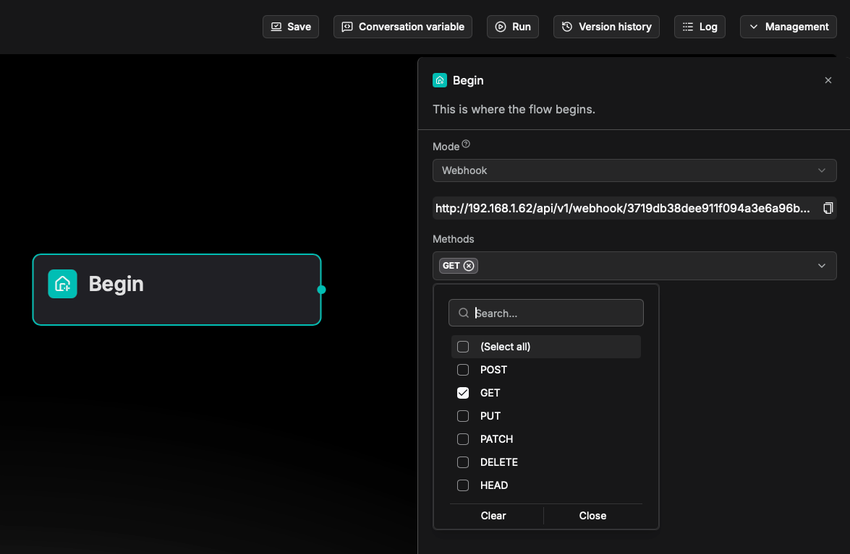

# Begin 组件

工作流中的起始组件。

---

**Begin** 组件设置开场问候语或接收用户输入。无论是从模板创建还是从零开始（空白模板），创建 Agent 时它会自动出现在画布上。工作流中只能有一个 **Begin** 组件。

## 适用场景

**Begin** 组件在所有情况下都是必需的。每个 Agent 都包含一个 **Begin** 组件，且不可删除。

## 配置说明

点击该组件显示其**配置**窗口。在此可以设置开场问候语和 Agent 的输入参数（全局变量）。

### 模式

Mode 定义工作流的触发方式。

- 对话模式（Conversational）：Agent 通过对话触发。
- 任务模式（Task）：Agent 在无对话的情况下启动。
- Webhook：通过 webhook 接收外部 HTTP 请求，实现自动触发和工作流启动。
  *选中后，将为当前 Agent 生成唯一的 Webhook URL。*

### 请求方法

支持的 HTTP 方法。仅在 **Mode** 选择 **Webhook** 时可用。

### 安全认证

身份认证方式，*仅*在 **Mode** 选择 **Webhook** 时可用。包括：

- **token**：基于令牌的身份验证。
- **basic**：基本身份验证。
- **jwt**：JWT 身份验证。

### Schema

Schema 定义了系统在 **Webhook** 模式下接收的 HTTP 请求的数据结构。其配置包括：

- Content type：
  - `application/json`
  - `multipart/form-data`
  - `application/x-www-form-urlencoded`
  - `text-plain`
  - `application/octet-stream`
- Query parameters
- Header parameters
- Request body parameters

### 响应

仅在 **Mode** 选择 **Webhook** 时可用。

工作流的响应模式，即工作流如何响应外部 HTTP 请求。支持的选项：

- **Accepted response**：当 HTTP 请求通过验证后，立即返回成功响应，工作流在后台异步运行。
  - 选择此项后，在 **Begin** 组件中配置相应的 HTTP 状态码和消息。
  - 返回的 HTTP 状态码范围为 `200-399`。
- **Final response**：系统仅在整个工作流完成后才返回最终处理结果。
  - 选择此项后，在 [Message](./message.md) 组件中配置相应的 HTTP 状态码和消息。
  - 返回的 HTTP 状态码范围为 `200-399`。

### 开场问候语

**仅对话模式。**

对话模式下的 Agent 以开场问候语开始。这是 Agent 在对话模式下对用户说的第一句话，可以是欢迎词或引导用户继续操作的说明。

### 全局变量

您可以在 **Begin** 组件中定义全局变量，这些变量可以是必填的或可选的。设置后，用户在与 Agent 交互时需要为这些变量提供值。点击 **+ 添加变量**添加全局变量，每个变量具有以下属性：

- **Name**：*必填*
  描述性名称，提供关于变量的附加说明。
- **Type**：*必填*
  变量的类型：
  - **Single-line text**：接受单行文本，不含换行符。
  - **Paragraph text**：接受多行文本，包含换行符。
  - **Dropdown options**：要求用户从下拉菜单中选择变量的值。需要设置*至少*一个下拉选项。
  - **file upload**：要求用户上传一个或多个文件。
  - **Number**：接受数字输入。
  - **Boolean**：要求用户在开和关之间切换。
- **Key**：*必填*
  唯一的变量名。
- **Optional**：一个开关，表示该变量是否可选。

:::tip 注意
要从客户端传入参数，请调用：

- HTTP 方法 [Converse with agent](../../../references/http_api_reference.md#converse-with-agent)，或
- Python 方法 [Converse with agent](../../../references/python_api_reference.md#converse-with-agent)。
:::

:::danger 重要
如果将键类型设置为 **file**，请确保上传文件的 token 数量不超过模型提供商的最大 token 限制；否则文件中的纯文本将被截断且不完整。
:::

:::note
您可以通过设置环境变量 `DOC_BULK_SIZE` 和 `EMBEDDING_BATCH_SIZE` 来调整文档解析和嵌入效率。
:::

## 常见问题

### 上传的文件在数据集中吗？

不。上传到 Agent 作为输入的文件不会存储在数据集中，因此不会使用 RAGFlow 内置的 OCR、DLR 或 TSR 模型进行处理，也不会使用 RAGFlow 内置的分块方法进行分块。

### 上传文件的文件大小限制

上传到 Agent 的文件没有*特定的*文件大小限制。但请注意，模型提供商通常有默认或显式的最大 token 设置，范围从 8196 到 128k 不等：上传文件的纯文本部分将作为键值传入，但如果文件的 token 数超过此限制，字符串将被截断且不完整。

:::tip 注意
`/docker/.env` 中的变量 `MAX_CONTENT_LENGTH` 和 `/docker/nginx/nginx.conf` 中的 `client_max_body_size` 设置的是每次上传到数据集或 RAGFlow 文件系统的文件大小限制。这些设置不适用于此场景。
:::
