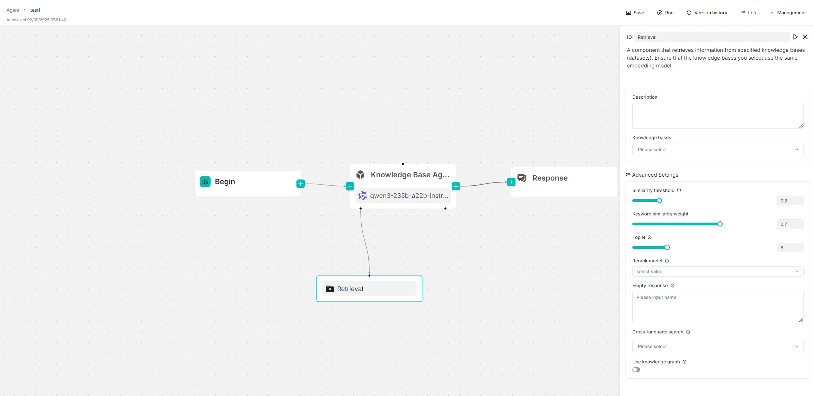

# Retrieval 组件

从指定数据集中检索信息的组件。

## 适用场景

在大多数 RAG 场景中，**Retrieval** 组件必不可少——先从指定数据集中提取信息，再将其发送给 LLM 生成内容。**Retrieval** 组件既可以作为独立的工作流模块运行，也可以作为 **Agent** 组件的工具使用。在后者角色中，**Agent** 组件自主控制何时调用它进行查询和检索。

以下截图展示了使用 **Retrieval** 组件的参考设计，其中该组件作为 **Agent** 组件的工具。您可以从 **Report Agent Using Knowledge Base** Agent 模板中找到它。

## 前提条件

确保[已正确配置目标数据集](../../dataset/configure_knowledge_base.md)。

## 快速入门

### 1. 点击 **Retrieval** 组件显示配置面板

相应的配置面板会出现在画布右侧。使用该面板定义和微调 **Retrieval** 组件的搜索行为。

### 2. 输入查询变量

**Retrieval** 组件依赖查询变量来指定其查询。

:::caution 重要
- 如果将 **Retrieval** 组件作为独立工作流模块使用，请在 **Input Variables** 文本框中输入查询变量。
- 如果作为 **Agent** 组件的工具使用，请在 **Agent** 组件的 **User prompt** 字段中输入查询变量。
:::

默认情况下，您可以使用 `sys.query`，即用户查询，也是 **Begin** 组件的默认输出。在 **Retrieval** 组件之前定义的所有全局变量也可以用作查询语句。使用 `(x)` 按钮或输入 `/` 查看所有可用的查询变量。

### 3. 选择要查询的数据集

您可以指定一个或多个数据集来检索数据。如果选择多个数据集，请确保它们使用相同的嵌入模型。

### 4. 展开**高级设置**配置检索方法

默认情况下，系统使用加权关键词相似度和加权向量余弦相似度的组合进行检索。如果选择了重排序模型，则使用加权关键词相似度和加权重排序评分的组合。

作为入门，您可以跳过此步骤，保持默认检索方法。

:::caution 警告
使用重排序模型会*显著*增加系统的响应时间。
:::

### 5. 启用跨语言检索

如果用户查询与数据集的语言不同，您可以在**跨语言检索**下拉菜单中选择目标语言。模型将翻译查询，以确保跨语言的语义匹配准确。

### 6. 测试检索结果

点击画布顶部的**运行**按钮来测试检索结果。

### 7. 选择下一个组件

必要时，点击 **Retrieval** 组件上的 **+** 按钮，从下拉列表中选择工作流中的下一个组件。

## 配置说明

### 查询变量

*必填*

选择检索的查询来源。默认为 `sys.query`，即 **Begin** 组件的默认输出。

**Retrieval** 组件依赖查询变量来指定其查询。在 **Retrieval** 组件之前定义的所有全局变量也可以用作查询。使用 `(x)` 按钮或输入 `/` 查看所有可用的查询变量。

### 检索来源

选择要从中检索数据的数据集或记忆。

- 如果选择多个数据集，必须确保所选数据集使用相同的嵌入模型；否则会出现错误提示。
- 如果选择 **Memory**，请配置以下之一：
  - **Memory**：从指定的已有记忆中检索。
  - **User ID**：从关联了用户 ID 的对话中检索。详情参见[用户 ID](./message.md#用户-id)。

### 相似度阈值

RAGFlow 在检索过程中使用加权关键词相似度和加权向量余弦相似度的组合。此参数设置用户查询与数据集中存储的分块之间相似度的阈值。任何相似度得分低于此阈值的分块将被排除在结果之外。

默认值为 0.2。

### 向量相似度权重

此参数设置向量相似度在复合相似度得分中的权重。两个权重之和必须等于 1.0。默认值为 0.3，这意味着在组合搜索中关键词相似度的权重为 1 - 0.3 = 0.7。

### Top N

此参数从检索到的分块中选择"Top N"个分块，将其输入给 LLM。

默认值为 8。

### 重排序模型

*可选*

如果选择了重排序模型，系统将使用加权关键词相似度和加权重排序评分的组合进行检索。

:::caution 警告
使用重排序模型会*显著*增加系统的响应时间。
:::

### 空结果响应

- 如果查询未从数据集中检索到任何结果，将此作为回复内容，或
- 将此字段留空，允许对话模型在没有找到结果时自行发挥。

:::caution 警告
如果未指定数据集，则必须将此字段留空；否则会出现错误。
:::

### 跨语言检索

选择一种或多种语言进行跨语言检索。如果未选择任何语言，系统将使用原始查询进行搜索。

### 使用知识图谱

:::caution 重要
启用此功能前，请确保已正确[为每个目标数据集构建知识图谱](../../dataset/advanced/construct_knowledge_graph.md)。
:::

在检索过程中是否使用指定数据集中的知识图谱进行多跳问答。启用后，将涉及跨实体、关系和社区报告分块的迭代搜索，会大大增加检索时间。

### 页面索引

是否使用大模型生成的页面索引结构来增强检索。这种方法模仿了人类在书籍中搜索信息的行为。

### 输出

**Retrieval** 组件输出的全局变量名称，可以被工作流中的其他组件引用。

## 常见问题

### 如何降低响应时间？

请按照以下清单检查以获得最佳性能：

- 将 **Rerank model** 字段留空以禁用重排序。
- 禁用**使用知识图谱**。
