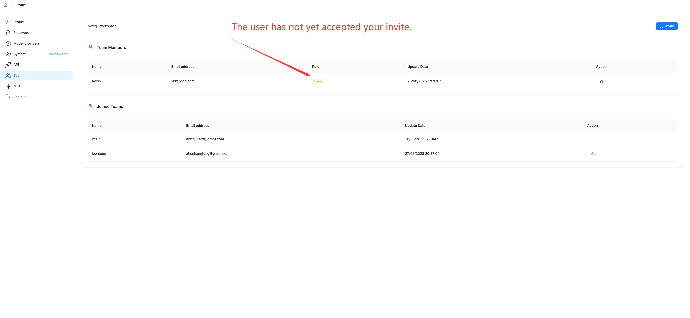
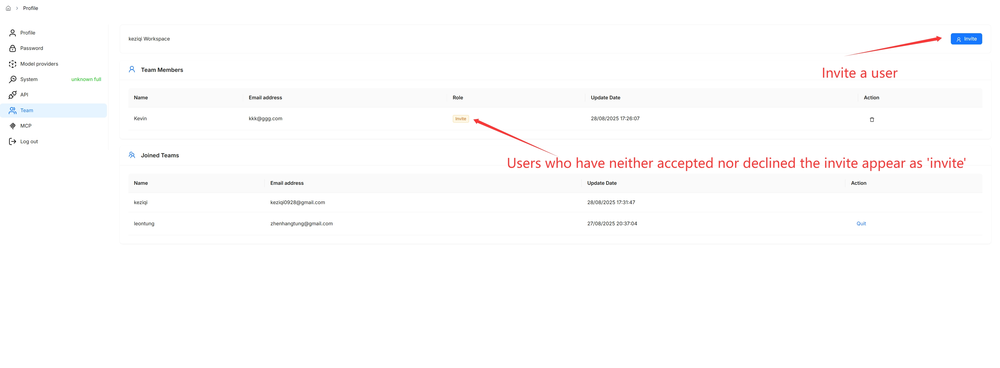
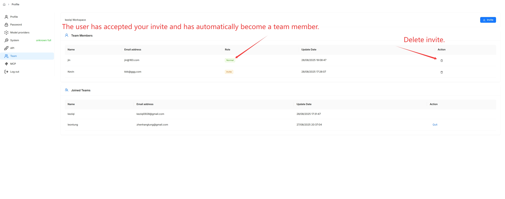

# 管理团队成员

邀请或移除团队成员。

---

默认情况下，每个 RAGFlow 用户被分配一个以自己名字命名的团队。RAGFlow 允许您邀请其他 RAGFlow 用户加入您的团队。您的团队成员可以帮助您：

- 向您共享的数据集上传文档。
- 解析您共享的数据集中的文档。
- 使用您共享的 Agent。

:::tip 注意
- 团队成员目前*不*允许邀请用户加入您的团队，只有您（团队所有者）有权这样做。
- 与团队成员共享已添加的模型仅在 RAGFlow 企业版中可用。
:::

## 前提条件

1. 确保受邀团队成员是 RAGFlow 用户，且使用的电子邮件地址已关联 RAGFlow 用户账户。
2. 要允许团队成员查看和更新您的数据集，请确保在数据集的 **Configuration** 页面上将 **Permissions** 从 **Only me** 更改为 **Team**。

## 邀请团队成员

点击页面右上角的头像，然后在左侧面板中选择 **Team** 进入 **Team** 页面。

_在 **Team** 页面上，您可以查看团队成员的信息以及您已加入的团队。_

默认情况下，您是自有团队的所有者，也是唯一有权邀请用户加入团队或移除团队成员的人。

## 移除团队成员

