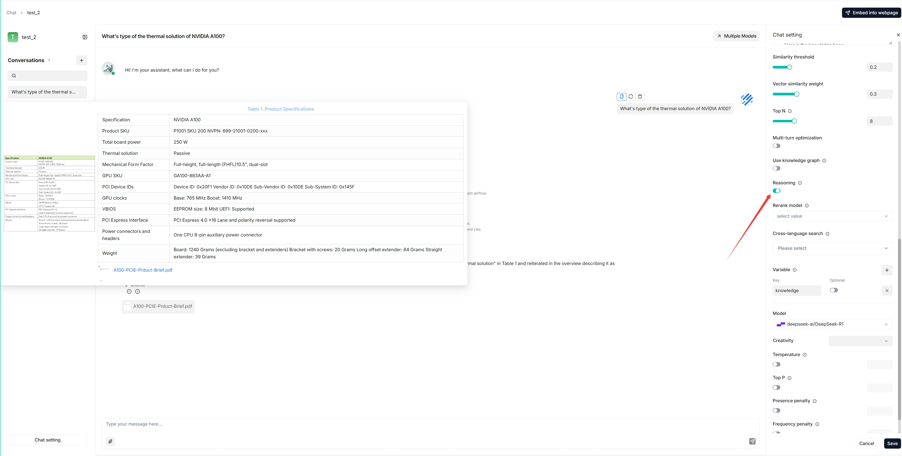
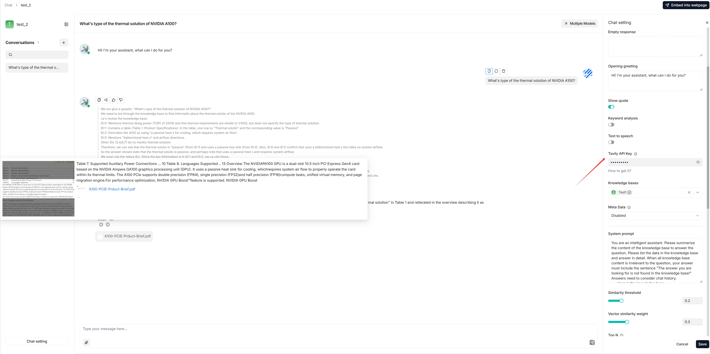

# 实现深度研究

为 Agent 推理实现深度研究功能。

---

从 v0.17.0 起，RAGFlow 支持在 AI 对话中集成 Agent 推理。下图展示了 RAGFlow 深度研究的工作流程：

要激活此功能：

1. 在**Chat setting**中启用 **Reasoning** 开关。

2. 输入正确的 Tavily API 密钥以使用基于 Tavily 的网页搜索：

*以下是集成了深度研究的对话截图：*

