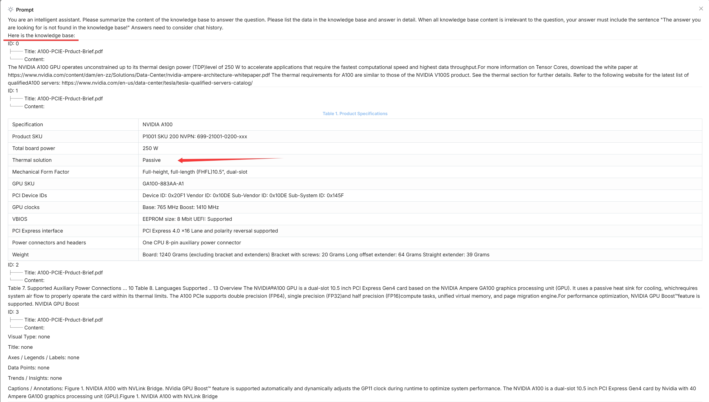
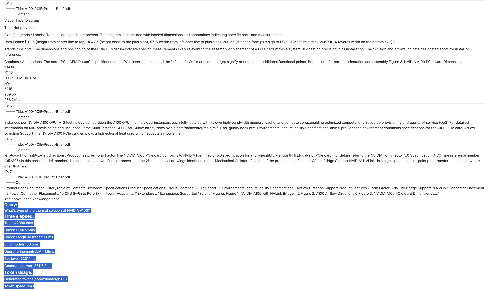
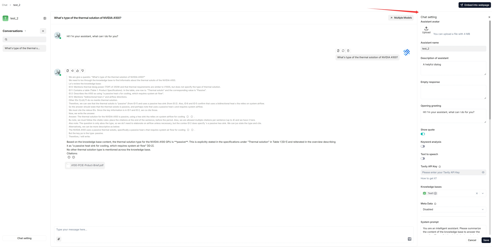
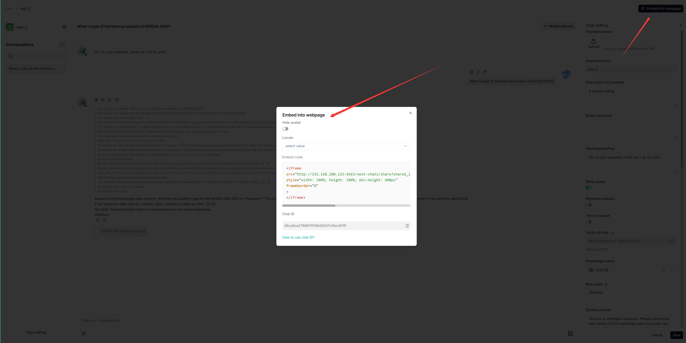
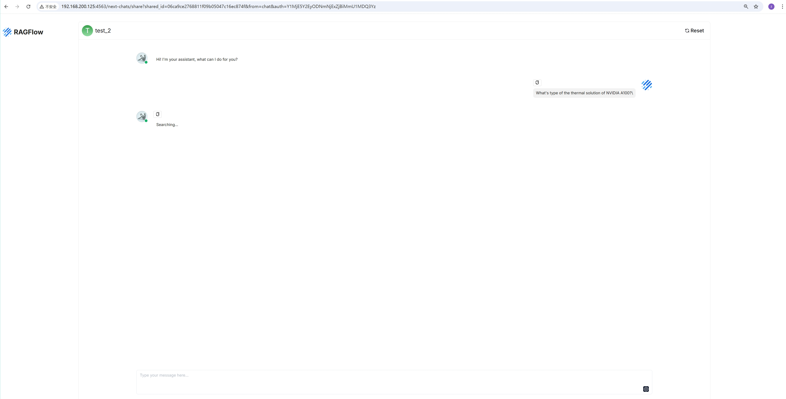

# 启动 AI 对话

使用已配置的对话助手发起 AI 驱动的对话。

---

RAGFlow 中的对话基于一个或多个特定数据集。创建数据集、完成文件解析并[运行检索测试](../dataset/run_retrieval_test.md)后，即可开始 AI 对话。

## 启动 AI 对话

通过创建助手来启动 AI 对话。

1. 点击页面中上方的 **Chat** 选项卡 **>** **创建助手**，显示*下一个对话*的 **Chat Configuration** 对话框。

   > RAGFlow 允许您灵活地为每个对话选择不同的对话模型，同时也可以在 **System Model Settings** 中设置默认模型。

2. 更新助手特定设置：

   - **Assistant name** 是对话助手的名称。每个助手对应一个具有独特数据集、提示词、混合搜索配置和大模型设置的对话。
   - **Empty response**：
     - 如果希望将 RAGFlow 的回答*限制*在您的数据集范围内，请在此处填写回复内容。当未检索到答案时，系统会*统一*以您设置的内容进行回复。
     - 如果希望 RAGFlow 在未从数据集中检索到答案时*自行发挥*，请留空，但这可能会导致幻觉。
   - **Show quote**：这是 RAGFlow 的关键功能，默认启用。RAGFlow 不像黑箱一样工作，而是清晰地显示其回答所依据的信息来源。
   - 选择相应的数据集。可以选择一个或多个数据集，但请确保它们使用相同的嵌入模型，否则会出现错误。

3. 更新提示词特定设置：

   - 在 **System** 中，填写 LLM 的提示词，初期也可以保持默认提示词不变。
   - **Similarity threshold** 设置每个文本分块的相似度"门槛"。默认值为 0.2。相似度得分较低的文本分块会被过滤掉。
   - **Vector similarity weight** 默认设置为 0.3。RAGFlow 使用混合评分系统来评估不同文本分块的相关性。此值设置向量相似度在混合评分中的权重。
     - 如果 **Rerank model** 为空，混合评分系统使用关键词相似度和向量相似度，关键词相似度的默认权重为 1-0.3=0.7。
     - 如果选择了 **Rerank model**，混合评分系统使用关键词相似度和重排序评分，重排序评分的默认权重为 1-0.7=0.3。
   - **Top N** 决定输入给 LLM 的*最大*分块数量。换句话说，即使检索到更多分块，也只将前 N 个分块作为输入。
   - **Multi-turn optimization** 使用多轮对话中的现有上下文增强用户查询，默认启用。启用后会消耗额外的 LLM token，并显著增加生成答案的时间。
   - **Use knowledge graph** 表示检索时是否使用指定数据集中的知识图谱进行多跳问答。启用后会涉及跨实体、关系和社区报告分块的迭代搜索，大大增加检索时间。
   - **Reasoning** 表示是否通过 Deepseek-R1/OpenAI o1 等推理过程生成答案。启用后，对话模型在遇到未知话题时会自主集成深度研究，动态搜索外部知识并通过推理生成最终答案。
   - **Rerank model** 设置要使用的重排序模型，默认为空。
     - 如果 **Rerank model** 为空，混合评分系统使用关键词相似度和向量相似度，向量相似度的默认权重为 1-0.7=0.3。
     - 如果选择了 **Rerank model**，混合评分系统使用关键词相似度和重排序评分，重排序评分的默认权重为 1-0.7=0.3。
   - [跨语言检索](../../references/glossary.md#cross-language-search)：可选
     从下拉菜单中选择一种或多种目标语言。系统的默认对话模型会将您的查询翻译为选定的目标语言，确保跨语言的语义匹配准确，让您可以检索到不同语言的相关结果。
     - 选择目标语言时，请确保数据集中存在这些语言，以保证有效的搜索。
     - 如果未选择目标语言，系统将仅以查询的语言进行搜索，这可能导致遗漏其他语言的相关信息。
   - **Variable** 指系统提示词中使用的变量（键）。`{knowledge}` 是保留变量。点击 **Add** 为系统提示词添加更多变量。
      - 如果不确定 **Variable** 背后的逻辑，请保持*原样*。
      - 从 v0.17.2 起，如果在此处添加了自定义变量，传入其值的唯一方式是调用：
         - HTTP 方法 [Converse with chat assistant](../../references/http_api_reference.md#converse-with-chat-assistant)，或
         - Python 方法 [Converse with chat assistant](../../references/python_api_reference.md#converse-with-chat-assistant)。

4. 更新模型特定设置：

   - 在 **Model** 中：选择对话模型。虽然在 **System Model Settings** 中选择了默认对话模型，RAGFlow 允许您为对话选择其他对话模型。
   - **Creativity**：**Temperature**、**Top P**、**Presence penalty** 和 **Frequency penalty** 的快捷设置，表示模型的自由程度。从 **Improvise**、**Precise** 到 **Balance**，每个预设配置对应一组独特的参数组合。
     该参数有三个选项：
     - **Improvise**：产生更具创造性的回答。
     - **Precise**：（默认）产生更保守的回答。
     - **Balance**：**Improvise** 和 **Precise** 之间的折中方案。
   - **Temperature**：模型输出的随机性程度。
     默认值为 0.1。
     - 较低的值会产生更确定、更可预测的输出。
     - 较高的值会产生更多样、更有创意的输出。
     - 温度设为零时，相同提示词会产生相同的输出。
   - **Top P**：核采样。
     - 通过设置阈值 *P* 并将采样限制在累积概率超过 *P* 的 token 上，降低生成重复或不自然文本的概率。
     - 默认值为 0.3。
   - **Presence penalty**：鼓励模型在回答中包含更多样化的 token。
     - 较高的 **presence penalty** 值使模型更有可能生成之前未在输出文本中出现过的 token。
     - 默认值为 0.4。
   - **Frequency penalty**：阻止模型在生成文本中过于频繁地重复相同的词或短语。
     - 较高的 **frequency penalty** 值使模型在使用重复 token 时更加保守。
     - 默认值为 0.7。

5. 现在，让我们开始吧：

   

:::tip 注意

1. 点击答案上方的灯泡图标查看展开的系统提示词：

   

   *灯泡图标仅对当前对话可用。*

2. 向下滚动展开的提示词查看每项任务的耗时：

   
:::

## 更新已有对话助手的设置

## 将对话功能集成到您的应用或网页中

RAGFlow 提供 HTTP 和 Python API，供您将 RAGFlow 的能力集成到您的应用中。详情请参阅以下文档：

- [获取 RAGFlow API 密钥](../../develop/acquire_ragflow_api_key.md)
- [HTTP API 参考](../../references/http_api_reference.md)
- [Python API 参考](../../references/python_api_reference.md)

您可以使用 iframe 将创建的对话助手嵌入到第三方网页中：

1. 开始之前，必须先[获取 API 密钥](../../develop/acquire_ragflow_api_key.md)；否则会弹出错误提示。
2. 将鼠标悬停在目标对话助手上 **>** **Edit** 显示 **iframe** 窗口：

   

3. 复制 iframe 并嵌入到您的网页中。

