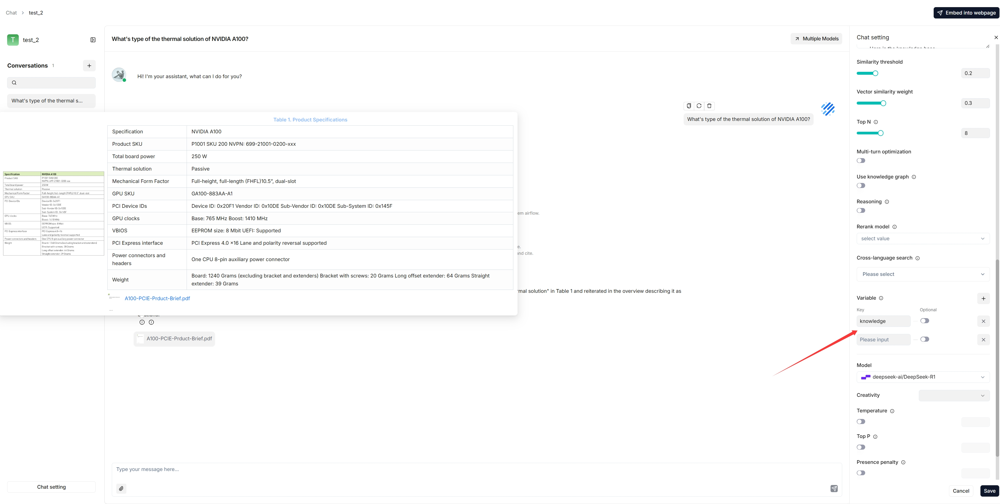

# 设置变量

设置变量以配合 LLM 的系统提示词使用。

---

在配置对话模型的系统提示词时，变量在增强灵活性和可重用性方面发挥着重要作用。通过变量，您可以动态调整发送给模型的系统提示词。在 RAGFlow 中，如果您在**Chat setting**中定义了变量，除系统保留变量 `{knowledge}` 外，您需要通过 RAGFlow 的 [HTTP API](../../references/http_api_reference.md#converse-with-chat-assistant) 或 [Python SDK](../../references/python_api_reference.md#converse-with-chat-assistant) 为它们传入值。

:::danger 重要
在 RAGFlow 中，变量与系统提示词紧密关联。当您在 **Variable** 部分添加变量时，请将其包含在系统提示词中。反之，删除变量时，请确保将其从系统提示词中移除；否则会出现错误。
:::

## 在哪里设置变量



## 1. 管理变量

在 **Variable** 部分，您可以添加、删除或修改变量。

### `{knowledge}` - 保留变量

`{knowledge}` 是系统保留变量，表示从 **Assistant settings** 选项卡中 **Knowledge bases** 指定的数据集中检索到的分块。如果您的对话助手关联了特定数据集，可以保持原样。

:::info 注意
目前 `{knowledge}` 设为可选或必填没有区别，但请注意此设计将在适当时候更新。
:::

从 v0.17.0 起，您可以在不指定数据集的情况下启动 AI 对话。此时，建议移除 `{knowledge}` 变量以避免不必要的引用，同时将 **Empty response** 字段留空以避免错误。

### 自定义变量

除了 `{knowledge}`，您还可以定义自己的变量来与系统提示词配合使用。要使用这些自定义变量，必须通过 RAGFlow 官方 API 传入它们的值。**Optional** 开关决定这些变量在相应 API 中是否为必填项：

- **禁用**（默认）：变量为必填项，必须提供。
- **启用**：变量为可选项，如果不需要可以省略。

## 2. 更新系统提示词

在 **Variable** 部分添加或删除变量后，请确保这些更改反映在系统提示词中，以避免不一致或错误。以下是一个示例：

```
你是一个智能助手。请通过总结指定数据集中的分块来回答问题...

你的回答应遵循专业和{style}的风格。

...

以下是知识库：
{knowledge}
以上是知识库。
```

:::tip 注意
如果移除了 `{knowledge}`，请确保仔细审查并更新整个系统提示词，以获得最佳效果。
:::

## API

为 **Chat Configuration** 对话框中定义的自定义变量传入值的*唯一*方式是调用 RAGFlow 的 [HTTP API](../../references/http_api_reference.md#converse-with-chat-assistant) 或 [Python SDK](../../references/python_api_reference.md#converse-with-chat-assistant)。

### HTTP API

参见[与对话助手对话](../../references/http_api_reference.md#converse-with-chat-assistant)。以下是示例：

```json {9}
curl --request POST \
     --url http://{address}/api/v1/chat/completions \
     --header 'Content-Type: application/json' \
     --header 'Authorization: Bearer <YOUR_API_KEY>' \
     --data-binary '
     {
          "chat_id": "{chat_id}",
          "stream": true,
          "messages": [
              {
                  "role": "user",
                  "content": "xxxxxxxxx"
              }
          ],
          "style":"hilarious"
     }'
```

### Python API

参见[与对话助手对话](../../references/python_api_reference.md#converse-with-chat-assistant)。以下是示例：

```python {18}
from ragflow_sdk import RAGFlow

rag_object = RAGFlow(api_key="<YOUR_API_KEY>", base_url="http://<YOUR_BASE_URL>:9380")
assistant = rag_object.list_chats(name="Miss R")
assistant = assistant[0]
session = assistant.create_session()    

print("\n==================== Miss R =====================\n")
print("Hello. What can I do for you?")

while True:
    question = input("\n==================== User =====================\n> ")
    style = input("Please enter your preferred style (e.g., formal, informal, hilarious): ")
    
    print("\n==================== Miss R =====================\n")
    
    cont = ""
    for ans in session.ask(question, stream=True, style=style):
        print(ans.content[len(cont):], end='', flush=True)
        cont = ans.content
```
