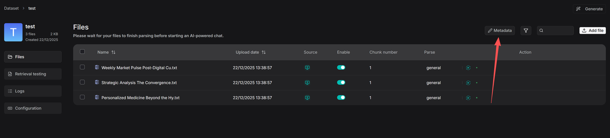
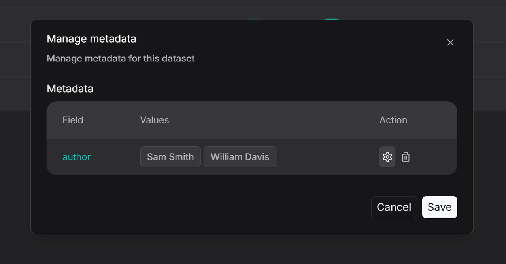
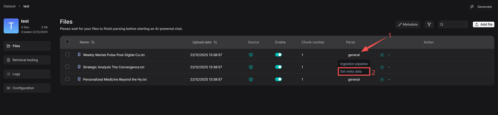
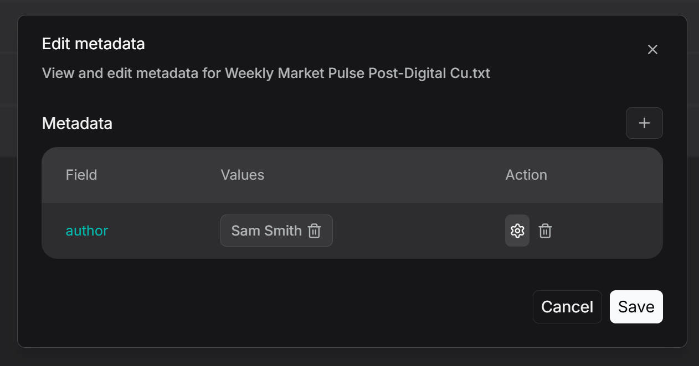
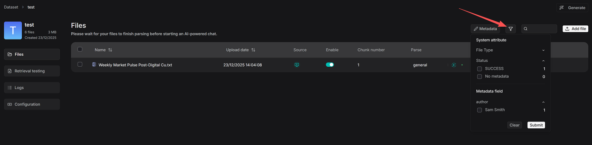
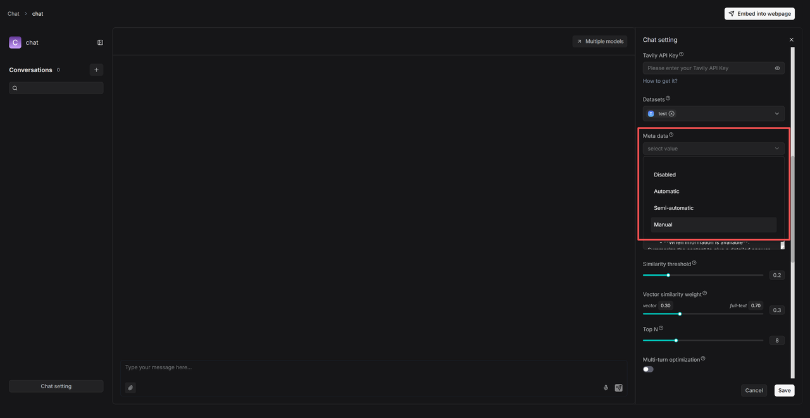

# 管理元数据

管理数据集和单个文档的元数据。

---

从 v0.23.0 起，RAGFlow 支持在数据集级别以及单个文件级别管理元数据。

## 操作步骤

1. 点击数据集内的 **Metadata** 进入 **Manage Metadata** 页面。

2. 在 **Manage Metadata** 页面上，可以执行以下任一操作：
   - 编辑值：修改现有值。如果将两个值重命名为相同值，它们将自动合并。
   - 删除：删除特定值或整个字段。这些更改将应用于所有关联的文件。

   _自动生成元数据的规则配置页面出现。_

3. 要管理单个文件的元数据，请导航到如下所示的文件详情页面。点击解析方法（如 **General**），然后选择 **Set Metadata** 查看或编辑文件的元数据。在此可以添加、删除或修改此特定文件的元数据字段。在此所做的任何编辑都将反映在知识库主元数据管理页面的全局统计中。

4. 过滤功能在两层运作：知识库管理和检索。在数据集内，点击 Filter 按钮查看现有元数据字段下各值关联的文件数量。选择特定值可以显示所有关联的文件。

5. 检索阶段也支持元数据过滤。例如在 Chat 中，配置知识库后可以设置元数据过滤规则：

- **自动**模式：系统根据用户查询和知识库中现有的元数据自动过滤文档。
- **半自动**模式：用户首先在字段级别定义过滤范围（如对 **Author**），然后系统在该预设范围内自动过滤。
- **手动**模式：用户手动设置精确的、基于值的过滤条件，支持 **Equals**、**Not equals**、**In**、**Not in** 等运算符。
