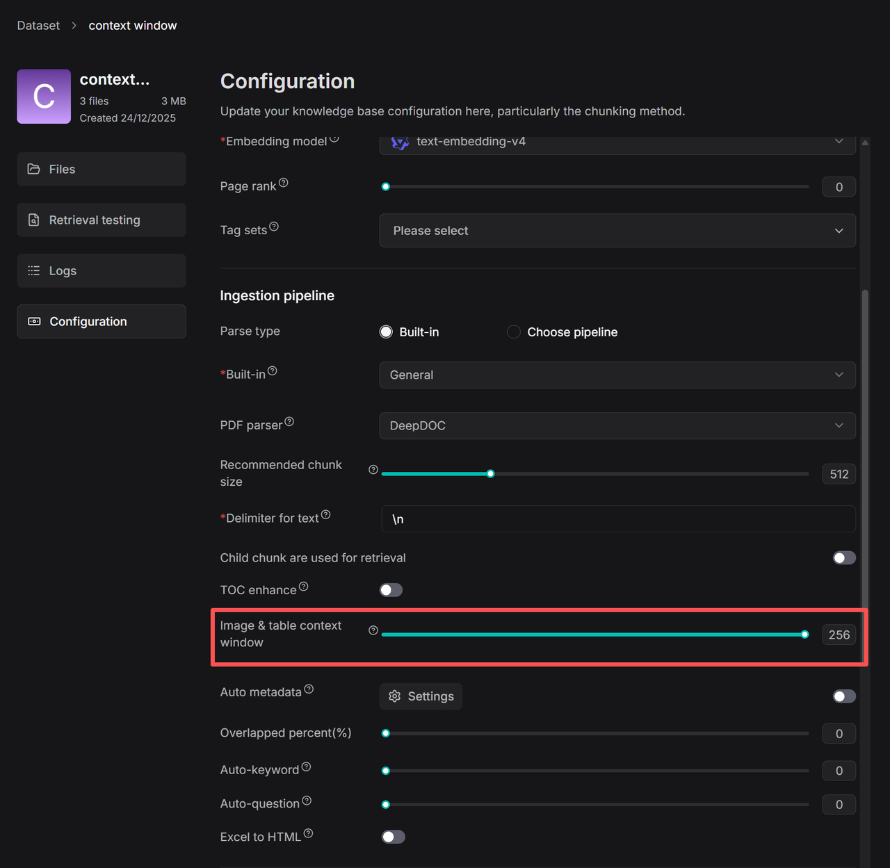

# 设置上下文窗口大小

设置图片和表格的上下文窗口大小，以改善长上下文 RAG 的性能。

---

RAGFlow 利用内置 DeepDoc 以及 MinerU、Docling 等外部文档模型来解析文档版面。在之前的版本中，基于文档版面提取的图片和表格被视为独立的分块。因此，如果搜索查询未能直接匹配图片或表格的内容，这些元素就不会被检索到。然而，实际文档通常将图表和表格与周围描述它们的文本交织在一起。因此，基于这些上下文文本来召回图表是一项必不可少的能力。

为此，RAGFlow 0.23.0 引入了 **Image & table context window** 功能。受面向研究的多模态开源 RAG 项目 RAG-Anything 关键原理的启发，此功能允许根据用户可配置的窗口大小，将周围文本与相邻的视觉元素组合到同一个分块中。这确保了它们一起被检索到，显著提高了图表和表格的召回准确性。

## 操作步骤

1. 在数据集的 **Configuration** 页面上，找到 **Image & table context window** 滑块：

2. 根据需要调整上下文 token 的数量。

   *红色框中的数字表示大约捕获图片/表格上方和下方**N 个 token**的文本，并作为上下文信息插入图片或表格分块中。捕获过程会在标点处智能优化边界，以保持语义完整性。*
