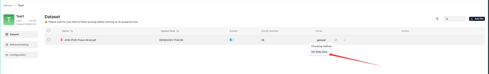
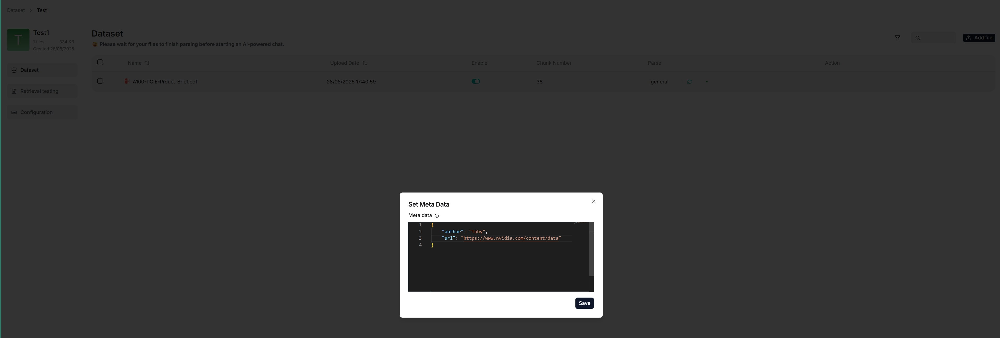

# 设置元数据

手动为已上传的文件添加元数据。

---

在数据集的 **Dataset** 页面上，您可以为任何已上传的文件添加元数据。这种方法允许您为现有文件"标记"额外信息，如 URL、作者、日期等。在 AI 驱动的对话中，这些信息将与检索到的分块一起发送给 LLM 进行内容生成。

例如，如果您有一个 HTML 文件数据集，希望 LLM 在回答查询时引用源 URL，可以为每个文件的元数据添加 `"url"` 参数。

:::tip 注意
确保元数据采用 JSON 格式；否则更新将不会生效。
:::

## 相关 API

[检索分块](../../references/http_api_reference.md#retrieve-chunks)

## 常见问题

### 可否为多个文档同时设置元数据？

从 v0.23.0 起，您可以为每个文档单独设置元数据，也可以让 LLM 为多个文件自动生成元数据。详情参见[提取元数据](./advanced/auto_metadata.md)。
