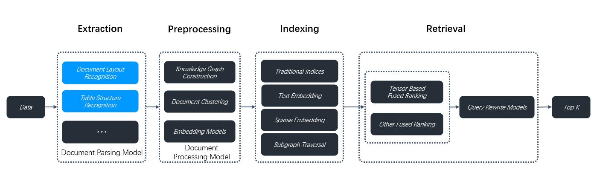

# 选择 PDF 解析器

选择用于解析 PDF 的视觉模型。

---

RAGFlow 并非一刀切的方案。它专为灵活性而构建，支持更深入的定制以适应更复杂的用例。从 v0.17.0 起，RAGFlow 将 DeepDoc 特定的数据提取任务与**PDF 文件**的分块方法解耦。这种分离使您能够自主选择一个在速度和性能之间取得平衡的视觉模型，用于 OCR（光学字符识别）、TSR（表格结构识别）和 DLR（文档版面识别）任务，以适应特定的用例。如果 PDF 仅包含纯文本，您可以选择 **Naive** 选项跳过这些任务，以减少整体解析时间。

## 前提条件

- PDF parser 下拉菜单仅在选择与 PDF 兼容的分块方法时出现，包括：
  - **General**
  - **Manual**
  - **Paper**
  - **Book**
  - **Laws**
  - **Presentation**
  - **One**
- 要使用第三方视觉模型解析 PDF，请确保在 **Model providers** 页面的 **Set default models** 下设置了默认 VLM。

## 快速入门

1. 在数据集的 **Configuration** 页面，选择分块方法，例如 **General**。

   _此时出现 **PDF parser** 下拉菜单。_

2. 选择最适合您场景的选项：

- DeepDoc：（默认）对 PDF 执行 OCR、TSR 和 DLR 任务的默认视觉模型，但可能比较耗时。
- Naive：如果*所有* PDF 都是纯文本，跳过 OCR、TSR 和 DLR 任务。
- [MinerU](https://github.com/opendatalab/MinerU)：（实验性）将 PDF 转换为机器可读格式的开源工具。
- [Docling](https://github.com/docling-project/docling)：（实验性）面向生成式 AI 的开源文档处理工具。
- [OpenDataLoader](https://github.com/opendataloader-project/opendataloader-pdf)：（实验性）一个确定性的本地优先 PDF 解析器，输出结构化 JSON + Markdown。作为独立服务容器运行，因此 RAGFlow 宿主机无需 Java 运行时。
- 来自特定模型提供商的第三方视觉模型。

:::danger 重要
从 v0.22.0 开始，RAGFlow 包含 MinerU（&ge; 2.6.3）作为可选的多后端 PDF 解析器。请注意，RAGFlow 仅作为 MinerU 的*远程客户端*，调用 MinerU API 解析文档并读取返回的文件。要使用此功能：
:::

1. 准备一个可访问的 MinerU API 服务（FastAPI 服务器）。
2. 在 **.env** 文件中或通过 UI 的 **Model providers** 页面，将 RAGFlow 配置为 MinerU 的远程客户端：
   - `MINERU_APISERVER`：MinerU API 端点（如 `http://mineru-host:8886`）。
   - `MINERU_BACKEND`：MinerU 后端：
      - `"pipeline"`（默认）
      - `"vlm-http-client"`
      - `"vlm-transformers"`
      - `"vlm-vllm-engine"`
      - `"vlm-mlx-engine"`
      - `"vlm-vllm-async-engine"`
      - `"vlm-lmdeploy-engine"`。
   - `MINERU_SERVER_URL`：（可选）下游 vLLM HTTP 服务器（如 `http://vllm-host:30000`）。当 `MINERU_BACKEND` 设置为 `"vlm-http-client"` 时适用。
   - `MINERU_OUTPUT_DIR`：（可选）存放 MinerU API 服务输出文件（zip/JSON）的本地目录，用于数据摄入前。
   - `MINERU_DELETE_OUTPUT`：使用临时目录时是否删除临时输出：
     - `1`：删除。
     - `0`：保留。
3. 在 Web UI 中，导航到数据集的 **Configuration** 页面，找到 **Ingestion pipeline** 部分：
   - 如果使用 **Built-in** 下拉菜单中的分块方法，请确保它支持 PDF 解析，然后从 **PDF parser** 下拉菜单中选择 **MinerU**。
   - 如果使用自定义数据摄入管道，请在 **Parser** 组件的 **PDF parser** 部分中选择 **MinerU**。

要使用外部 Docling Serve 实例（而非本地进程内 Docling），请设置：

- `DOCLING_SERVER_URL`：Docling Serve API 端点（例如 `http://docling-host:5001`）。

当设置 `DOCLING_SERVER_URL` 后，RAGFlow 将 PDF 内容发送到 Docling Serve（`/v1/convert/source`，回退到 `/v1alpha/convert/source`），并摄入返回的 markdown/文本。如果未设置该变量，RAGFlow 将继续使用本地 Docling（`USE_DOCLING=true` + 已安装的包）行为。

:::note
所有 MinerU 环境变量都是可选的。设置这些值后，会在首次使用时为租户自动配置 MinerU OCR 模型。要避免自动配置，请跳过环境变量设置，仅从 UI 中的 **Model providers** 页面配置 MinerU。
:::

:::caution 警告
第三方视觉模型标记为**实验性**，因为我们尚未对这些模型在以上数据提取任务中的表现进行完整测试。
:::

## 常见问题

### 什么情况下应该选择 DeepDoc 或第三方视觉模型作为 PDF 解析器？

如果 PDF 包含格式化或图像型文本而非纯文本，请使用视觉模型提取数据。DeepDoc 是默认视觉模型，但可能比较耗时。您也可以根据需求和硬件能力选择轻量级或高性能的 VLM。

### 是否可以选择视觉模型来解析 DOCX 文件？

不可以。此下拉菜单仅适用于 PDF。要使用此功能，请先将 DOCX 文件转换为 PDF。
