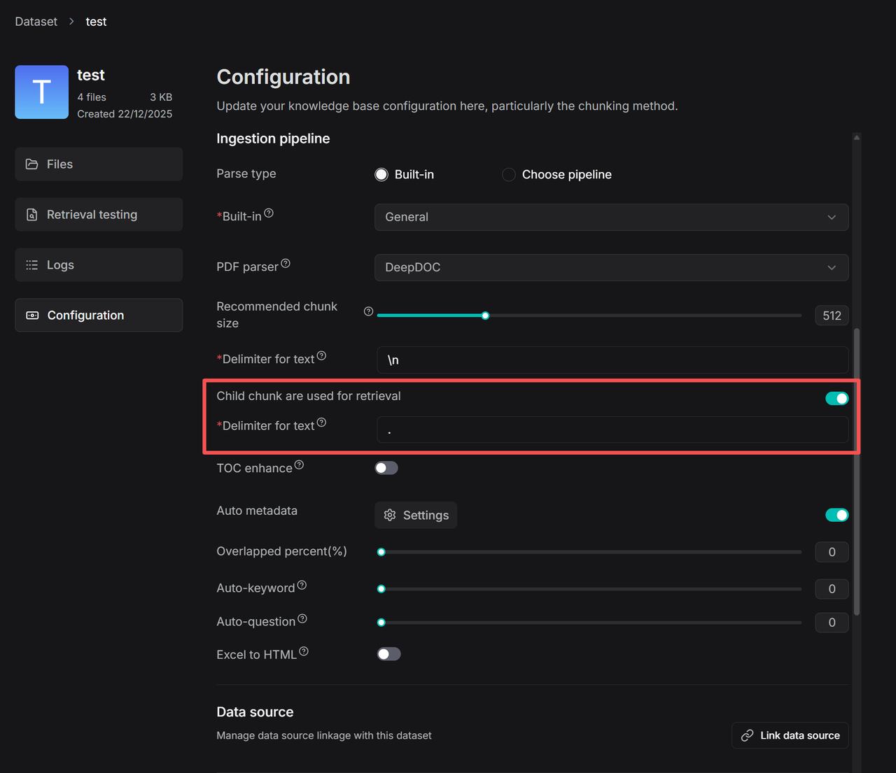

# 配置子分块策略

设置父子分块策略以改善检索效果。

---

实际 RAG 应用中一个长期存在的挑战在于传统"分块-嵌入-检索"管道的结构性矛盾：单个文本分块同时承担语义匹配（召回）和上下文理解（使用）两个目标——这两个目标在本质上是相互冲突的。召回要求细粒度、精确的分块，而答案生成要求连贯、信息完整的上下文。

为解决这一矛盾，RAGFlow 此前引入了目录（TOC）增强功能，使用大语言模型（LLM）生成文档结构，并在检索时根据该 TOC 自动补充缺失的上下文。在 v0.23.0 中，此能力已系统性地集成到数据摄入管道中，并引入了一种新颖的父子分块机制。

在这种机制下，文档首先被分割为较大的父分块，每个父分块保持相对完整的语义单元，以确保逻辑和背景的完整性。每个父分块可进一步细分为多个子分块，用于精确召回。在检索过程中，系统首先基于子分块定位最相关的文本段落，同时自动关联并召回其父分块。这种方法在保持高召回相关性的同时，为生成阶段提供了充足的语义背景。

例如，在处理*合规手册*时，用户查询"违约责任"可能精确检索到子分块"违约罚金为合同总金额的 20%"，但缺乏上下文，无法明确该条款适用于"一般违约"还是"重大违约"。利用父子分块机制，系统会返回此子分块及其父分块（包含该条款的完整章节），使 LLM 能够基于更广泛的上下文做出准确判断，避免误解。

通过这种"精确定位+上下文补充"的双层结构，RAGFlow 在确保检索准确性的同时，显著增强了生成答案的可靠性和完整性。

## 操作步骤

1. 在数据集的 **Configuration** 页面上，找到 **Child chunk are used for retrieval** 开关：

2. 设置子分块的分隔符。

3. 此配置在数据摄入管道设置中应用于 **Chunker** 组件：

