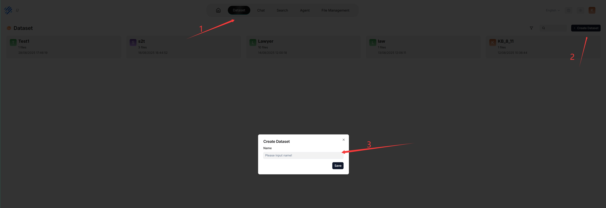
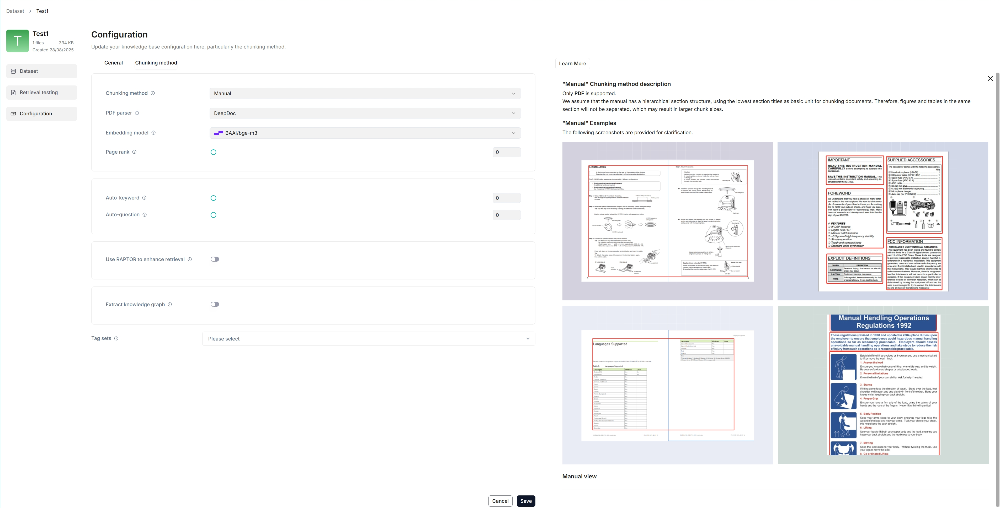
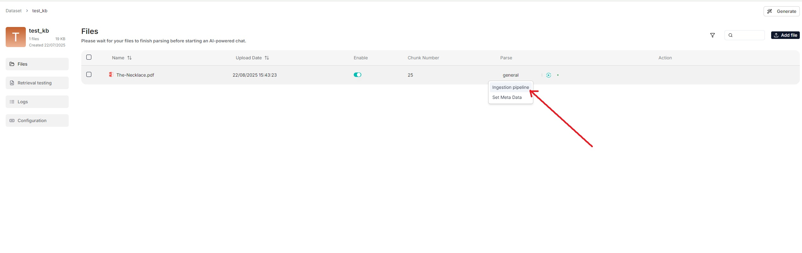
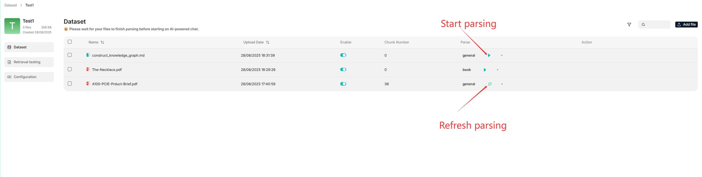
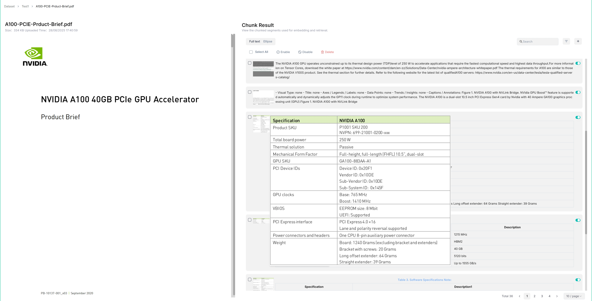
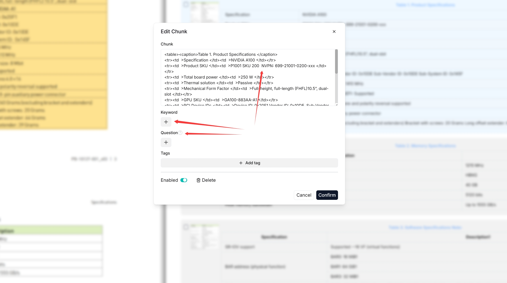
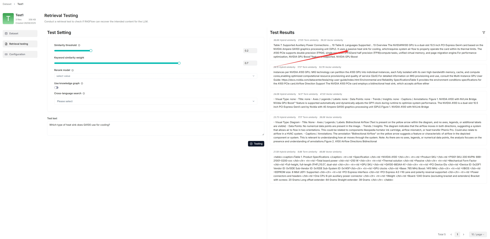
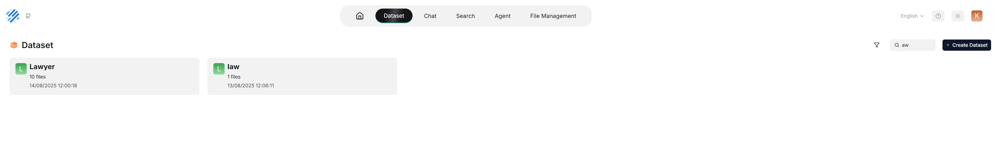
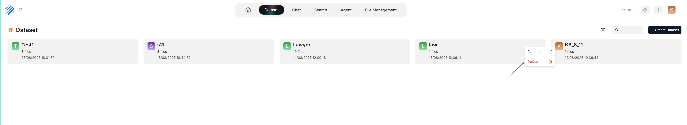

# 配置数据集

RAGFlow 的大多数对话助手和 Agent 都基于数据集。每个 RAGFlow 数据集作为一个知识源，将用户从本地上传的文件以及在 RAGFlow 文件系统中生成的文件引用*解析*为真正的"知识"，用于后续的 AI 对话。本指南演示数据集功能的一些基本用法，涵盖以下主题：

- 创建数据集
- 配置数据集
- 搜索数据集
- 删除数据集

## 创建数据集

拥有多个数据集可以构建更灵活、多样化的问答。要创建第一个数据集：

_每次创建数据集时，都会在 **root/.knowledgebase** 目录中生成一个同名文件夹。_

## 配置数据集

以下截图显示数据集的配置页面。正确配置数据集对于未来的 AI 对话至关重要。例如，选择错误的嵌入模型或分块方法会导致意外的语义丢失或不匹配的对话回答。

本节涵盖以下主题：

- 选择分块方法
- 选择嵌入模型
- 上传文件
- 解析文件
- 干预文件解析结果
- 运行检索测试

### 选择分块方法

RAGFlow 提供多种内置分块模板，方便对不同版面的文件进行分块并确保语义完整性。从 **Parse type** 下的 **Built-in** 分块方法下拉菜单中，可以选择适合文件版面和格式的默认模板。下表显示了每种支持的分块模板的描述和兼容的文件格式：

| **模板**       | 描述                                                      | 文件格式                                                                                             |
|--------------|----------------------------------------------------------|------------------------------------------------------------------------------------------------------|
| General      | 文件按预设的分块 token 数量连续分块。                         | MD, MDX, DOCX, XLSX, XLS (Excel 97-2003), PPT, PDF, TXT, JPEG, JPG, PNG, TIF, GIF, CSV, JSON, EML, HTML |
| Q&A          | 检索相关信息并生成答案以回答问题。                              | XLSX, XLS (Excel 97-2003), CSV/TXT                                                                   |
| Resume       | 仅企业版，也可在 cloud.ragflow.io 上试用。                     | DOCX, PDF, TXT                                                                                       |
| Manual       |                                                          | PDF                                                                                                  |
| Table        | 表格模式使用 TSI 技术进行高效数据解析。                          | XLSX, XLS (Excel 97-2003), CSV/TXT                                                                   |
| Paper        |                                                          | PDF                                                                                                  |
| Book         |                                                          | DOCX, PDF, TXT                                                                                       |
| Laws         |                                                          | DOCX, PDF, TXT                                                                                       |
| Presentation |                                                          | PDF, PPTX                                                                                            |
| Picture      |                                                          | JPEG, JPG, PNG, TIF, GIF                                                                             |
| One          | 每个文档整体作为一个分块。                                     | DOCX, XLSX, XLS (Excel 97-2003), PDF, TXT                                                            |
| Tag          | 该数据集作为其他数据集的标签集。                                | XLSX, CSV/TXT                                                                                        |

您也可以在 **Files** 页面上更改文件的分块方法。

  
从 v0.21.0 起，RAGFlow 支持数据摄入管道，用于自定义数据摄入和清洗工作流。

   
  要使用自定义数据管道：

  1. 在 **Agent** 页面，点击 **+ 创建 Agent** > **Create from blank**。
  2. 选择 **Ingestion pipeline** 并在弹出窗口中命名数据管道，然后点击 **Save** 显示数据管道画布。
  3. 更新数据管道后，点击画布右上角的 **Save**。
  4. 导航到数据集的 **Configuration** 页面，在 **Ingestion pipeline** 中选择 **Choose pipeline**。
     
     *您保存的数据管道将出现在下方的下拉菜单中。*

### 选择嵌入模型

嵌入模型将分块转换为嵌入向量。一旦数据集有了分块，嵌入模型就无法更改。要切换到不同的嵌入模型，必须删除数据集中的所有现有分块。原因很明显：我们*必须*确保特定数据集中的文件使用*相同*的嵌入模型转换为嵌入向量（确保它们在相同的嵌入空间中进行比较）。

:::danger 重要
某些嵌入模型针对特定语言进行了优化，如果用于嵌入其他语言的文档，性能可能会受到影响。
:::

### 上传文件

- RAGFlow 的文件系统允许将文件关联到多个数据集，此时每个目标数据集持有该文件的引用。
- 在 **Knowledge Base** 中，您还可以选择从本地上传单个文件或文件夹（批量上传）到数据集，此时数据集持有文件副本。

虽然直接上传文件到数据集看起来更方便，但我们*强烈*建议先将文件上传到 RAGFlow 文件系统，然后再将它们关联到目标数据集。这样，可以避免永久删除已上传到数据集的文件。

### 解析文件

文件解析是数据集配置中的一个关键话题。RAGFlow 中的文件解析有两层含义：根据文件版面进行分块，以及基于这些分块构建嵌入和全文（关键词）索引。选择分块方法和嵌入模型后，即可开始解析文件：

- 如上所示，RAGFlow 允许对特定文件使用不同的分块方法，提供超出默认方法的灵活性。
- 如上所示，RAGFlow 允许启用或禁用单个文件，提供对基于数据集的 AI 对话的更精细控制。

### 干预文件解析结果

RAGFlow 具有可见性和可解释性，允许您查看分块结果并在必要时进行干预。操作如下：

1. 点击完成文件解析的文件查看分块结果：

   _您会进入 **Chunk** 页面：_

   

2. 将鼠标悬停在各快照上快速查看每个分块。

3. 双击分块文本添加关键词、问题、标签或进行*手动*更改：

   

:::caution 注意
您可以为文件分块添加关键词，以提高其在包含这些关键词的查询中的排名。此操作增加其关键词权重，可改善其在搜索结果列表中的位置。
:::

4. 在检索测试中，在 **Test text** 中快速提问，以二次确认配置是否有效：

   _从以下可以看出，RAGFlow 以真实的引用作为回答。_

   

### 运行检索测试

RAGFlow 在对话中使用全文搜索和向量搜索的多重召回。在设置 AI 对话之前，考虑调整以下参数以确保预期信息始终出现在答案中：

- 相似度阈值：低于该阈值的分块将被过滤。默认设置为 0.2。
- 向量相似度权重：向量相似度在总分中所占的百分比。默认设置为 0.3。

详情参见[运行检索测试](./run_retrieval_test.md)。

## 搜索数据集

截至 RAGFlow v0.25.4，搜索功能仍处于初级阶段，仅支持按名称搜索数据集。

## 删除数据集

您可以删除数据集。将鼠标悬停在目标数据集卡片的三点图标上，会出现 **Delete** 选项。删除数据集后，**root/.knowledge** 目录下的关联文件夹将自动删除。后果是：

- 直接上传到数据集的文件会消失；
- 在 RAGFlow 文件系统内创建的文件引用会消失，但关联的文件仍然存在。

