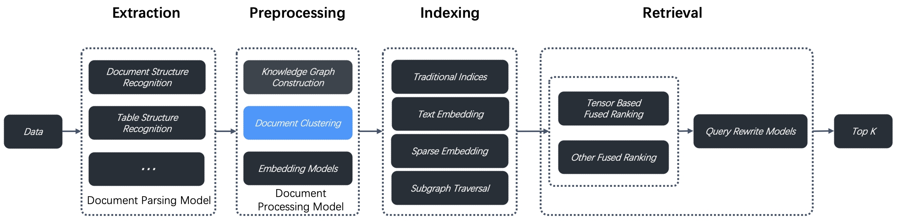
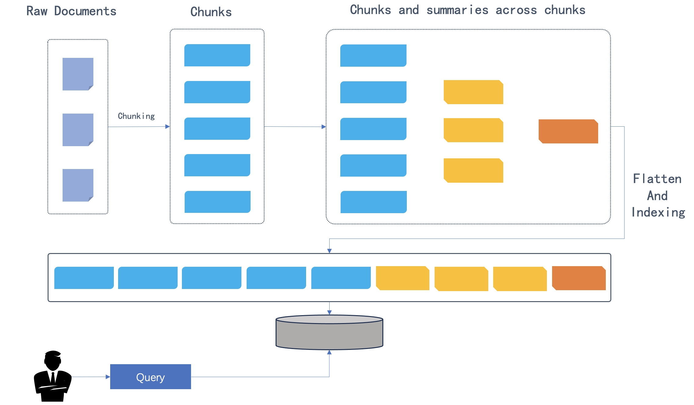

# 启用 RAPTOR

一种用于长上下文知识检索和总结的递归抽象方法，在广泛语义理解与精细细节之间取得平衡。

---

RAPTOR（Recursive Abstractive Processing for Tree Organized Retrieval，递归抽象处理树组织检索）是一种在 [2024 年论文](https://arxiv.org/html/2401.18059v1)中引入的增强型文档预处理技术。为解决多跳问答问题，RAPTOR 对文档分块执行递归聚类和总结，构建层次树结构，从而在长文档中实现更具上下文感知能力的检索。RAGFlow v0.6.0 将 RAPTOR 集成到数据预处理流程中，用于文档聚类，位于数据提取和索引之间，如下图所示。



我们使用这种新方法的测试表明，在需要复杂多步推理的问答任务上取得了最先进（SOTA）的结果。通过将 RAPTOR 检索与内置分块方法和/或其他检索增强生成（RAG）方法相结合，您可以进一步提高问答准确性。

:::danger 警告
启用 RAPTOR 需要大量内存、计算资源和 token。
:::

## 基本原理

原始文档被分割成分块后，分块按照语义相似度（而非在文本中的原始顺序）进行聚类。然后由系统默认对话模型将聚类总结为更高级别的分块。此过程递归应用，自底向上形成不同总结级别的树结构。如下图所示，初始分块构成叶节点（蓝色），并递归总结为根节点（橙色）。



递归聚类和总结既捕捉了广泛的整体理解（通过根节点），又保留了精细的细节（通过叶节点），这对于多跳问答是必需的。

## 适用场景

对于涉及复杂多步推理的多跳问答任务，问题和答案之间往往存在语义鸿沟。因此，仅用问题搜索通常无法检索到有助于得到正确答案的相关分块。RAPTOR 通过为对话模型提供更丰富、更具上下文感知能力和更相关的分块来进行总结，从而在不丢失细节的前提下实现整体理解。

:::tip 注意
知识图谱也可用于多跳问答任务。详情参见[构建知识图谱](../advanced/construct_knowledge_graph.md)。您可以使用任一方法或两者兼用，但请确保了解所涉及的内存、计算和 token 成本。
:::

## 前提条件

系统默认对话模型用于总结聚类内容。开始之前，请确保已正确配置对话模型：


## 配置说明

RAPTOR 功能默认禁用。要启用它，请在数据集的 **Configuration** 页面上手动打开 **Use RAPTOR to enhance retrieval** 开关。

### 提示词

以下提示词将*递归*应用于聚类总结，`{cluster_content}` 作为内部参数。我们建议目前保持原样。此设计将在适当时候更新。

```
Please summarize the following paragraphs... Paragraphs as following:
      {cluster_content}
The above is the content you need to summarize.
```

### Max token

每个生成总结分块的最大 token 数。默认值为 256，最大限制为 2048。

### 阈值

在 RAPTOR 中，分块按语义相似度进行聚类。**Threshold** 参数设置分块被归为一组所需的最小相似度。

默认值为 0.1，最大限制为 1。较高的 **Threshold** 意味着每个簇中的分块较少，较低的则意味着更多。

### Max cluster

要创建的最大簇数。默认值为 64，最大限制为 1024。

### 随机种子

随机种子。点击 **+** 更改种子值。

## 快速入门

1. 导航到数据集的 **Configuration** 页面并更新：
   - 提示词：*可选* - 建议在理解其机制之前保持原样。
   - Max token：*可选*
   - Threshold：*可选*
   - Max cluster：*可选*

2. 导航到数据集的 **Files** 页面，点击页面右上角的 **Generate** 按钮，然后从下拉菜单中选择 **RAPTOR** 启动 RAPTOR 构建过程。

   *必要时可以点击下拉菜单中的暂停按钮停止构建过程。*

3. 返回 **Configuration** 页面：
   *RAPTOR 层次树结构生成后，**RAPTOR** 字段从 `Not generated` 变为 `Generated at a specific timestamp`。您可以点击字段右侧的回收站按钮删除它。*

4. 一旦 RAPTOR 层次树结构生成，您的对话助手和 **Retrieval** Agent 组件将默认使用它进行检索。
