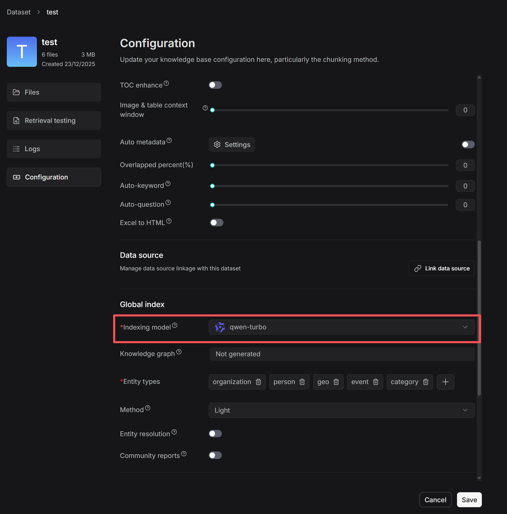
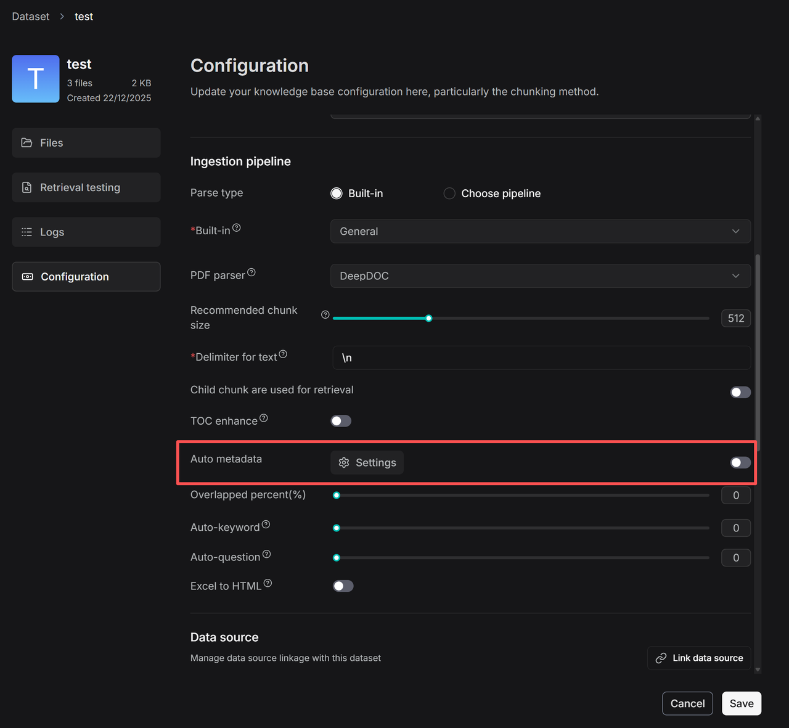
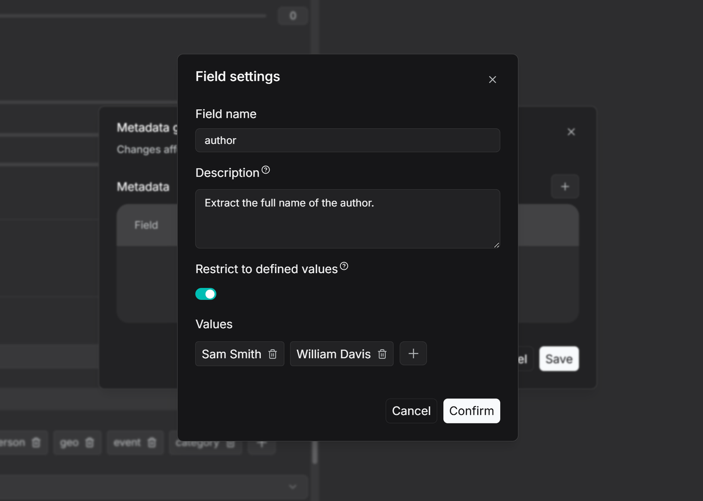
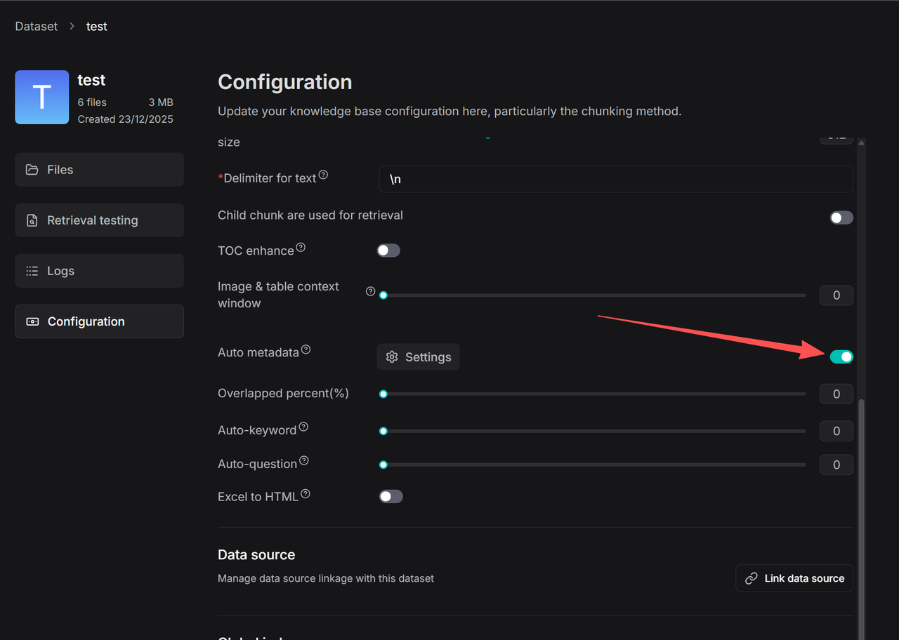

# 自动提取元数据

自动从上传的文件中提取元数据。

---

RAGFlow v0.23.0 引入了自动元数据功能，使用大语言模型自动提取和生成文件的元数据——无需手动输入。在典型的 RAG 流程中，元数据有两个关键作用：

- 检索阶段：过滤掉不相关的文档，缩小搜索范围以提高检索准确性。
- 生成阶段：如果检索到文本分块，其关联的元数据也会传递给 LLM，提供关于源文档的更丰富的上下文信息，以辅助答案生成。

:::danger 警告
启用元数据提取需要大量内存、计算资源和 token。
:::

## 操作步骤

1. 在数据集的 **Configuration** 页面上，选择索引模型，该模型将用于为该数据集生成知识图谱、RAPTOR、自动元数据、自动关键词和自动问题功能。

2. 点击 **Auto metadata** **>** **Settings** 进入自动元数据生成规则的配置页面。

   _自动生成元数据的规则配置页面出现。_

3. 点击 **+** 添加新字段并进入配置页面。

4. 输入字段名称（如 Author），并在 Description 部分添加描述和示例。这为大语言模型（LLM）提供上下文，使值提取更加准确。如果留空，LLM 将仅根据字段名提取值。

5. 要限制 LLM 仅从预定义列表中生成元数据，请启用"限制为已定义值"模式并手动添加允许的值。LLM 将仅从此预设范围内生成结果。

6. 配置完成后，在 Configuration 页面上打开自动元数据开关。所有新上传的文件在解析过程中都将应用这些规则。对于已经处理过的文件，必须重新解析才能触发元数据生成。然后您可以使用过滤功能检查文件的元数据生成状态。

