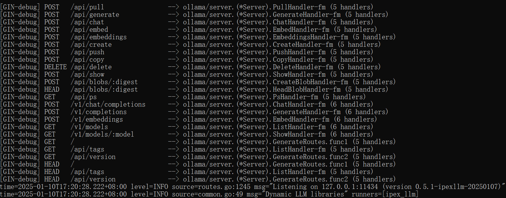
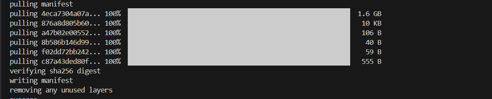
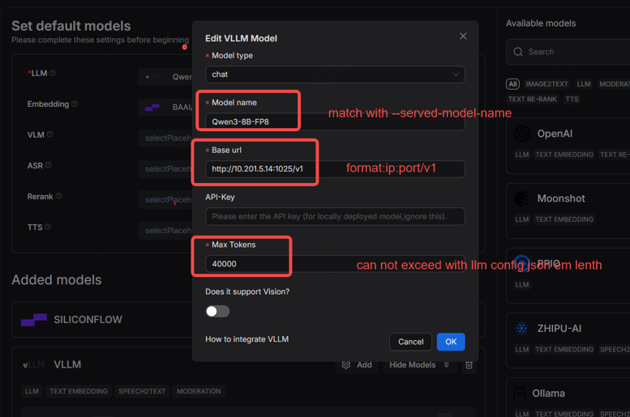
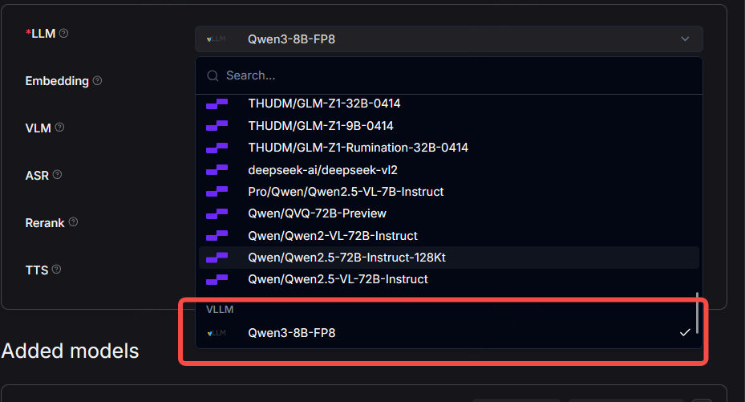
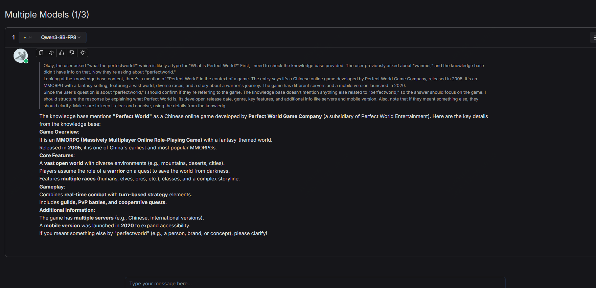
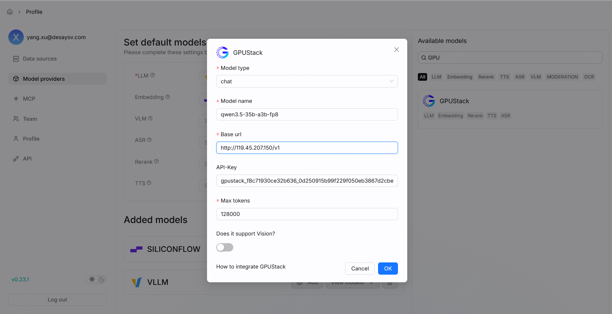
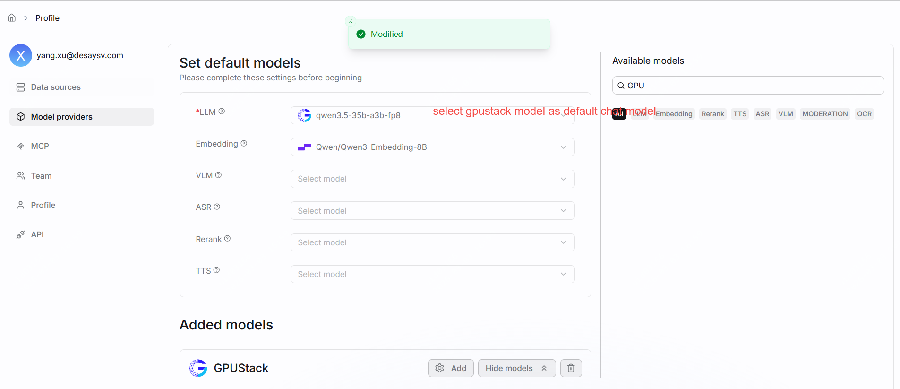

# 部署本地模型
import Tabs from '@theme/Tabs';
import TabItem from '@theme/TabItem';

使用 Ollama、Xinference、vLLM、SGLang、GPUStack 或其他框架部署和运行本地模型。

---

RAGFlow 支持使用 Ollama、Xinference、IPEX-LLM、vLLM、SGLang、GPUStack 或 jina 在本地部署模型。如果您有本地部署的模型要利用，或希望启用 GPU 或 CUDA 进行推理加速，可以将 Ollama 或 Xinference 绑定到 RAGFlow 中，将其中任何一个用作与本地模型交互的本地"服务器"。

RAGFlow 与 Ollama 和 Xinference 无缝集成，无需额外的环境配置。您可以使用它们在 RAGFlow 中部署两种类型的本地模型：对话模型和嵌入模型。

:::tip 注意
本用户指南不打算涵盖 Ollama 或 Xinference 的安装或配置的诸多细节；重点是 RAGFlow 内部的配置。如需最新信息，您可能需要查阅 Ollama 或 Xinference 的官方站点。
:::

## 使用 Ollama 部署本地模型

[Ollama](https://github.com/ollama/ollama) 使您能够运行本地部署的开源大语言模型。它将模型权重、配置和数据打包到一个由 Modelfile 定义的单一包中，并优化了设置和配置，包括 GPU 使用。

:::note
- 有关下载 Ollama 的信息，请参见[此处](https://github.com/ollama/ollama?tab=readme-ov-file#ollama)。
- 有关支持的模型和变体的完整列表，请参见 [Ollama 模型库](https://ollama.com/library)。
:::

### 1. 使用 Docker 部署 Ollama

Ollama 可以[从二进制文件安装](https://ollama.com/download)或[使用 Docker 部署](https://hub.docker.com/r/ollama/ollama)。以下是使用 Docker 部署的说明：

```bash
$ sudo docker run --name ollama -p 11434:11434 ollama/ollama
> time=2024-12-02T02:20:21.360Z level=INFO source=routes.go:1248 msg="Listening on [::]:11434 (version 0.4.6)"
> time=2024-12-02T02:20:21.360Z level=INFO source=common.go:49 msg="Dynamic LLM libraries" runners="[cpu cpu_avx cpu_avx2 cuda_v11 cuda_v12]"
```

确保 Ollama 在所有 IP 地址上监听：
```bash
$ sudo ss -tunlp | grep 11434
> tcp   LISTEN 0      4096                  0.0.0.0:11434      0.0.0.0:*    users:(("docker-proxy",pid=794507,fd=4))
> tcp   LISTEN 0      4096                     [::]:11434         [::]:*    users:(("docker-proxy",pid=794513,fd=4))
```

按需拉取模型。我们建议从 `llama3.2`（一个 3B 对话模型）和 `bge-m3`（一个 567M 嵌入模型）开始：
```bash
$ sudo docker exec ollama ollama pull llama3.2
> pulling dde5aa3fc5ff... 100% ▕████████████████▏ 2.0 GB
> success
```

```bash
$ sudo docker exec ollama ollama pull bge-m3                 
> pulling daec91ffb5dd... 100% ▕████████████████▏ 1.2 GB                                  
> success 
```

### 2. 找到 Ollama URL 并确保其可访问

- 如果 RAGFlow 运行在 Docker 中，localhost 在 RAGFlow Docker 容器内被映射为 `host.docker.internal`。如果 Ollama 运行在同一台宿主机上，Ollama 的正确 URL 将是 `http://host.docker.internal:11434/`，您应该检查 Ollama 是否可以从 RAGFlow 容器内部访问：
```bash
$ sudo docker exec -it docker-ragflow-cpu-1 bash
$ curl http://host.docker.internal:11434/
> Ollama is running
```

- 如果 RAGFlow 从源代码启动，而 Ollama 与 RAGFlow 运行在同一台宿主机上，检查 Ollama 是否可以从 RAGFlow 的宿主机访问：
```bash
$ curl http://localhost:11434/
> Ollama is running
```

- 如果 RAGFlow 和 Ollama 运行在不同的机器上，检查 Ollama 是否可以从 RAGFlow 的宿主机访问：
```bash
$ curl http://${IP_OF_OLLAMA_MACHINE}:11434/
> Ollama is running
```

### 3. 添加 Ollama

在 RAGFlow 中，点击页面右上角的 Logo **>** **Model providers** 并将 Ollama 添加到 RAGFlow：


### 4. 完成 Ollama 基本设置

在弹出的窗口中，完成 Ollama 的基本设置：

1. 确保模型名称和类型与第 1 步（使用 Docker 部署 Ollama）中拉取的模型匹配。例如（`llama3.2` 和 `chat`）或（`bge-m3` 和 `embedding`）。
2. 输入 Ollama base URL，即 `http://host.docker.internal:11434`、`http://localhost:11434` 或 `http://${IP_OF_OLLAMA_MACHINE}:11434`。
3. 可选：如果您的模型包含图像到文本模型，打开 **Does it support Vision?** 下方的开关。

:::caution 警告
不正确的 base URL 设置将触发以下错误：
```bash
Max retries exceeded with url: /api/chat (Caused by NewConnectionError('<urllib3.connection.HTTPConnection object at 0xffff98b81ff0>: Failed to establish a new connection: [Errno 111] Connection refused'))
```
:::

### 5. 更新系统模型设置

点击 Logo **>** **Model providers** **>** **System Model Settings** 更新模型：
   
- *现在您应该可以在 **Chat model** 下的下拉列表中找到 **llama3.2**，在 **Embedding model** 下的下拉列表中找到 **bge-m3**。*

### 6. 更新对话配置

在 **Chat Configuration** 中相应地更新您的模型。

## 使用 Xinference 部署本地模型

Xorbits Inference（[Xinference](https://github.com/xorbitsai/inference)）使您能够释放尖端 AI 模型的全部潜力。

:::note
- 有关安装 Xinference 的信息，请参见[此处](https://inference.readthedocs.io/en/latest/getting_started/)。
- 有关支持模型的完整列表，请参见[内置模型](https://inference.readthedocs.io/en/latest/models/builtin/)。
:::

要部署本地模型（例如 **Mistral**），使用 Xinference：

### 1. 检查防火墙设置

确保宿主机的防火墙允许 9997 端口的入站连接。

### 2. 启动 Xinference 实例

```bash
$ xinference-local --host 0.0.0.0 --port 9997
```

### 3. 启动本地模型

启动本地模型（**Mistral**），确保将 `${quantization}` 替换为您选择的量化方法：

```bash
$ xinference launch -u mistral --model-name mistral-v0.1 --size-in-billions 7 --model-format pytorch --quantization ${quantization}
```

### 4. 添加 Xinference

在 RAGFlow 中，点击页面右上角的 Logo **>** **Model providers** 并将 Xinference 添加到 RAGFlow：


### 5. 完成 Xinference 基本设置

输入可访问的 base URL，如 `http://<your-xinference-endpoint-domain>:9997/v1`。
> 对于 rerank 模型，请使用 `http://<your-xinference-endpoint-domain>:9997/v1/rerank` 作为 base URL。

### 6. 更新系统模型设置

点击 Logo **>** **Model providers** **>** **System Model Settings** 更新模型。
   
*现在您应该可以在 **Chat model** 下的下拉列表中找到 **mistral**。*

### 7. 更新对话配置

在 **Chat Configuration** 中相应地更新您的对话模型。

## 使用 IPEX-LLM 部署本地模型

[IPEX-LLM](https://github.com/intel-analytics/ipex-llm) 是一个 PyTorch 库，用于在本地 Intel CPU 或 GPU（包括 iGPU 或 Arc、Flex、Max 等独立 GPU）上低延迟运行 LLM。它在 Linux 和 Windows 系统上支持 Ollama。

要使用 IPEX-LLM 加速的 Ollama 部署本地模型（例如 **Qwen2**）：

### 1. 检查防火墙设置

确保宿主机的防火墙允许 11434 端口的入站连接。例如：
   
```bash
sudo ufw allow 11434/tcp
```

### 2. 使用 IPEX-LLM 启动 Ollama 服务

#### 2.1 安装用于 Ollama 的 IPEX-LLM

:::tip 注意
IPEX-LLM 在 Linux 和 Windows 系统上支持 Ollama。
:::

有关安装用于 Ollama 的 IPEX-LLM 的详细信息，请参见[在 Intel GPU 上运行 llama.cpp 与 IPEX-LLM 指南](https://github.com/intel-analytics/ipex-llm/blob/main/docs/mddocs/Quickstart/llama_cpp_quickstart.md)：
- [前提条件](https://github.com/intel-analytics/ipex-llm/blob/main/docs/mddocs/Quickstart/llama_cpp_quickstart.md#0-prerequisites)
- [安装 IPEX-LLM cpp 与 Ollama 二进制文件](https://github.com/intel-analytics/ipex-llm/blob/main/docs/mddocs/Quickstart/llama_cpp_quickstart.md#1-install-ipex-llm-for-llamacpp)

*安装完成后，您应该已经创建了一个 Conda 环境（例如 `llm-cpp`），用于运行带有 IPEX-LLM 的 Ollama 命令。*

#### 2.2 初始化 Ollama

1. 激活 `llm-cpp` Conda 环境并初始化 Ollama：

<Tabs
  defaultValue="linux"
  values={[
    {label: 'Linux', value: 'linux'},
    {label: 'Windows', value: 'windows'},
  ]}>
  <TabItem value="linux">
  
  ```bash
  conda activate llm-cpp
  init-ollama
  ```
  </TabItem>
  <TabItem value="windows">

  在 Miniforge Prompt 中以*管理员权限*运行这些命令：

  ```cmd
  conda activate llm-cpp
  init-ollama.bat
  ```
  </TabItem>
</Tabs>

2. 如果已安装的 `ipex-llm[cpp]` 需要升级 Ollama 二进制文件，则删除旧的二进制文件并使用 `init-ollama`（Linux）或 `init-ollama.bat`（Windows）重新初始化 Ollama。
   
   *当前目录中会出现一个指向 Ollama 的符号链接，您可以使用此可执行文件遵循标准 Ollama 命令。*

#### 2.3 启动 Ollama 服务

1. 将环境变量 `OLLAMA_NUM_GPU` 设置为 `999`，确保模型的所有层都在 Intel GPU 上运行；否则某些层可能默认在 CPU 上运行。
2. 对于在 Linux OS（Kernel 6.2）上使用 Intel Arc™ A 系列显卡获得最佳性能，在启动 Ollama 服务之前设置以下环境变量：

   ```bash 
   export SYCL_PI_LEVEL_ZERO_USE_IMMEDIATE_COMMANDLISTS=1
   ```
3. 启动 Ollama 服务：

<Tabs
  defaultValue="linux"
  values={[
    {label: 'Linux', value: 'linux'},
    {label: 'Windows', value: 'windows'},
  ]}>
  <TabItem value="linux">

  ```bash
  export OLLAMA_NUM_GPU=999
  export no_proxy=localhost,127.0.0.1
  export ZES_ENABLE_SYSMAN=1
  source /opt/intel/oneapi/setvars.sh
  export SYCL_CACHE_PERSISTENT=1

  ./ollama serve
  ```

  </TabItem>
  <TabItem value="windows">

  在 Miniforge Prompt 中运行以下命令：

  ```cmd
  set OLLAMA_NUM_GPU=999
  set no_proxy=localhost,127.0.0.1
  set ZES_ENABLE_SYSMAN=1
  set SYCL_CACHE_PERSISTENT=1

  ollama serve
  ```
  </TabItem>
</Tabs>

:::tip 注意
要使 Ollama 服务接受来自所有 IP 地址的连接，请使用 `OLLAMA_HOST=0.0.0.0 ./ollama serve` 而不是简单的 `./ollama serve`。
:::

*控制台会显示类似以下内容的消息：*



### 3. 拉取并运行 Ollama 模型

#### 3.1 拉取 Ollama 模型

在 Ollama 服务运行的情况下，打开一个新的终端并运行 `./ollama pull <model_name>`（Linux）或 `ollama.exe pull <model_name>`（Windows）拉取所需的模型。例如 `qwen2:latest`：



#### 3.2 运行 Ollama 模型

<Tabs
  defaultValue="linux"
  values={[
    {label: 'Linux', value: 'linux'},
    {label: 'Windows', value: 'windows'},
  ]}>
  <TabItem value="linux">

  ```bash
  ./ollama run qwen2:latest
  ```
  </TabItem>
  <TabItem value="windows">

  ```cmd
  ollama run qwen2:latest
  ```

  </TabItem>
</Tabs>

### 4. 配置 RAGFlow

要在 RAGFlow 中启用 IPEX-LLM 加速的 Ollama，还必须在 RAGFlow 中完成配置。步骤与*使用 Ollama 部署本地模型*部分中概述的步骤相同：

1. [添加 Ollama](#4-添加-ollama)
2. [完成 Ollama 基本设置](#5-完成-ollama-基本设置)
3. [更新系统模型设置](#6-更新系统模型设置)
4. [更新对话配置](#7-更新对话配置)

### 5. 部署 vLLM

ubuntu 22.04/24.04

```bash
pip install vllm
```

### 5.1 以最佳实践运行 vLLM

```bash
nohup vllm serve /data/Qwen3-8B --served-model-name Qwen3-8B-FP8 --dtype auto --port 1025 --gpu-memory-utilization 0.90 --tool-call-parser hermes --enable-auto-tool-choice  > /var/log/vllm_startup1.log 2>&1 &
```

您可以获取日志信息：
```bash
tail -f -n 100 /var/log/vllm_startup1.log
```

当看到以下内容时，表示 vLLM 引擎已准备好接受访问：
```bash
Starting vLLM API server 0 on http://0.0.0.0:1025
Started server process [19177]
Application startup complete.
```

### 5.2 通过 WebUI 将 RAGFlow 与 vLLM Chat/EM/Rerank LLM 集成

设置 → Model providers → 搜索 → vllm → 添加，按如下配置：



选择 vLLM 对话模型作为默认 LLM 模型：


### 5.3 使用 vLLM 对话模型进行对话
创建对话 → 创建对话记录：


### 6. 部署 GPUStack

ubuntu 22.04/24.04

### 6.1 以最佳实践运行 GPUStack

```bash
sudo docker run -d --name gpustack \
    --restart unless-stopped \
    -p 80:80 \
    -p 10161:10161 \
    --volume gpustack-data:/var/lib/gpustack \
    gpustack/gpustack
```

您可以获取 Docker 信息：
```bash
docker ps
```

当看到以下内容时，表示 GPUStack 引擎已准备好：
```bash
root@gpustack-prod:~# docker ps
CONTAINER ID   IMAGE               COMMAND                  CREATED       STATUS       PORTS                                                                                  NAMES
abf59be84b1a   gpustack/gpustack   "/usr/bin/entrypoint…"   6 hours ago   Up 6 hours   0.0.0.0:80->80/tcp, [::]:80->80/tcp, 0.0.0.0:10161->10161/tcp, [::]:10161->10161/tcp   gpustack
```

### 6.2 通过 WebUI 将 RAGFlow 与 GPUStack Chat/EM/Rerank LLM 集成

设置 → Model providers → 搜索 → gpustack → 添加，按如下配置：



选择 GPUStack 对话模型作为默认 LLM 模型：

