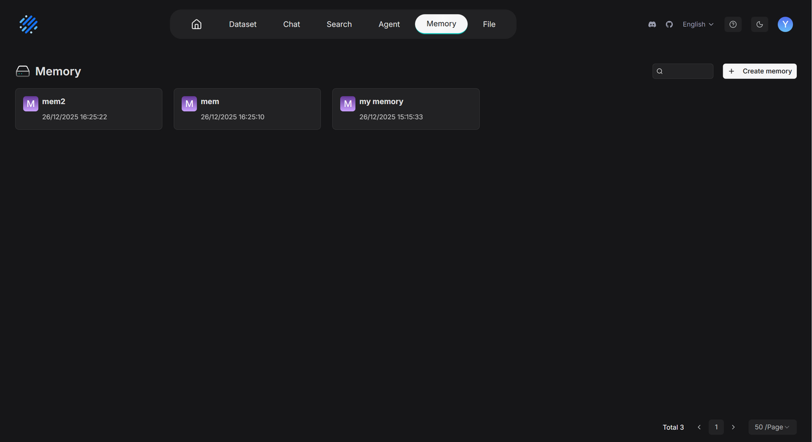
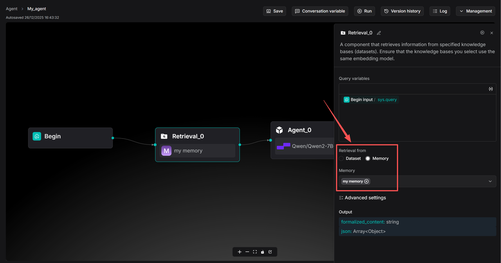
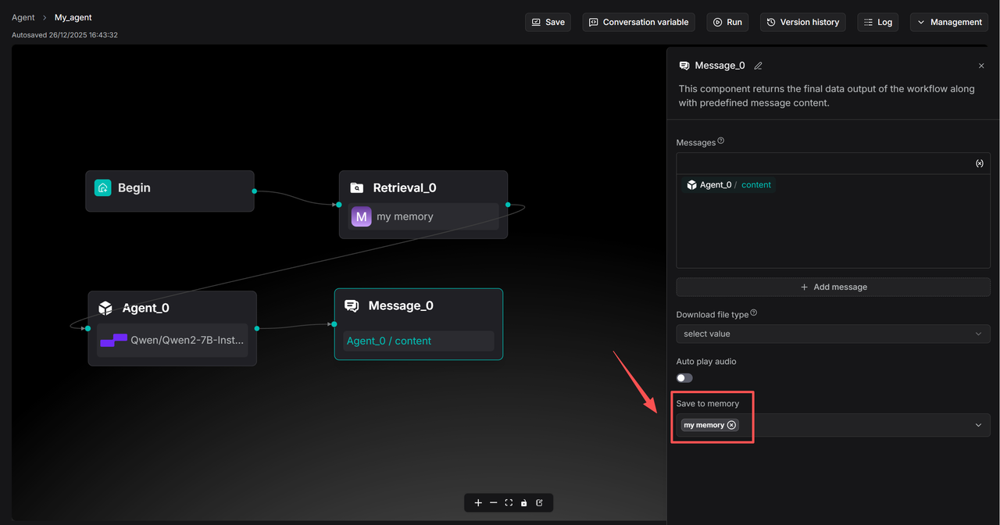

# 使用记忆

RAGFlow 的 Memory 模块旨在保存一切，包括 Agent 工作时产生的对话。它保留对话的原始日志，如用户说的话和 AI 的回复，还保存在对话过程中创建的额外信息，如摘要或 AI 关于交互所做的笔记。它的主要作用包括：使对话从一轮到下一轮流畅过渡、允许 AI 记住用户的个人信息，以及让 AI 从所有历史对话中学习。

该模块不仅仅存储原始数据，还智能地将信息分类为不同的有用类型。它可以提取关键事实和含义（语义记忆）、记住历史对话中的特定事件和故事（情景记忆），以及保存当前任务所需的细节（工作记忆）。这将简单的日志转变为一个组织有序的历史经验库。

因此，用户可以轻松地将任何已保存的信息带回新的对话中。这些历史上下文帮助 AI 保持主题连贯、避免自我重复，使对话更加连贯和自然。更重要的是，它为 AI 提供了一个可靠的历史依据进行思考，使回答更加准确和有用。

## 创建记忆

Memory 模块提供精简的集中化管理来管理所有记忆。

创建 Memory 时，用户可以精确定义要提取的信息类型，确保只捕获和组织相关的数据。从导航路径 Overview >> Memory，用户可以执行关键的管理操作，包括重命名记忆、整理记忆以及与团队成员共享以支持协作工作流。

## 配置记忆

在 **Memory** 页面，点击目标记忆 **>** **Configuration** 查看和更新其设置。

### 名称

所创建记忆的唯一名称。

### 嵌入模型

用于将记忆转换为嵌入向量的嵌入模型。

### LLM

用于从记忆中提取知识的对话模型。

### 记忆类型

记忆中存储的内容：

`Raw`：用户与 Agent 之间的原始对话（默认必选）。
`Semantic Memory`：关于用户和世界的一般知识和事实。
`Episodic Memory`：特定事件和体验的时间戳记录。
`Procedural Memory`：学到的技能、习惯和自动化流程。

### 记忆大小

分配给记忆及相应嵌入的默认容量，以字节为单位。默认值为 `5242880`（5MB）。

:::tip 注意
一条 1KB 的消息加上 1024 维嵌入约占 9KB 内存（1KB + 1024 x 8Bytes = 9KB）。以 5MB 的默认限制，系统大约可存储 500 条这样的消息。
:::

### 权限

- **Only me**：用户独享。
- **Team**：与团队成员共享此记忆。

## 管理记忆

在单个 Memory 页面内，您可以微调已保存条目在 Agent 调用期间的使用方式。每个条目可以有选择地启用或禁用，让您可以控制哪些信息保持活跃，而不必永久删除任何内容。

当某些细节不再相关时，您也可以完全选择遗忘特定的记忆条目。这使 Memory 保持干净、专注且更易于长期维护，确保 Agent 仅依赖最新且有用的信息。

手动遗忘的记忆条目将完全排除在 Agent 调用返回的结果之外，确保它们不再影响下游行为。这有助于保持回答聚焦于最相关且有意保留的信息。

当 Memory 达到存储限制并应用自动遗忘策略时，之前手动遗忘的条目也会被优先删除。这使得系统能够更智能地回收容量，同时尊重用户更早的策展决策。

## 增强 Agent 上下文

在 [Retrieval](../agent/agent_component_reference/retrieval.md) 和 [Message](../agent/agent_component_reference/message.md) 组件设置中，提供了新的 Memory 调用功能。在 Message 组件中，用户可以配置 Agent 将选定的数据写入指定的 Memory，而 Retrieval 组件可以设置为从同一 Memory 中读取以回答未来的查询。这使得一个简单的问答机器人 Agent 能够随时间累积上下文，提供更丰富、更具记忆感知能力的回答。

### 从记忆检索

对于使用 Memory 的任何 Agent 配置，必须有一个 **Retrieval** 组件将存储的信息带回对话中。通过将 Retrieval 与具有记忆感知能力的组件配合使用，Agent 可以在需要时持续回忆并应用相关的历史数据。

### 保存到记忆

完成 **Retrieval** 组件设置的同时，在 **Message** 组件的 **Save to Memory** 下选择相应的 Memory：

## 常见问题

### 我可以共享记忆吗？

可以。记忆可以在 Agent 之间共享。参见以下话题：

- [创建记忆](#创建记忆)
- [增强 Agent 上下文](#增强-agent-上下文)

如果您希望与团队成员共享记忆，请确保已配置其团队权限。详情参见[共享记忆](../team/share_memory.md)。
