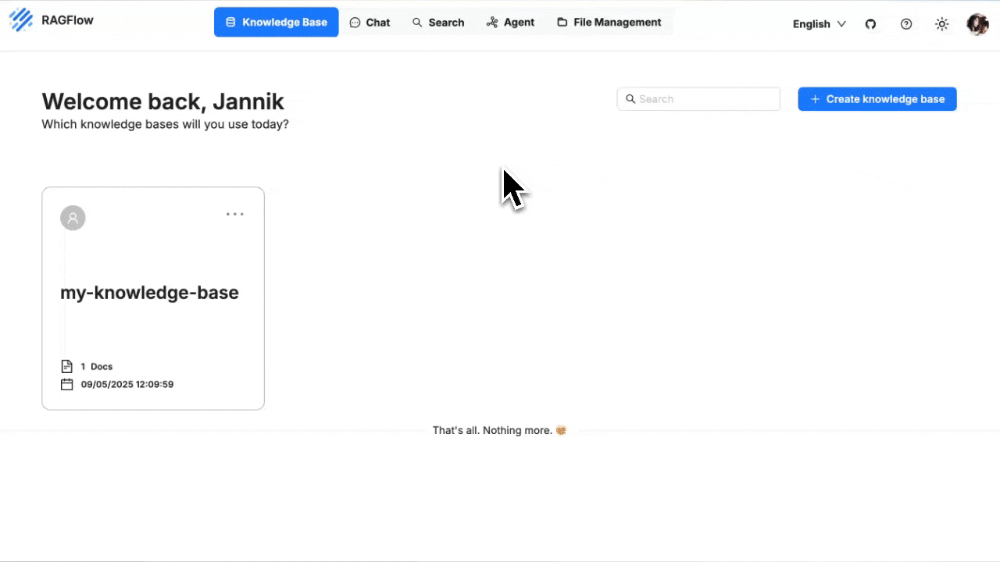
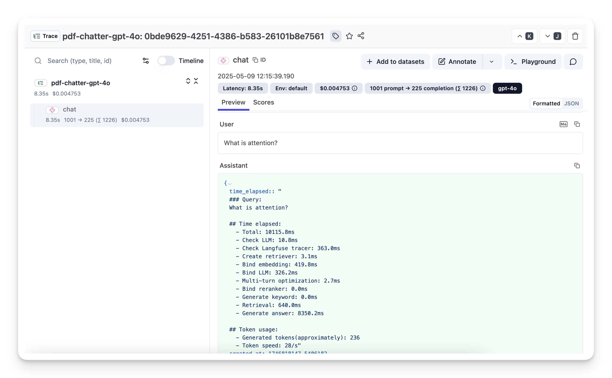

# 链路追踪

使用 Langfuse 进行可观测性与链路追踪。

---

:::info 致谢
本文档由社区贡献者 [jannikmaierhoefer](https://github.com/jannikmaierhoefer) 贡献。👏
:::

RAGFlow 内置了 [Langfuse](https://langfuse.com) 集成，使您能够**近乎实时地检查和调试 RAG 流水线中的每个检索和生成步骤**。

Langfuse 将 trace、span 和 prompt 负载存储在一个专门构建的可观测性后端中，并在其上提供筛选和可视化功能。

:::info 注意
• RAGFlow **≥ 0.18.0**（包含 Langfuse 连接器）  
• 一个 Langfuse 工作区（云端或自托管），包含*项目公钥*和*密钥*
:::

---

## 1. 获取您的 Langfuse 凭据

1. 登录您的 Langfuse 仪表板。
2. 打开 **设置 ▸ 项目**，然后创建新项目或选择已有项目。
3. 复制**公钥**和**密钥**。
4. 记下 Langfuse **主机地址**（例如 `https://cloud.langfuse.com`）。如为自托管，请使用您自己安装的基础 URL。

> 这些密钥是*项目级别*的：一对密钥即可满足所有应向同一项目写入数据的环境。

---

## 2. 将密钥添加到 RAGFlow

RAGFlow 将凭据*按租户*存储。您可以通过 Web UI 或 HTTP API 进行配置。

1. 登录 RAGFlow，点击右上角的头像。
2. 选择 **API ▸ 向下滚动到底部 ▸ Langfuse 配置**。
3. 填写您的 Langfuse **Host**、**Secret Key** 和 **Public Key**。
4. 点击**保存**。

保存后，RAGFlow 即开始自动发送 trace 数据——无需任何代码更改。

---

## 3. 运行流水线并观察 trace

1. 在 RAGFlow 中执行任意聊天或检索流水线（例如 Quickstart 演示）。
2. 打开您的 Langfuse 项目 ▸ **Traces**。
3. 按 **名称 ~ `ragflow-*`** 筛选（RAGFlow 为每个 trace 添加 `ragflow-` 前缀）。

对于每个用户请求，您将看到：

• 一个代表整体请求的 **trace**  
• 用于检索、排序和生成步骤的 **span**  
• 作为元数据的完整 **prompt**、**检索到的文档**和 **LLM 响应**

（[Langfuse 中的示例 trace](https://cloud.langfuse.com/project/cloramnkj0002jz088vzn1ja4/traces/0bde9629-4251-4386-b583-26101b8e7561?timestamp=2025-05-09T19%3A15%3A37.797Z&display=details&observation=823997d8-ac40-40f3-8e7b-8aa6753b499e)）

:::tip 注意
使用 Langfuse 的 diff 视图比较 prompt 版本，或深入分析长时间运行的检索以识别性能瓶颈。
:::
